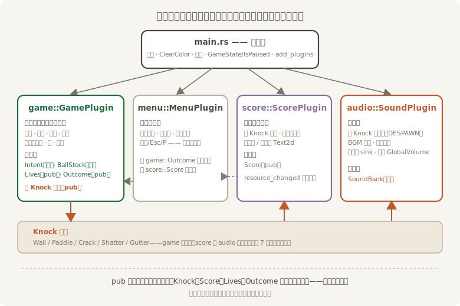

# 拆台重组：插件化

第 2 章介绍 Plugin 时把话说满过：“写 Bevy 游戏，就是写一组 Plugin。角色控制一个插件、计分一个插件、UI 一个插件——第 20 章的打砖块项目就按这个方式组织。”十八章之后，债主上门了。

817 行的单文件还没到“写不下去”的地步，但每种病都冒头了：找 `serve_ball` 靠 Ctrl+F；记分牌和碰撞挤在同一个文件里，改前者时总担心碰着后者；`main()` 的注册清单长到要滚屏；真要两个人合写，一个文件就是一场合并冲突。Bevy 给的成药就是你用了二十章的那个：`DefaultPlugins` 本身是三十多个插件的合订本，时间一个、窗口一个、音频一个——现在轮到你的游戏长成“几个插件的合订本”。

## 边界怎么划

第一刀最忌讳按**机制**切：`components.rs`、`systems.rs`、`resources.rs`——那只是把一锅粥分装三碗，改任何一个功能照样三碗都动。要按**领域**切：每一摊管一件完整的事，摊与摊之间只靠消息和资源说话。《打瓦》的四摊早就在前几节的叙事里成形了：



<span class="caption">Figure 20-10：四摊各管各的——pub 清单就是插件间的合同</span>

- **game**——玩法本体：场地、球、瓦，鼓点上的物理与胜负。对外只承诺 `Knock` 消息、`Lives` 与 `Outcome` 资源，和几个场地常量；
- **menu**——画面流程：三块幕布加状态机的钥匙。它不懂玩法，只看 `Outcome` 与 `Score` 的脸色；
- **score**——记账与挂牌：听 `Knock` 记分，把数字写上牌。对外只承诺 `Score`；
- **audio**——武场：听 `Knock` 敲家伙，管 BGM 与总闸。它对碰撞长什么样一无所知。

注意**谁也不调用谁的函数**。四摊之间全部的耦合，就是图底部那条消息总线和三个 pub 资源——这是第 5、7 章反复演练的“资源是黑板、消息是通道”在工程尺度上的样子。

## 搬家，撞墙

动手。`src/` 下开四个文件，`main.rs` 顶上四行 `mod` 声明，然后把 817 行按图分发——代码本身一个字不用改。真的吗？编译器很快开口了。最小化的事故现场（用 `mod` 块在单文件里重演两个文件）：

```rust
{{#include ../../code/ch20-breakout/no-compile/listing-20-08.rs}}
```

<span class="caption">Listing 20-8：行不通——搬进模块的 Score 没标 pub（no-compile/listing-20-08.rs）</span>

```text
error[E0603]: struct `Score` is private
  --> ch20-breakout\no-compile\listing-20-08.rs:17:23
   |
17 |     use crate::score::Score; // 结算屏要读分数
   |                       ^^^^^ private struct
   |
note: the struct `Score` is defined here
  --> ch20-breakout\no-compile\listing-20-08.rs:11:5
   |
11 |     struct Score(u32);
   |     ^^^^^^^^^^^^^^^^^^
```

这不是 Bevy 的错误，是 Rust 模块系统的本职：单文件时代人人平等，拆了模块，“谁能看见谁”第一次成了问题。修法当然是给 `Score` 补一个 `pub`——但别一路 `pub` 到底。**编译器逼你回答的，恰好是架构问题**：哪些类型是合同，哪些是私货？逐个报错逐个想，最后 `pub` 出来的清单就是 Figure 20-10 底部那一行：`Knock`、`Score`、`Lives`、`Outcome`，加几个场地常量。`Intent`、`BallStock`、`SoundBank`、碰撞那一套——全是各摊的内政，一个都不漏出去。

## 四摊开张

拆完的 `main.rs` 瘦成一条总装线，全文如下：

```rust
{{#include ../../code/ch20-breakout/src/main.rs}}
```

<span class="caption">Listing 20-9：src/main.rs——声明模块、定义全场公认的状态与配色、装配 App</span>

状态机和配色留在 `main.rs`，因为它们是“全场公认”的——每一摊都 `use crate::{GameState, IsPaused}`。相机也留下：它不归任何一摊管。`Window` 里多出的两行是给网页版留的记号：`canvas` 指定把画面挂到页面上哪个 `<canvas>` 元素，`fit_canvas_to_parent` 让画布尺寸跟着页面走——这两个字段只在编成 WebAssembly 进浏览器时才起作用，桌面构建原样忽略，所以它们不改变你眼前这个游戏的任何行为。下一节你会在书页里直接开一局，跑的就是这份一字未改的 `main.rs`。每个插件的门面长一个样——一个空结构体，把原来写在 `main()` 里的注册搬进 `build`（第 2 章说过，`build` 的参数就是 `&mut App`，你能对 App 做的事都能搬进来）。玩法摊的门面与合同：

```rust
{{#include ../../code/ch20-breakout/src/game.rs:contract}}
```

```rust
{{#include ../../code/ch20-breakout/src/game.rs:plugin}}
```

<span class="caption">Listing 20-10：src/game.rs——对外的合同，与原样搬家的注册清单</span>

其余三摊同款，各自认领自己的 `OnEnter` 与 `Update` 系统：

```rust
{{#include ../../code/ch20-breakout/src/score.rs:plugin}}
```

<span class="caption">Listing 20-11：src/score.rs——记分摊的门面</span>

```rust
{{#include ../../code/ch20-breakout/src/menu.rs:plugin}}
```

<span class="caption">Listing 20-12：src/menu.rs——画面流程摊的门面</span>

```rust
{{#include ../../code/ch20-breakout/src/audio.rs:plugin}}
```

<span class="caption">Listing 20-13：src/audio.rs——武场的门面</span>

四个文件的函数体与 Listing 20-7 逐字相同——搬家不改字，只添 `pub` 与 `use`（完整文件就在 `code/ch20-breakout/src/`，对照着读一遍很值）。`add_message::<Knock>()` 跟着写者走进了 `GamePlugin`，`init_resource::<Score>()` 跟着账本走进了 `ScorePlugin`——**谁的家当谁注册**，这是插件自治的纪律。

## 静默的坑：忘了挂牌

拆完跑一遍。空格开局，台子照搭、球照弹、瓦照碎——但哪里不对：**记分牌没了**。命数牌、提示行也没了。控制台里“头一片，开张”那句台词也哑了。没有报错，没有警告，游戏好端端地跑着，就是缺了一块：

```text
老雷：夜戏散了，伙计们后台耍一局《打瓦》——空格开局。
场记：开台——56 片瓦，3 只绣球。
场记：一只绣球喂了沟——还剩 2 只。
场记：一只绣球喂了沟——还剩 1 只。
```

打完这一局，结算屏该落下来的瞬间，沉默变成了巨响：

```text
thread 'Compute Task Pool (11)' (1252) panicked at C:\Users\94887\.cargo\registry\src\index.crates.io-1949cf8c6b5b557f\bevy_ecs-0.19.0\src\error\handler.rs:130:1:
Encountered an error in system `<Enable the debug feature to see the name>`: Parameter `<Enable the debug feature to see the name>` failed validation: Resource does not exist
If this is an expected state, wrap the parameter in `Option<T>` and handle `None` when it happens, or wrap the parameter in `If<T>` to skip the system when it happens.
```

案情会诊。panic 的罪名是第 5.2 节判过的那条：**某个系统要的资源不存在**——你声明“必须有”，引擎当真。但系统和参数的名字都被打了码：`<Enable the debug feature to see the name>`。听它的话，把 debug feature 临时打开重跑（不用改 `Cargo.toml`，命令行就能开）：

```console
cargo run -p ch20-breakout --features bevy/debug
```

```text
Encountered an error in system `ch20_breakout::menu::show_curtain`: Parameter `Res<'_, Score>` failed validation: Resource does not exist
```

名字一出，全案告破：`show_curtain` 找不到 `Score`。`Score` 是谁注册的？`ScorePlugin` 的 `init_resource`。`ScorePlugin` 是谁装的？——回头看 `main.rs` 的 `add_plugins` 元组：**忘写了**。一行之差，症状却分两段：游戏期一切静默（记分摊的系统压根没注册，没注册就没人 panic——和第 4 章 `Single`、第 6 章 `run_if` 的“静默跳过”一个脾气），直到别的插件来要它欠的资源，才轰然炸响。把 `score::ScorePlugin` 补进元组，世界恢复原样。

这就是插件化的隐性代价：**注册遗漏是静默的**。两个习惯能护住你：`add_plugins` 用一个元组一次列全（别散落几处）；新拆完插件，第一时间把每个画面走一遍——本章这种“能跑就能看出来”的小项目，跑一圈就是最好的测试。

拆完的游戏与 Listing 20-7 行为逐帧一致——同样的台、同样的球、同样的锣鼓。变的只有一件事：下次想改记分规则，你打开的是 114 行的 `score.rs`，而不是 817 行的单文件。
