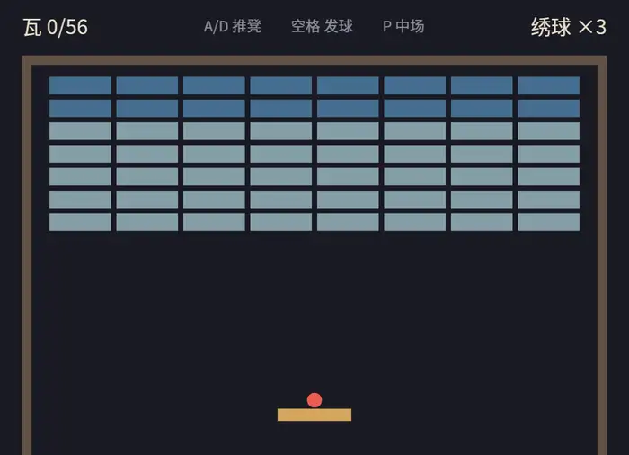

# 终场

走完整一遍流程，当一次玩家：

```console
cargo run -p ch20-breakout
```

后台招牌亮起，空格开局。球趴在凳上随你走，再按空格——上天。接住，弹墙，砸瓦；筒瓦第一下掉釉、第二下才碎；记分牌随脆响走字，半场时场记报“过半了”。打到兴头按 P，全世界定格，曲子停在半拍；倒杯水回来再按 P，从那一拍接着演。三只绣球都喂了沟，下行三叹里“绣球散尽”落幕，空格再来——新台新账。手稳的那一局，第五十六片瓦碎掉的瞬间，上行琶音收锣，“满堂彩”：



<span class="caption">Figure 20-11：《打瓦》——五十六片瓦、三只绣球、一条凳</span>

## 脉络收拢

这个一千行不到的游戏，是前十九章的点名册。哪一章在哪上岗，值得最后清点一遍：

| 章 | 在《打瓦》里的岗位 |
|---|---|
| 2　App 与 Plugin | 总装线 `main.rs`；终局的四摊插件——“写游戏就是写一组 Plugin”兑现 |
| 3　Entity 与 Component | `Paddle`、`Ball`、`Velocity`、`Health`、`Glued`；despawn 的延迟语义当安全网 |
| 4　System 与 Query | 碰撞的 `Single` + `Has` + `Option<(A, B)>`；球死后 `Single` 静默跳过成了白拿的正确行为 |
| 5　Resource | `Score`、`Lives`、`Intent`、`Outcome` 四块黑板；`resource_changed` 给记分牌与总闸当闸门 |
| 6　Schedule | 鼓点上 `.chain()` 钉死结算顺序；`run_if` 把守状态门；链上自动同步点让胜利不迟到一拍 |
| 7　Message | `Knock` 一写两读（记分、武场）；`AppExit` 谢幕 |
| 9　层级 | 幕布是 `children!` 文字树，despawn 一根拔全家 |
| 10　State | `Menu/Playing/GameOver` + `IsPaused` 子状态；OnEnter 搭台 + `DespawnOnExit` 挂牌——街机厅的预告原样兑现 |
| 12　Transform 与数学 | 场地几何、网格铺瓦的半片修正、判面的向量算术；`bounding` 模块补上最后一格抽屉 |
| 13　Camera | 一台 `Camera2d`，原点居中的坐标语境 |
| 14　Asset | 字体与音效的提货单；`BallStock` 克隆铸模补球 |
| 15　Sprite 与 Mesh2d | 色块搭台、圆网格铸球、掉釉改色 |
| 16　文本 | 记分牌、命数牌与三块幕布全是 `Text2d` |
| 17　输入 | 意图层骨架；键盘手柄合流 |
| 18　时间 | 物理上鼓点；瞬时发球过收集站；中场按停 `Time<Virtual>` |
| 19　音频 | 三张欠条全清：消息驱动 `DESPAWN` 音效、双闸暂停、总闸只管新声的坑 |

没出场的两位也交代一下：第 8 章的 Observer 是官方 `breakout.rs` 触发音效的选择——读者只有一个时它同样顺手，我们的 `Knock` 有两个读者，Message 更对路；第 11 章的 World 直通车，这个规模用不上——它的舞台在工具和引擎代码里。

对照读一遍官方 `vendor/bevy/examples/games/breakout.rs` 也是好功课：你会认出同款的常量表、同款的判面函数、同款的“迎面才反弹”，也会看出分岔——它没有状态机、没有命数、球永远撞底墙弹回，而你的版本有开有合、有胜有负。**能看懂官方示例的每一行，还能说出自己为什么不这么写**——这就是这一部分要带你到的地方。

## 小结

- **实战的节奏**：常量先行 → 组件即列 → 系统即规则；每一步都保持能跑，问题可见了再修——穿墙引出碰撞，哑局引出记分，僵局引出状态机
- **碰撞自己写得起**：`bounding` 模块的 `Aabb2d`（中心 + 半尺寸）配 `BoundingCircle`，`intersects` 判交、`closest_point` 判面、迎面才翻速度——二十行换一个打砖块的全部物理
- **消息是插件的公共语言**：写者报事实、不下指令；`FixedUpdate` 写 `Update` 读有引擎兜底；读者从一个加到三个，写者一字不改
- **状态机骨架**：三态管流程、子状态管中场；`in_state(IsPaused::Running)` 一个条件两层门；OnEnter 搭台 + `DespawnOnExit` 挂牌，重开一局 = 再进一次 `Playing`
- **中场三道闸**：`run_if` 拦规则、`Time<Virtual>` 停时间、`AudioSink` 自己拧——少一道都算没停干净
- **插件按领域拆**：pub 清单即合同；谁的家当谁注册；**注册遗漏是静默坑**——症状从“缺一块”到“要资源时 panic”，`--features bevy/debug` 让报错点名道姓
- 改参数（球速、瓦的行列、绣球数）请随意——常量都在文件头上等着，这正是当初把它们提出来的原因

## 练习

1. **手柄司机**：菜单、结算屏与中场的按键眼下只认键盘。给 `menu_keys` 等几个系统补上 `Query<&Gamepad>`（South 确认、Start 当 P 用），让手柄玩家全程不碰键盘。想想这几处为什么不必走 `Intent`——状态切换是流程操作，不是逐拍结算的玩法意图。
2. **击点改角**：现在球的反弹角永远是出生那一个，瞄准全靠凳子站位。经典打砖块的手感来自“击点改角”——球打在凳面越偏的位置，反弹的水平分量越大。`hit_side` 里的 `closest` 已经给了你击点，拿它和凳心的偏移去改 `velocity.x`，再亲手体会一下为什么街机都这么做。
3. **鼓点之间**：把 `Time::<Fixed>::from_hz(8.0)` 插进 App，亲眼看球一顿一顿地蹦；然后按 18.7 节的 previous/current 两本账给球装上渲染插值。装完把鼓点恢复 64 Hz，说说正式参数下这笔工值不值。
4. **残局检视**：现在闭幕即拆台，结算屏背后空空如也。用 ComputedStates（10.5 节）造一个 `InMatch`（`Playing` 或 `GameOver` 时存在），把场上实体改挂 `DespawnOnExit(InMatch)`，让残局留在结算屏背后。再想想“空格再来一局”时谁来拆旧台——体会正文为什么选了简单的方案。
5. **音量牌**：-/= 拧总闸时只有控制台有反应。在台口亮一行 `Text2d` 显示当前音量，两秒后淡出（第 18 章的 `Timer` 配第 15 章的 `set_alpha`）。它该挂在哪个插件名下？

## 下一章

第三部分到此收官。你已经能从零做出一个完整的 2D 游戏，也能读懂官方示例的门道。第四部分进入三维——好消息是：没有一个概念需要推倒重学。`Transform` 本来就是三维的（z 你一直在用），相机换个投影，资产还是提货单，`Mesh2d` + `ColorMaterial` 升维成 `Mesh3d` + `StandardMaterial`。多出来的新东西只有一类：**光**。下一章，把一盏灯点进世界。
