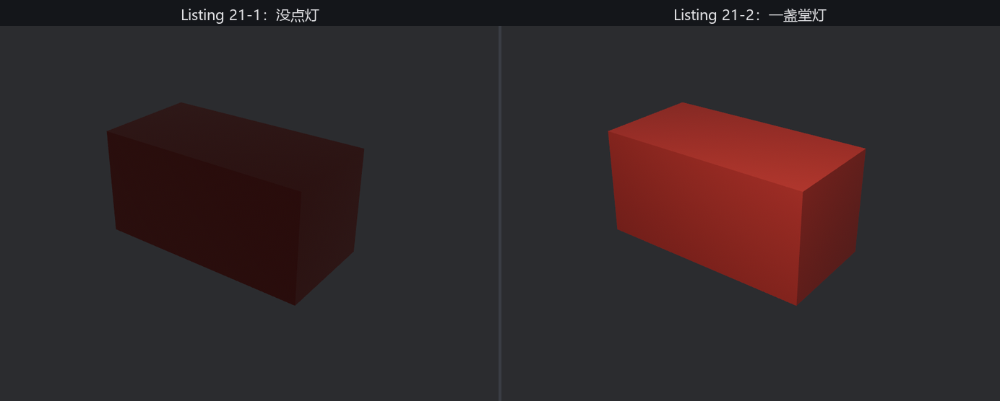
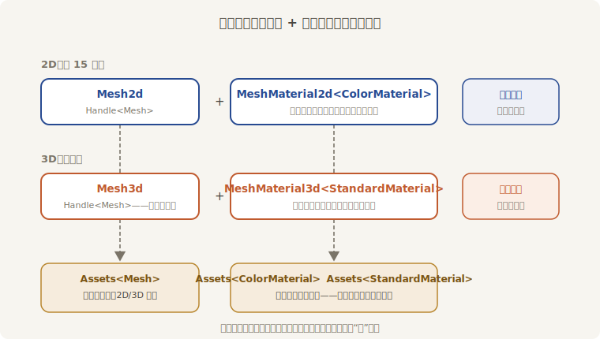

# 亮相：箱笼、机位与一盏灯

老鲁进场的头件活，是给戏班打一只装行头的箱笼——一只两尺长的长方体。手艺照搬第 15 章：形状铸成 Mesh、颜色调成材质、各发一张提货单。只有三处换了字：`Camera2d` 换 `Camera3d`，`Mesh2d` 换 `Mesh3d`，材质从 `ColorMaterial` 换成 3D 的标配 **`StandardMaterial`**：

```rust
{{#include ../../code/ch21-meshes/examples/listing-21-01.rs:setup}}
```

<span class="caption">Listing 21-1：头件活——第 15 章的铸造手艺原样升维（examples/listing-21-01.rs）</span>

机位那一行是第 13 章的功课实战：`Camera3d` 默认透视投影，纵向视角 45°；摆三维机位的标配是 `looking_at(目标点, Vec3::Y)`——给定立足点和盯住的目标，朝向自动算好（第 12 章说过“前方是 −Z”，`looking_at` 替你把 −Z 轴对准目标）。箱笼没写 `Transform`，由 `Mesh3d` 的 required components 补成默认值，端坐原点。跑起来：

```console
cargo run -p ch21-meshes --example listing-21-01
```

```text
老鲁：坯子上台了——咦，怎么黑灯瞎火的？
```



<span class="caption">Figure 21-1：同一只箱笼——左边没点灯，一团昏红；右边一盏堂灯，三面三个亮法</span>

窗口里确实有个箱笼（Figure 21-1 左），但像隔着毛玻璃看的：一团昏沉的暗红，三张可见面几乎一个色，棱角全靠猜。代码一字不差地照抄了 2D 的手艺，画面却病恹恹的——这是 3D 给新人的第一课。

## 2D 为什么从来不用点灯

病根在材质的脾气上。`ColorMaterial` 是**不受光材质**：你给什么颜色，它往屏幕上画什么颜色，光照计算根本不存在——所以 2D 场景从来不需要灯。而 `StandardMaterial` 是**受光材质**：它身上那块颜色只是“固有色”，每个像素最终多亮，要拿场景里的**光**来算。没有光，这笔账就是零乘以任何数。

那箱笼为什么不是纯黑？因为引擎垫了一层兜底：`bevy_light` 默认插了一个 `GlobalAmbientLight` 资源——**环境光**，一种来自四面八方、没有方向的弱光（默认白色、亮度 80；亮度的量纲连同灯的全家，留给第 22 章）。它保证你忘了点灯时还能看见个轮廓，但也只能给轮廓：环境光没有方向，每张面领到的亮度一模一样，**立体感无从谈起**。Figure 21-1 左那团昏红，就是环境光的全部本事。

## 点起一盏堂灯

补一个实体就够了：

```rust
{{#include ../../code/ch21-meshes/examples/listing-21-02.rs:light}}
```

<span class="caption">Listing 21-2：点灯——补一个带 PointLight 的实体（examples/listing-21-02.rs）</span>

**`PointLight`**（点光源——从一个点向四面八方发光，像一盏不带灯罩的灯泡）也是普通组件：挂上实体、配个 `Transform` 摆位置，引擎就接手了。默认参数照亮这种小场景绰绰有余。再跑：

```console
cargo run -p ch21-meshes --example listing-21-02
```

```text
老鲁：灯一点，坯子就有棱有角了——三面三个亮法。
```

Figure 21-1 右就是点灯后的画面：朱漆亮了起来，更要紧的是**三张面三种亮度**——顶面迎着灯最亮，正面斜对着灯次之，右侧面背着灯最暗。人眼正是靠这种亮度差读出“这是个立体的箱子”。亮度差从哪来？每张面**朝向不同**，与灯的夹角就不同。“朝向”这笔账记在 Mesh 的顶点数据里，名叫法线——21.4 节拆开看。

灯的家族（`DirectionalLight`、`SpotLight`）、参数（强度、射程、影子）都是第 22 章的正题；本章这盏堂灯点到为止：**3D 场景至少要有一盏灯，否则只有环境光的兜底轮廓**。

## 同一个模式，第二层楼

把两对组件并排放好，第 15 章的全部经验原样迁移：



<span class="caption">Figure 21-2：同一个模式的两层楼——形状 + 皮相各发一张提货单，Mesh 货架两边通用</span>

值得圈出来的三件事：

- **`Mesh` 是同一种资产**。`Mesh2d` 和 `Mesh3d` 里装的都是 `Handle<Mesh>`，住同一个 `Assets<Mesh>` 货架。同一只 `Circle` 网格，发给 `Mesh2d` 是剪纸，发给 `Mesh3d` 就是 3D 世界里一张没有厚度的圆片；
- **材质不通用**。`ColorMaterial` 与 `StandardMaterial` 是两种资产，各住各的 `Assets<T>`，2D 与 3D 的渲染管线各认各的；
- **`materials.add(Color::srgb(...))` 的便捷写法照旧好使**——`StandardMaterial` 也实现了 `From<Color>`，颜色进的是 `base_color` 字段，其余字段取默认值。全写开是什么样，21.3 节见。

箱笼验收。下一节老雷把整张道具单拍在案上——内置几何体，全家福。
