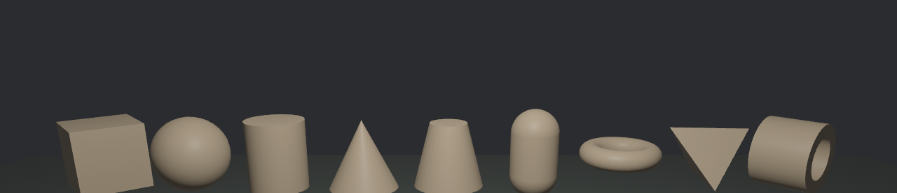
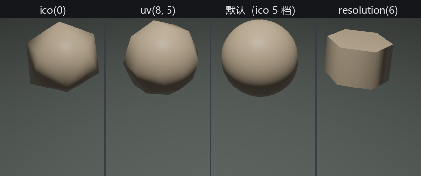

# 开料单：内置几何体

老雷的道具单一摊开，箱柜、绣球、鼓、帽、瓦罐、枕、镯子……老鲁眼皮都不抬：这些都是基本形。第 12 章几何课认识的**几何原语**（primitives，也叫图元——圆、矩形那些“纯数学、会答题”的类型）当时就预告过有两副面孔，第 15 章已经把 2D 的几位喂给过 Mesh 系统；今天 3D 那一整套整队上岗。九件坯子加一块台面，一次铸齐：

```rust
{{#include ../../code/ch21-meshes/examples/listing-21-03.rs:lineup}}
```

<span class="caption">Listing 21-3（节选一）：九件坯子照料单排开——素坯材质全场共用一份（examples/listing-21-03.rs）</span>

台面是块特殊的料——`Plane3d`，一张无厚度的平面，默认朝上（法线 +Y）。它的尺寸不写在形状里，而是进**铸模工序**调出来的，稍后细说：

```rust
{{#include ../../code/ch21-meshes/examples/listing-21-03.rs:ground}}
```

<span class="caption">Listing 21-3（节选二）：台面——Plane3d 进 .mesh() 工序裁尺寸（examples/listing-21-03.rs）</span>

立体的东西得转着看。给每件展品挂上 `Showpiece` 标记，一个系统让它们匀速自转——第 12 章的 `rotate_y` 原样上岗：

```rust
{{#include ../../code/ch21-meshes/examples/listing-21-03.rs:turn}}
```

<span class="caption">Listing 21-3（节选三）：转台——展品绕自身 Y 轴匀速自转（examples/listing-21-03.rs）</span>

```console
cargo run -p ch21-meshes --example listing-21-03
```

```text
老鲁：九件坯子一排细分实验，全上转台——转着看才知道圆不圆。
```



<span class="caption">Figure 21-3：内置几何体全家福——从左到右与料单同序，素坯还没上漆</span>

这批料的全名册如下。构造函数的参数都直白：尺寸即尺寸，半径即半径——拿不准时点进源码看一眼字段就是（`bevy_math` 定义形状，`bevy_mesh` 负责铸模）：

| 图元 | 造法 | 它是什么 |
|---|---|---|
| `Cuboid` | `new(长, 高, 深)` | 长方体；`default()` 是单位立方 |
| `Sphere` | `new(半径)` | 球 |
| `Cylinder` | `new(半径, 高)` | 圆柱 |
| `Cone` | `new(半径, 高)` | 圆锥 |
| `ConicalFrustum` | 结构体字面量 | 锥台：圆锥截掉尖 |
| `Capsule3d` | `new(半径, 中段长)` | 胶囊：圆柱两头扣半球 |
| `Torus` | `new(内半径, 外半径)` | 环面：甜甜圈 |
| `Tetrahedron` | `new(a, b, c, d)` 四个顶点 | 四面体 |
| `Plane3d` | `new(法线, 半尺寸)` | 无厚度平面 |
| `Triangle3d` | `new(a, b, c)` | 空间里的一张三角形 |
| `Extrusion` | `new(2D 图元, 厚度)` | **挤出体**：把任意 2D 图元拉出厚度 |

最后一行是 2D 图元的升维通道：料单末尾那只镯子就是 `Extrusion::new(Annulus::new(0.4, 0.65), 1.0)`——第 15 章的圆环拉出一指厚。第 12 章认识的 2D 图元家族（`Rectangle`、`Triangle2d`、`RegularPolygon`……）全都能这么挤；它们也能不挤、直接 `meshes.add` 进 3D 世界，得到的是一张没有厚度的片。

## 省一道手续？

九件坯子九次 `meshes.add`，老鲁嫌入库麻烦：形状现成的，直接塞给 `Mesh3d` 不行吗？

```rust
{{#include ../../code/ch21-meshes/no-compile/listing-21-04.rs:skip_add}}
```

<span class="caption">Listing 21-4：行不通——把形状直接塞给 Mesh3d（no-compile/listing-21-04.rs）</span>

```text
error[E0308]: mismatched types
   --> ch21-meshes\no-compile\listing-21-04.rs:21:16
    |
 21 |         Mesh3d(Cuboid::new(2.0, 1.0, 1.0)),
    |         ------ ^^^^^^^^^^^^^^^^^^^^^^^^^^ expected `Handle<Mesh>`, found `Cuboid`
    |         |
    |         arguments to this struct are incorrect
    |
    = note: expected enum `bevy::prelude::Handle<bevy::prelude::Mesh>`
             found struct `bevy::prelude::Cuboid`
note: tuple struct defined here
   --> bevy_mesh-0.19.0\src\components.rs:102:12
    |
102 | pub struct Mesh3d(pub Handle<Mesh>);
    |            ^^^^^^
```

编译器把规矩写得明白：`Mesh3d` 里装的是 `Handle<Mesh>`——**提货单，不是货**。第 14 章的库房纪律在渲染资产上一寸不让：网格数据本体住 `Assets<Mesh>` 货架，组件上只挂轻飘飘的提货单，这才有“十四颗星共用一份网格”的省钱诀窍。`meshes.add(Cuboid::new(...))` 一句里其实发生了两件事：`Cuboid` 先经 `From` 铸成 `Mesh`（`add` 收的是 `impl Into<Mesh>`），再入库换一张提货单出来。

## 圆，是装出来的

转台上的球看着浑圆。可 Mesh 的内里只有平直的三角形（下一节亲手摸），**根本没有“曲面”这种东西**——那圆从哪来？前排四件实验品给出答案。`meshes.add(Sphere::new(0.8))` 走的是默认铸法；在形状后面接 `.mesh()`，就进入**铸模工序**（MeshBuilder），细分多少由你说了算：

```rust
{{#include ../../code/ch21-meshes/examples/listing-21-03.rs:resolution}}
```

<span class="caption">Listing 21-3（节选四）：同一种料，不同细分——前排的实验品（examples/listing-21-03.rs）</span>



<span class="caption">Figure 21-4：圆是三角形装出来的——细分越多越圆，掰到 6 还能当六棱墩使</span>

- **`ico(0)`**：icosphere（二十面体细分球）不做细分，就是个正二十面体——“球”的最粗坯；每细分一档，三角形数翻两番，默认的 5 档已经看不出棱；
- **`uv(8, 5)`**：经纬球，8 条经线 5 条纬线，像个粗剥的橘子；参数拉高同样变圆；
- **`resolution(6)`**：圆柱的“圆”本是 32 边形装的；掰到 6，圆柱就成了六棱墩——细分旋钮不只为了“更圆”，也能反着用来造型。

每种图元的工序各有几颗旋钮：`Plane3d` 的 `size`/`subdivisions`（台面那行已经用过）、`Cylinder` 的 `resolution`/`segments`、`Sphere` 的 `ico`/`uv`……规律是统一的：**形状本身只记尺寸这类数学事实，三角形怎么铺归 `.mesh()` 工序管**。各图元的旋钮清单，去 `bevy_mesh` 源码的 `primitives/` 目录翻 builder 的字段即可。

但这里藏着一个没解释的现象。三角形再小也是**平**的，平面拼出来的壳理应面面分明、棱棱可见——可默认那颗球浑圆得没有一丝棱角，细分远没到“小于一个像素”的程度。是谁在把棱磨平？这桩悬案押到 21.5 节，先去给素坯上漆。
