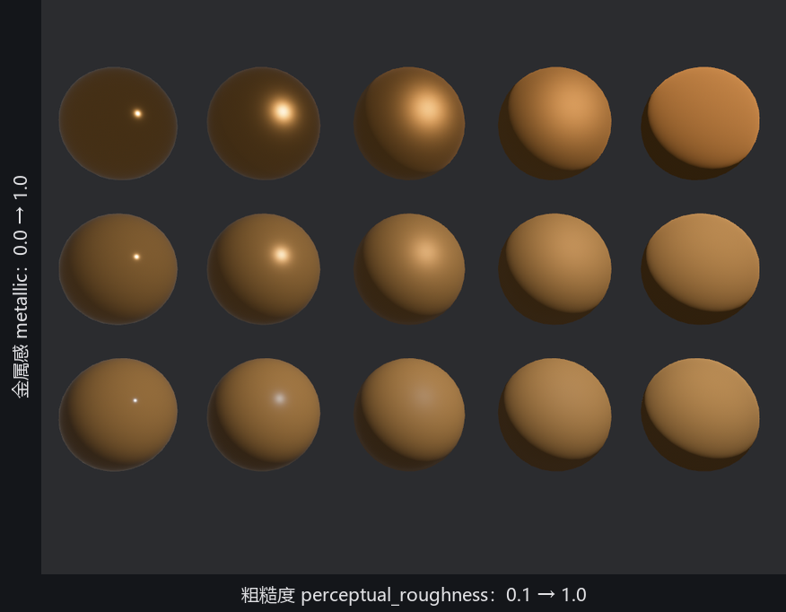
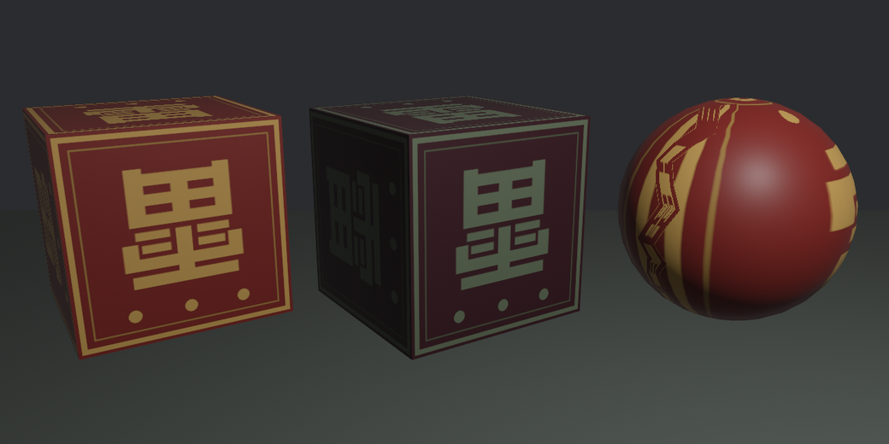

# 上漆：StandardMaterial 初见

素坯齐了，小棠提漆桶进场。道具单上写着讲究：铜锣要鎏金，瓷瓶要亮，案板要哑光的木色。在 2D 里这些全靠她一笔笔画；3D 的分工不一样——**画面上的质感是材质参数与光实时算出来的**，小棠要学的不是画，是拧旋钮。

`StandardMaterial` 的字段有几十个（第 24 章逐个清点），今天只认头三根旋钮：

| 字段 | 含义 | 默认值 |
|---|---|---|
| `base_color` | 固有色：表面“本来的颜色” | 白 |
| `metallic` | 金属感：0 是绝缘体（木、瓷、塑料），1 是金属 | 0.0 |
| `perceptual_roughness` | 粗糙度：0.089 是镜面般光滑，1 是彻底哑光 | 0.5 |

名字里的 perceptual（感知的）说的是刻度按人眼感受调匀，0.5 看起来就是“半糙”；下限 0.089 是着色器数值精度的护栏，写 0 也会被钳到这。21.1 节 `materials.add(Color::srgb(...))` 的便捷写法，等价于只拧第一根旋钮、其余全默认。

三根旋钮，画面上到底差在哪？口说无凭，铸一面墙：同一款金漆、同一盏灯，横轴把粗糙度从 0.1 拧到 1.0，纵轴把金属感从 0.0 拧到 1.0，十五颗球各占一格：

```rust
{{#include ../../code/ch21-meshes/examples/listing-21-05.rs:grid}}
```

<span class="caption">Listing 21-5：材质墙——两根旋钮的十五种组合（examples/listing-21-05.rs）</span>

```console
cargo run -p ch21-meshes --example listing-21-05
```

```text
小棠：一缸金漆调十五个样——横着越来越糙，竖着越来越金。
```



<span class="caption">Figure 21-5：材质墙实拍——同一款金漆、同一盏灯，两根旋钮拧出十五种质感</span>

读图从最下一行（`metallic` 为 0，非金属）读起：左端粗糙度 0.1，球面上一粒锐利的白色高光——亮光漆、上了釉的瓷；往右高光越摊越散，到 1.0 就是一团均匀的哑光——陶土、粉笔。注意高光是**白**的：非金属的反光不沾固有色，这是现实里漆器反光的真实物理。再看最上一行（`metallic` 为 1，金属）：右端是磨砂的暖金色——拉丝铜；左端却近乎黑，只剩一粒灯的亮点。

## 镜面金属为什么发黑

左上角那颗“光滑的金属球”按直觉该最闪亮，结果最黑——这不是 bug，是物理。金属与非金属的根本分别：**非金属**有漫反射，四面八方来的光都揉进固有色再散出去，所以哑光陶土在哪都有底色；**金属**没有漫反射，它只会像镜子一样反射周遭的世界，固有色只是给反射镀的色。而我们这个世界里有什么可照的？一盏灯，加一片虚空。镜子忠实地照出了虚空。

粗糙度高的金属反而暖亮，是因为糙面把那盏灯的反射揉碎摊开了；越光滑越接近镜子，越照出“这世界一无所有”的真相。**要让金属好看，得给它一个值得照的世界**——天空、环境的映像。第 22 章的 `EnvironmentMapLight` 干的就是这件事，到时候回来再看这面墙的左上角。

这套“参数描述物理性质、画面交给光照算”的路数，就是 `bevy_pbr` 名字里的 **PBR**（Physically Based Rendering，基于物理的渲染）。它最大的红利是**材质与光照解耦**：这缸金漆调好后，换白天的太阳、夜里的灯笼，质感依然成立，不用回头重调——第 22 章换灯时你会亲眼验证。

## 捎一张贴图

纯色之外，`base_color` 还有个搭档 `base_color_texture`：贴一张图上去。班里正好有面雷字旗的图（`scripts/make_ch21_assets.py` 画的 PNG），交给第 14 章的提货单流程：

```rust
{{#include ../../code/ch21-meshes/examples/listing-21-06.rs:setup}}
```

<span class="caption">Listing 21-6：贴上班旗——base_color_texture 与染色乘法（examples/listing-21-06.rs）</span>

```console
cargo run -p ch21-meshes --example listing-21-06
```

```text
小棠：一张雷字旗，箱笼贴两只，绣球裹一只——正面怎么是倒的？
```



<span class="caption">Figure 21-6：同一张旗贴三件——染色是乘法，球面会挤皱，箱笼的正面竟是倒的</span>

三件展品三个看点。其一，中间那只箱笼证明 `base_color` 与贴图**相乘**：白底（默认）等于原样上身，染上青蓝后，旗面的暗红底乘成了近黑的紫、金字乘掉了红光——和第 15 章 `Sprite` 的 image 配 color 同一条规则，乘法不是罩一层滤镜。其二，右边的球：同一张方图裹上球面，两极必然挤皱——平面图贴曲面没有无损的方案。其三，最扎眼的：**箱笼正面的雷字是倒的**。

贴图怎么“铺”在网格上，由网格顶点里一套叫 **UV** 的坐标决定（下一节正题）。内置图元出厂自带 UV，但怎么铺是铸模工序定的——`Cuboid` 的正面恰好就是倒着铺的，你说了不算。想说了算？自己凿坯子去——这正是下一节老鲁要干的事。
