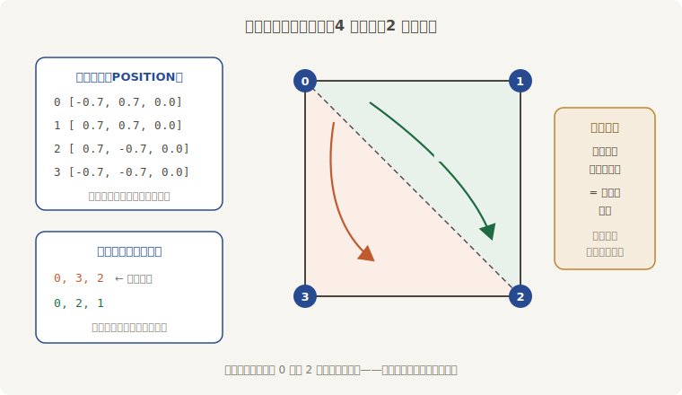
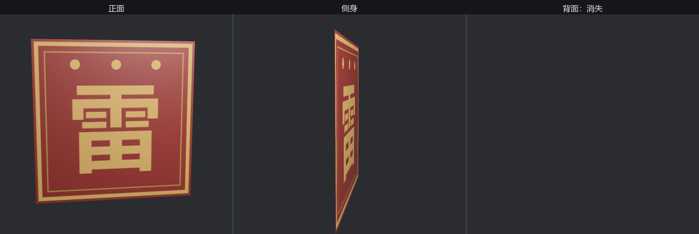

# 手搓坯子：顶点、索引与贴图坐标

得月楼门口要挂一面方旗。方旗用 `Rectangle` 一行就能铸，但老鲁拦下了：迟早要做料单上没有的形状，今天拿这面最简单的旗，把 Mesh 的内里看个通透。

拆开看，**Mesh 就是几张表**：一张**顶点**（vertex）清单，记录每个点的属性；一张**三角形**清单，规定哪三个点钉成一张面。一面方旗四个角、两个三角形，数据量小到能默写：



<span class="caption">Figure 21-7：一面方旗的两张清单——4 个顶点写一份，2 个三角形靠索引点名</span>

照图施工。`Mesh::new` 起一张空表，属性逐项插入：

```rust
{{#include ../../code/ch21-meshes/examples/listing-21-07.rs:build}}
```

<span class="caption">Listing 21-7：手搓班旗第一稿——只交了位置和三角形清单（examples/listing-21-07.rs）</span>

逐行过。`Mesh::new` 要两个参数：**`PrimitiveTopology::TriangleList`** 声明“索引三个一组、每组一张独立三角形”——最通用的拓扑（还有线段、三角形带等花样，3D 模型基本都用这种）；**`RenderAssetUsages::default()`** 是第 14 章库房细则的亲戚，管这份网格数据上传显卡后要不要在内存里留底——默认两边都留，想在运行时改顶点就别动它。

**`ATTRIBUTE_POSITION`** 是第一张属性表：每个顶点一个 `[x, y, z]`，写在网格自己的局部坐标里（实体的 `Transform` 再把它摆进世界——第 12 章的两本账）。**`with_inserted_indices`** 是三角形清单：`Indices::U32` 里每三个数钉一张面，数字是顶点的行号。0 号顶点被两张三角形都点了名——**这就是索引的本事**：顶点数据写一份，谁用谁点名，立省一份重复（25 万顶点的模型上省的就不是一份了）。

三个一组的**顺序**不是随便报的。从旗子正面（+Z 那侧）看，`0, 3, 2` 和 `0, 2, 1` 都是**逆时针**——这叫**缠绕顺序**（winding order），渲染器靠它分辨三角形的正反面：**逆时针报数的那一侧是正面**。报反了会怎样，这一节末尾亲眼看。

挂上看看。手搓的坯子照样走 `meshes.add` 入库——`Assets<Mesh>` 不问出身：

```console
cargo run -p ch21-meshes --example listing-21-07
```

```text
老鲁：头一面手搓的旗，挂上——这颜色怎么不太对劲？
```


<span class="caption">Figure 21-8：失聪的旗——灯就在斜前方，旗面却是一片死色</span>

旗子出来了，形状端正——颜色却是 21.1 节“没点灯”的那种死红。可这回灯明明就点在斜前方！更阴的是：**控制台一行警告都没有**。不报错、不提示，画面默默地病着——这比上一只编译错误难缠得多，记住这个症状。

## 法线：受光的前提

病根：受光材质算亮度，靠的是“表面朝向”与“光的方向”的夹角；而“朝向”是顶点的一项**属性**，名叫**法线**（normal）——一根垂直于表面、长度为 1 的箭头。我们的顶点表只交了位置，没交法线，着色器拿不到朝向，光照计算直接哑火，只剩环境光的兜底死色。**法线是受光的前提；忘写法线没有任何报错，只有一面聋掉的旗。**

旗面朝 +Z，四个顶点的答复一致。顺手把第三张属性表也补上——**UV**（贴图坐标）：每个顶点一个 `[u, v]`，声明“我这个角对应贴图上的哪一点”。约定：u 朝右、v 朝下，`(0, 0)` 是贴图的**左上角**：

```rust
{{#include ../../code/ch21-meshes/examples/listing-21-08.rs:build}}
```

<span class="caption">Listing 21-8（节选一）：旗子齐活——位置、法线、UV、索引四样俱全（examples/listing-21-08.rs）</span>

材质换上 21.3 节的雷字旗贴图，再挂一回（这次让它上转台慢慢转）：

```rust
{{#include ../../code/ch21-meshes/examples/listing-21-08.rs:spawn}}
```

<span class="caption">Listing 21-8（节选二）：手搓的坯子配贴图材质——与内置图元同一套挂法（examples/listing-21-08.rs）</span>

```console
cargo run -p ch21-meshes --example listing-21-08
```

```text
老鲁：旗子齐活，上转台——盯住它转到背面的那一刻。
```



<span class="caption">Figure 21-9：旗的正、侧、背——背面整张消失，这就是背面剔除</span>

正面（Figure 21-9 左）一切如愿：旗面受光了，雷字端端正正、铆钉在上——左上角的顶点 0 钉在贴图的 `(0, 0)`，**这次 UV 是我们自己写的**，上一节箱笼的“倒挂之谜”到此解开：不是引擎错了，是 `Cuboid` 出厂的 UV 就那么铺。

## 背面剔除

接着盯：旗子转过 90°，只剩一条线（旗面本来就没有厚度）；再转过去——**整张消失**。这不是 bug，是渲染器的省工铁律：**背面剔除**（backface culling）。靠缠绕顺序认出“这一面背对相机”的三角形，画都不画——对箱笼这种实心体，背面反正被正面挡着，白画一半纯属浪费。代价就是单张薄片转过去就没了；当初要是把索引报成顺时针，旗子就会反过来“只有背面可见”。真要双面旗，`StandardMaterial` 有 `cull_mode`、`double_sided` 两个字段管这事——第 24 章的清单见。

老鲁的识字课毕业：**顶点位置、索引、法线、UV，凿一只坯子的四样家什全齐了**。但法线的本事远不止“别忘写”——下一节它要正面回答 21.2 节的悬案。
