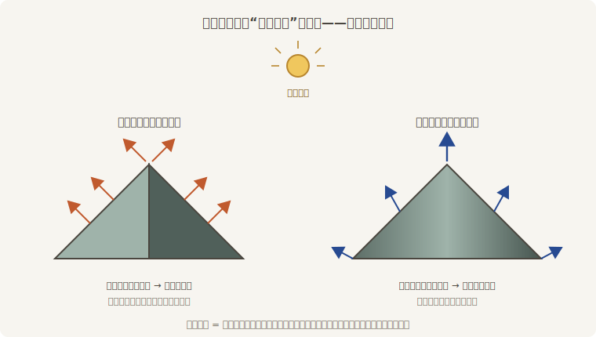
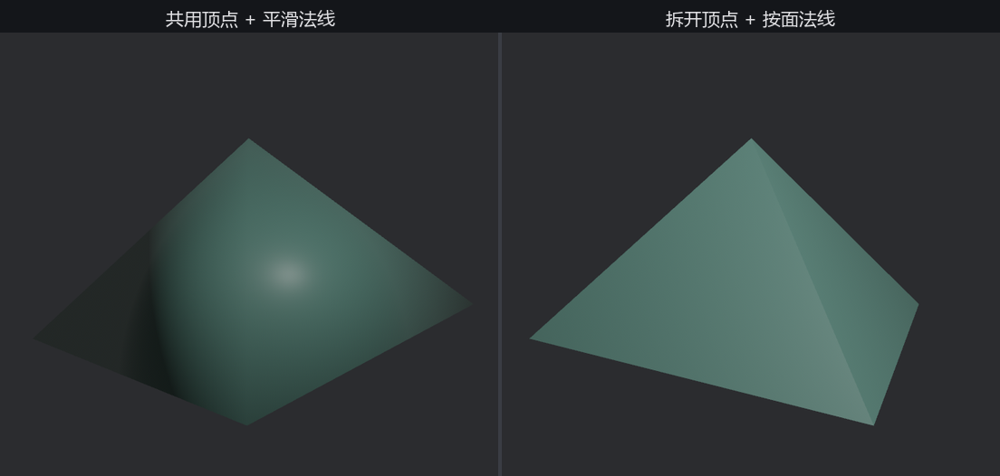

# 法线：受光的方向

得月楼的柱子要戴亭盖——四棱锥，料单上没有，老鲁手搓。五个顶点（四角加锥尖）、六张三角形（四面锥身、两片底）。这回法线不手写了，交给引擎代算，由此引出本章最后一桩公案。

先把上一节的认识说满。法线写在**顶点**上，而受光的是三角形面上的每一个**像素**——中间隔着一步：渲染器拿三角形三个角的法线，对面内每个像素**插值**（interpolate——按到三个角的远近加权混合）出一根属于这个像素的法线，再去和灯算夹角。这一步是理解下面一切现象的钥匙：



<span class="caption">Figure 21-10：法线是顶点对“我朝哪儿”的答复——逐像素的答案由三个角插值而来</span>

关键在：**顶点法线不必真的垂直于它所在的面**。它是顶点的一项自由属性，写什么是你的事——插值只管照办。于是同一份几何能撒出两种谎：

- 同面的三个角答复一致 → 插出来处处相同 → 整面一刀切的亮度，**棱锋利**；
- 相邻面共用顶点、答复被折中 → 亮度跨着棱连续渐变 → 棱在视觉上**消失**，平直的三角形拼出“弧面”的错觉。

口说无凭，铸两顶亭盖对比。几何完全相同，只差顶点共不共用：

```rust
{{#include ../../code/ch21-meshes/examples/listing-21-09.rs:build}}
```

<span class="caption">Listing 21-9：同一份几何的两种做法——共用顶点的平滑与拆开顶点的锋利（examples/listing-21-09.rs）</span>

两个帮手都来自 `Mesh` 自带的工具箱。**`with_computed_normals`** 代算法线，规矩是：网格带索引（顶点共用）就算**平滑法线**——每个顶点的答复取它参与的所有面的折中；不带索引就算**按面法线**（flat normals）——每张三角形三个角答复一致。**`with_duplicated_vertices`** 负责拆：把“5 个顶点 + 索引”展开成“每张三角形各揣三个私有顶点”，共用关系就此解除——拆完再代算，走的自然是按面那条路。

```console
cargo run -p ch21-meshes --example listing-21-09
```

```text
老鲁：一样的料一样的尺寸，左边那顶怎么看着像个馒头？
```



<span class="caption">Figure 21-11：同一份几何、同一盏灯——左边的法线在撒“我是弧面”的谎，右边按面直说</span>

左边那顶（Figure 21-11 左）正是插值在捣鬼：锥尖只有一份法线，四坡的折中——笔直朝天；底角的答复也被锥面和底面拉扯成斜的。逐像素插值后明暗成了连续渐变，亭盖看着像被吹了气。右边拆开顶点后，每坡自说自话，棱线当场归位。

## 两桩悬案一并结案

**立方体为什么 24 个顶点**。`Cuboid` 出厂的顶点表有 24 行——几何上明明只有 8 个角。现在答案显然：每个角被三张面共用，而三张面的法线（还有 UV）各不相同；顶点是**位置、法线、UV 的属性组合**，答案不同就得各立一行。8 个角 × 各拆 3 份 = 24。**顶点不是几何点，是属性组合**——这是读懂一切网格数据的钥匙。

**默认的球为什么浑圆**。反过来用谎言：球的铸模工序故意让相邻三角形**共用顶点法线**（顶点法线取的是真球面在该点的方向），插值把棱全部抹平——你看到的“圆”，一大半是法线的功劳。Figure 21-4 里 `uv(8, 5)` 的粗球轮廓边缘仍是折线（轮廓骗不了人，那是真实的几何边界），面内却已经圆润如真球——同一颗球上，几何与法线各管各的真实。

> 法线既然是任人书写的属性，就还能撒更精细的谎——不动几何，只在表面“画”出砖缝、锤痕的凹凸感。那叫法线贴图，`StandardMaterial` 的 `normal_map_texture` 字段伺候，第 24 章见。

亭盖完工，老鲁的木匠铺出师了。回得月楼，合龙。
