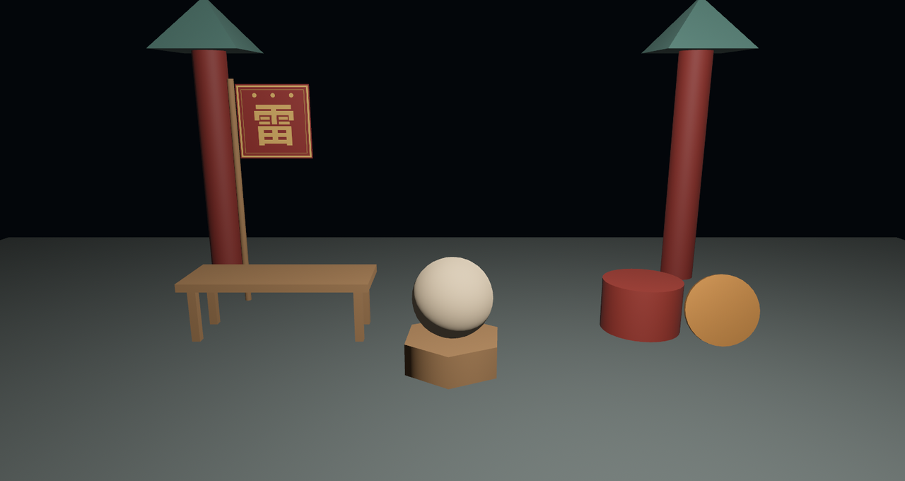

# 得月楼开张

工序齐了：铸形、上漆、点灯、手搓。`src/main.rs` 把整座园子的布景合龙——青砖台面、两根朱漆立柱戴着老鲁的亭盖、条案、大鼓、斜倚的拉丝铜锣、旗杆挑着手搓的雷字旗；台中央一只六棱墩当转台，绣球坐镇。所有零件都是本章的旧识，只挑两段有新意的看。柱头戴亭盖——手搓的坯子与内置图元混用，互相毫无隔阂：

```rust
{{#include ../../code/ch21-meshes/src/main.rs:roof}}
```

<span class="caption">Listing 21-10（节选一）：亭盖量产版——21.5 节的几何接 with_duplicated_vertices 流水线（src/main.rs）</span>

转台上的绣球预先调好三桶漆，存进一个资源当漆架——材质提货单和别的资产一样，攥在手里随时能用：

```rust
{{#include ../../code/ch21-meshes/src/main.rs:showcase}}
```

<span class="caption">Listing 21-10（节选二）：漆架——三桶漆先入库，提货单存进 Resource（src/main.rs）</span>

换漆系统是全场唯一的交互。看它怎么换：**不改材质内容，直接换提货单**——`MeshMaterial3d` 是普通组件，把里面的 `Handle` 换成漆架上的另一张，渲染器下一帧就照新漆画：

```rust
{{#include ../../code/ch21-meshes/src/main.rs:repaint}}
```

<span class="caption">Listing 21-10（节选三）：空格换漆——换的是整张提货单（src/main.rs）</span>

这一招和第 20 章瓦片掉釉改色的思路不同，值得品一下：三桶漆**预先**铸好，运行时只是倒腾 `Handle`——便宜（不产生新资产）、可逆（随时换回来）、还能多件道具共享同一桶。反过来，若想全场所有鎏金件一起变色，那就该改 `Assets<StandardMaterial>` 里的资产本体——第 14 章“改资产，所有提货单跟着变”的规矩，对材质一样灵。

开张：

```console
cargo run -p ch21-meshes
```

```text
老雷：得月楼头一晚，立体布景合龙——都转着看看。
场记：空格换漆，绣球眼下是素坯。
场记：绣球换鎏金。
场记：绣球换亮瓷。
```



<span class="caption">Figure 21-12：得月楼开张——本章全部工序的合影，绣球等着换漆</span>

按几下空格：素坯的哑光、鎏金的暖反光、亮瓷上一粒锐白高光——21.3 节材质墙上的三个格子，逐一披到同一只绣球身上。注意鎏金那一档在这盏孤灯下偏暗——金属还在等一个值得照的世界。

## 小结

- 3D 渲染的最小阵容是**四个实体**：`Camera3d` 机位、一盏灯、再加“形状 + 皮相”的实体——`Mesh3d` 与 `MeshMaterial3d<StandardMaterial>` 这对组件，正是第 15 章 `Mesh2d` 那套模式的升维，Mesh 资产两边通用
- **没灯不是全黑，是没有立体感**：`StandardMaterial` 是受光材质，没灯时只剩默认 `GlobalAmbientLight` 的无方向兜底；`ColorMaterial` 不受光，所以 2D 从来不用点灯
- **内置图元**一句 `meshes.add(形状)` 就铸（`From` 进 `Mesh`，`Mesh3d` 只收提货单不收货）；接 `.mesh()` 进铸模工序拧细分、尺寸；2D 图元用 `Extrusion` 挤出厚度
- `StandardMaterial` 头三根旋钮：`base_color` 固有色（可乘 `base_color_texture` 贴图）、`metallic` 金属感、`perceptual_roughness` 粗糙度；**非金属的高光是白的，光滑金属照出的是周遭世界**——世界空空，它就发黑
- **Mesh = 顶点属性表 + 三角形索引表**：位置、法线、UV 逐项插入，索引三个一组、从正面看逆时针缠绕；背面默认剔除
- 两个静默坑：**忘写法线**，旗子对灯失聪、一片死色，零警告；**忘了 `MeshMaterial3d`**（第 15 章的老相识），网格压根不画
- **法线决定受光**，且按三角形三角插值：共用顶点 + 平滑法线 = 把棱抹成弧面（球就这么圆的）；拆开顶点 + 按面法线 = 棱角锋利（立方体 24 顶点的原因）；`with_computed_normals` 按有无索引自动二选一

## 练习

1. **挪灯**：把得月楼的堂灯搬到台口正前下方（如 `(0.0, 1.5, 9.0)`），再跑一遍——观察影调如何翻天覆地，体会“材质没动，画面全变”的 PBR 解耦。
2. **双面旗**：班旗的背面现在是剔除的。再插入 4 个顶点（位置照抄、法线 `[0.0, 0.0, -1.0]`、UV 把 u 镜像），索引从正面看按顺时针报数——也就是从背面看逆时针，让旗子两面都有字。觉得手酸的话，去 `Mesh` 的工具箱里找找 `with_inverted_winding`。
3. **第十件坯子**：往全家福里加一件 `Extrusion::new(RegularPolygon::new(0.6, 6), 1.0)`，先猜它长什么样再跑。
4. **凿一顶六角亭盖**：把 21.5 节的四棱锥改成六棱锥——7 个顶点、12 张三角形，索引自己算。算缠绕顺序时，Figure 21-7 的口诀放手边。
5. **第四桶漆**：往漆架里加一桶 `emissive`（自发光）调高的漆，按出来看看——黑暗里它自己亮，但照不亮旁边的六棱墩。这根旋钮的脾气，第 24 章细说。

## 下一章

得月楼的布景立起来了，可那盏堂灯从开工到散场一动没动、一档没调——它挂在哪、多亮、什么颜色、投不投影子，全是没拆的封。还有材质墙左上角那颗黑着的镜面金属球，始终在等一个值得照的世界。下一章把灯的全家请上台：平行光、点光、聚光、环境光照——光照与阴影。
