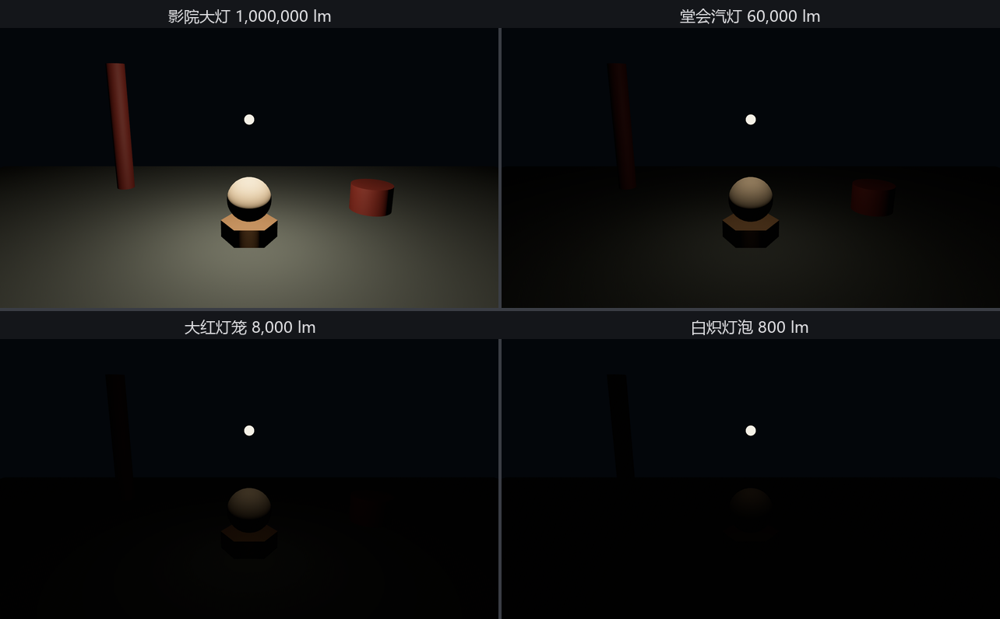

# 拆堂灯：PointLight

老烛上台的头件事不是点灯，是**拉闸**。第 21 章说过，引擎默认垫着一层 `GlobalAmbientLight` 兜底，忘点灯也能看见轮廓——但兜底的光会把灯的真实脾气搅浑。行家调灯，先清场：

```rust
{{#include ../../code/ch22-lighting/examples/listing-22-01.rs:grades}}
```

<span class="caption">Listing 22-1（其一）：老烛的灯谱——四档灯，一档一个流明数（examples/listing-22-01.rs）</span>

灯谱上的数字是**流明**（lumen，符号 lm）——光通量的单位，量的是一盏灯每秒往四面八方泼出去的光的总量。这不是随手编的游戏数值：Bevy 的光走物理单位，一只 800 流明的灯泡就是现实里六十瓦白炽灯的量，你可以拿着超市灯泡包装盒上的数字直接填进来。堂灯本尊：

```rust
{{#include ../../code/ch22-lighting/examples/listing-22-01.rs:lamp}}
```

<span class="caption">Listing 22-1（其二）：堂灯全参数——intensity、range、radius 三根旋钮（examples/listing-22-01.rs）</span>

三根旋钮各管一摊：

- **`intensity`**——流明数，光的总量。默认值一百万，注释里的名目叫“影院大灯”（`light_consts::lumens::VERY_LARGE_CINEMA_LIGHT`），正是第 21 章那盏没拆封的堂灯的出厂设置；
- **`range`**——光程，米。出了这个半径的东西**一点光都拿不到**，是一刀切断，不是渐暗。它是给渲染器省账用的：场上几十盏灯，每个像素只结算照得到自己的那几盏；
- **`radius`**——发光体的几何大小。点光在数学上是一个没有体积的点，`radius` 让它假装成一颗有半径的发光球，高光会跟着变胖——效果留给练习。

灯本身没有形状——`PointLight` 只发光，不画灯泡。画面里那颗看得见的小圆球，是挂在同一实体下的子网格（第 9 章的 `children!`），材质开了 `emissive` 自发光（第 21 章练习 5 摸过的那根旋钮，第 24 章细讲）：纯粹给人看的道具，不参与照明。

换档的系统平平无奇——改组件字段而已：

```rust
{{#include ../../code/ch22-lighting/examples/listing-22-01.rs:dial}}
```

<span class="caption">Listing 22-1（其三）：空格换档、R 收放光程——灯的参数就是组件字段（examples/listing-22-01.rs）</span>

跑起来，一路把档位按到底：

```console
cargo run -p ch22-lighting --example listing-22-01
```

```text
老烛：总闸拉了，全场就这一盏灯——先看它的真本事。
老烛：眼下是影院大灯，一百万流明。空格换档，R 收放光程。
老烛：换堂会汽灯——60000 流明。
老烛：换大红灯笼——8000 流明。
老烛：换白炽灯泡——800 流明。
```



<span class="caption">Figure 22-1：灯谱四档——每降一档，画面掉一层，最后一档只剩灯泡自己亮着</span>

Figure 22-1 的前三档都讲得通：流明砍一个数量级，画面暗一层，光池缩一圈。按 R 把光程收到 5 米，还能看见右边的大鼓被一刀切出光圈外——`range` 的脾气眼见为实。

蹊跷的是最后一档。**800 流明是现实里一只正经的六十瓦灯泡**，晚上拧开它，一间屋子亮亮堂堂；可在台上，它照出来的画面黑得几乎什么都没有——只有那颗自发光的灯泡珠子孤零零悬着。灯没坏，数值没错，物理也没错。

老烛看着一片漆黑的台面，不慌不忙地从怀里掏出那块测光表：“灯是真的，暗也是真的——是这台‘相机’的胃口，还按着白天的量在吃光。”

灯的账只记了一半。另一半在下一节。
