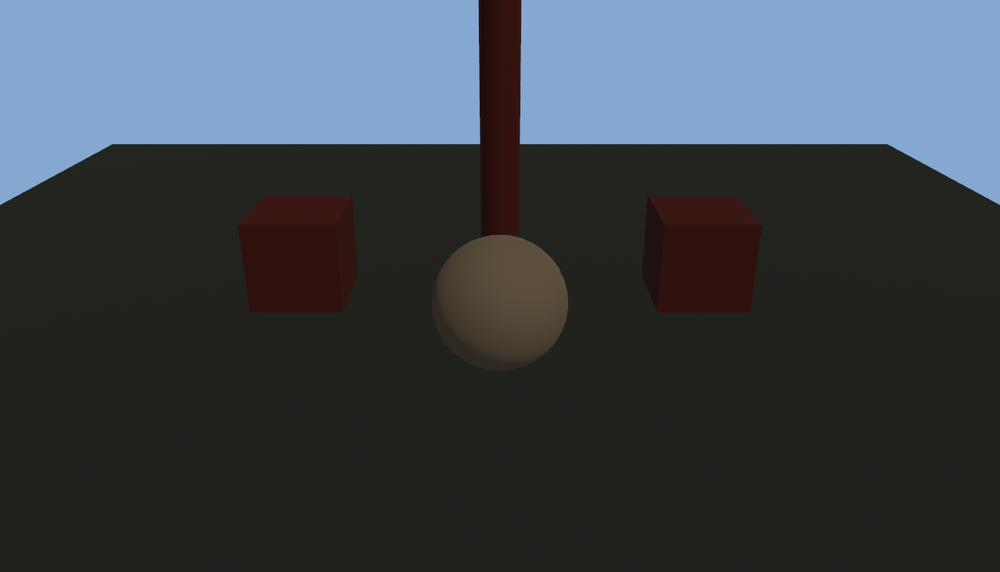

# 把太阳请上台

第 21 章那盏堂灯是 `PointLight`——从一个点向四周发光，照小场景够用，照整座园子就力不从心：近的晃眼、远的够不着。户外戏的主光该是**太阳**。太阳远到光线几乎平行，满台一视同仁，没有近强远弱。Bevy 管这种灯叫 `DirectionalLight`（平行光）。

掌灯的头一件事，是把堂灯换成一轮朝阳：

```rust
{{#include ../../code/ch22-lighting/examples/listing-22-01.rs:sun}}
```

<span class="caption">Listing 22-1：把太阳请上台——一盏平行光（examples/listing-22-01.rs）</span>

```console
cargo run -p ch22-lighting --example listing-22-01
```



<span class="caption">Figure 22-1：一盏平行光把整座园子照得通透——注意此刻还没有影子</span>

两行代码，两个要点：方向，和亮度。

## 方向是「旋转」，不是「位置」

平行光只有方向，没有位置——太阳在天上哪个点，对地上的影响没区别，要紧的是它**从哪个朝向照下来**。所以 `DirectionalLight` 的 `Transform` 里，**平移被彻底忽略，只有旋转管用**。第 13 章见过的 `looking_to(方向, 上)` 正好趁手：第一个参数就是「光往哪个方向射」。这里 `Vec3::new(-0.4, -0.8, -0.5)` 是斜向下、略偏台前——像清晨从左上方斜射进来的阳光。

这也是平行光给新人的头号坑：拿 `from_xyz` 挪光的位置，跑起来画面纹丝不动，因为平移根本不被读取。要改平行光，改的永远是它的旋转。

## 亮度的量纲：太阳记「勒克斯」

第 21 章卖了个关子——亮度到底拿什么单位记。答案是：Bevy 的灯用**真实物理量纲**，三种灯各记各的账。

平行光记的是 **illuminance（照度）**，单位**勒克斯（lux）**，意思是「打到表面上每平方米多少光」。这正是气象学描述天光的单位，于是 Bevy 在 `light_consts::lux` 里备好了一串实景常量，照着挑就行：

| 常量 | 勒克斯 | 大致情景 |
|---|---|---|
| `FULL_MOON_NIGHT` | 0.05 | 满月夜 |
| `CLEAR_SUNRISE` | 400 | 晴朗日出 |
| `OVERCAST_DAY` | 1 000 | 阴天 |
| `AMBIENT_DAYLIGHT` | 10 000 | 白昼漫射光（平行光默认值） |
| `DIRECT_SUNLIGHT` | 100 000 | 正午直射 |

Listing 22-1 用的是 `CLEAR_SUNRISE`——日出的清淡，配上偏暖的 `color`，正合「黎明」这一档。把它换成 `DIRECT_SUNLIGHT` 再跑，整座园子会骤然刺眼：这就是正午。

点光和聚光记的是另一笔账（**流明**），环境光与环境光照记第三笔（**坎德拉每平方米**）——各自到该出场时再说。现在只需记住一句：**Bevy 的灯是有物理量纲的，别拿一个小数当「随便调亮一点」**，10 000 和 100 000 差着一个白昼与正午。

太阳上了台，可台面干干净净——立柱底下、木箱旁边，一道影子也没有。下一节把影子打开。
