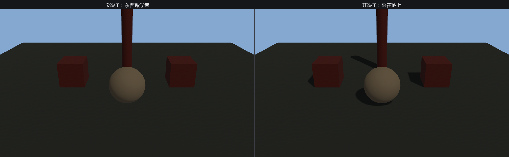

# 开影子

Figure 22-1 哪儿不对劲？立柱杵在台面上，脚下却没有影子——东西像浮着的。这不是 bug：**Bevy 的灯默认不投影子**。算影子要额外渲染一遍场景（从灯的视角画一张深度图），开销不小，所以得由你点头。点头只要一行：

```rust
{{#include ../../code/ch22-lighting/examples/listing-22-02.rs:sun_shadow}}
```

<span class="caption">Listing 22-2：给太阳加一行 `shadows_enabled: true`（examples/listing-22-02.rs）</span>

```console
cargo run -p ch22-lighting --example listing-22-02
```



<span class="caption">Figure 22-2：同一座园子——左边没影子，东西像浮着；右边开了影子，全都踩在了地上</span>

就这一行。立柱拖出一道长影，木箱压住自己的影子，整座园子一下「落地」了。影子不只是装饰：它是人眼判断「东西离地多高、彼此前后多远」最硬的线索，缺了它，再精确的摆位也显得飘。

`shadows_enabled` 是每盏灯各自的开关——`DirectionalLight`、`PointLight`、`SpotLight` 都有这个字段，默认全是 `false`。一个常见做法是：**只给主光开影子，副光保持关闭**。影子是按灯计费的，三盏灯全开，就要画三遍深度图；主光投影定调子，副光只管补亮，没必要个个都掏这份开销。

那道影子是怎么来的？开了 `shadows_enabled`，引擎会从太阳的朝向把全场景渲进一张**阴影贴图（shadow map）**——本质是一张深度图，记下「从灯看过去，每个方向最近的遮挡物有多远」。着色时拿这张图一比：某个像素如果比贴图里记的更远，说明它被挡住了，就是在影子里。

这张贴图分辨率有限，比对又是浮点数，误差难免——下一节就来收拾这份误差闹出的乱子。
