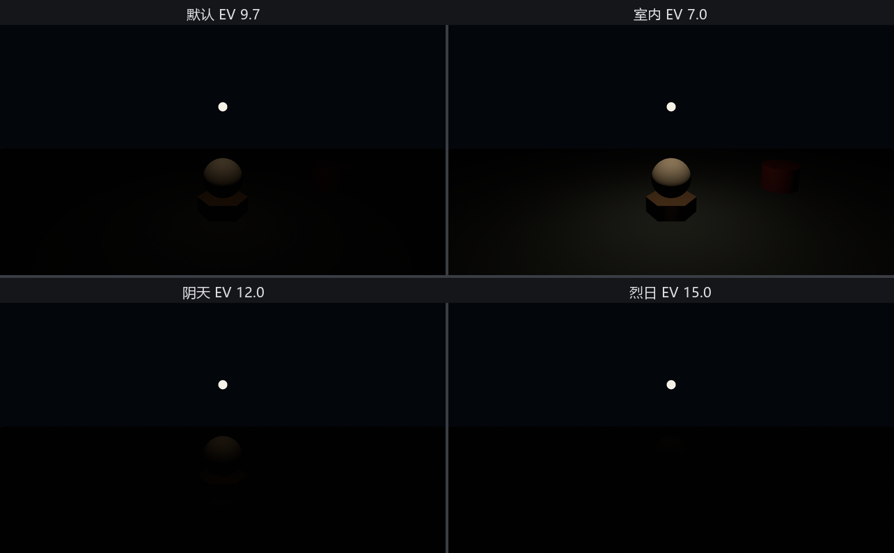

# 老烛的测光表：Exposure

摄影师都懂 22.1 结尾那一幕：夜里拍照，照片黑成一团，不等于屋里真的黑——是相机**曝光**没跟上。胶片时代靠光圈、快门、感光度三件套凑出进光量；Bevy 把这三件套折成一个数，挂在相机上：

```rust
{{#include ../../code/ch22-lighting/examples/listing-22-02.rs:camera}}
```

<span class="caption">Listing 22-2（其一）：Exposure 是相机组件——不挂就是默认档（examples/listing-22-02.rs）</span>

**`Exposure`** 的唯一字段 `ev100` 是摄影行话“EV100”——以 ISO 100 为基准的曝光值。记两条脾气就够用：

- **数越大，吃光越少**。每加 1，进光量砍半；每减 1，翻倍。EV 15 是烈日当空的口径，EV 5 上下才是烛光晚餐；
- **默认值 9.7**，一个对标 Blender 默认曝光的折中档，大致相当于“户外明亮日子”的口径。

引擎给了几档现成的常数，老烛的测光表就拨这几档：

```rust
{{#include ../../code/ch22-lighting/examples/listing-22-02.rs:presets}}
```

<span class="caption">Listing 22-2（其二）：测光表的四档——全是 Exposure 上的关联常数（examples/listing-22-02.rs）</span>

场上还是那盏灯——22.1 的堂灯拨在大红灯笼档，8000 流明，一整晚不碰。按 E 只换表：

```rust
{{#include ../../code/ch22-lighting/examples/listing-22-02.rs:meter}}
```

<span class="caption">Listing 22-2（其三）：E 键拨曝光——改的是相机，不是灯（examples/listing-22-02.rs）</span>

```console
cargo run -p ch22-lighting --example listing-22-02
```

```text
老烛：还是那盏 8000 流明的大红灯笼，一整晚都不碰它。
老烛：按 E，我换的是测光表，不是灯。
老烛：曝光拨到室内档，EV 7。
老烛：曝光拨到阴天档，EV 12。
老烛：曝光拨到烈日档，EV 15。
老烛：曝光拨到默认（对标 Blender）档，EV 9.7。
```



<span class="caption">Figure 22-2：同一盏灯，四档曝光四种夜——灯从头到尾没动过一根汗毛</span>

Figure 22-2 里灯的参数一位小数都没变，画面却从“黑咕隆咚”到“亮亮堂堂”再回“黑透”。EV 7 是引擎注释里的“室内”口径，正好接得住一盏 8000 流明的灯笼——这就是 22.1 的谜底：**画面的亮暗从来是灯和相机合谋的结果**。800 流明的白炽灯泡不是不亮，是默认那档“户外白天”的曝光根本瞧不上它；真要拍，把 `ev100` 再往下拨一两档就是了。

这笔账后面每一节都要用：

- 调光先对表——**先定曝光基准，再调灯的数值**，顺序反了会把物理正确的灯全拧成离谱的数；
- 各家单位各有量纲：点光聚光用流明，太阳用勒克斯（下下节），环境光和天幕用坎德拉每平方米（cd/m²，亮度单位——后文出场时再各自交代）。数值差几个数量级都正常，曝光是把它们拉到同一张画面上的那杆秤。

> **物理相机三件套**：`Exposure::from_physical_camera(PhysicalCameraParameters { .. })` 能按光圈 f 值、快门秒数、ISO 感光度算出 `ev100`——给拍过照的读者一条近路，官方 `3d/lighting` 示例整场都用它。

灯有了亮度，相机有了口径。下一节请第二种灯上台——它不满场泼光，只认准一个人。
