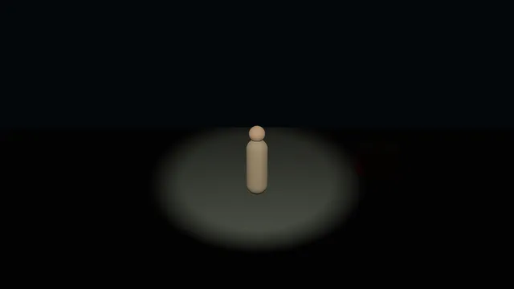
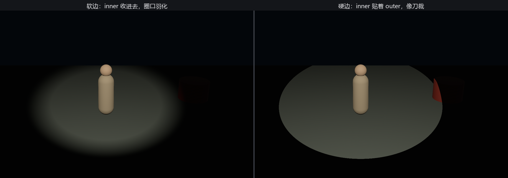

# 追光：SpotLight

夜戏的规矩：角儿在哪，光在哪。干这活的灯叫**追光**——一只点光装进不透光的罩子，只留一个口，光全从锥形的口里出去。Bevy 里它叫 **`SpotLight`**（聚光灯）：

```rust
{{#include ../../code/ch22-lighting/examples/listing-22-03.rs:spot}}
```

<span class="caption">Listing 22-3（其一）：追光吊在台口上方——光锥的口径由两个角度定（examples/listing-22-03.rs）</span>

和 `PointLight` 比，多了两个角度、一条脾气：

- **`outer_angle`**——光锥的外沿（弧度）。出了这个角度，一点光没有；
- **`inner_angle`**——内沿。内沿以里是全亮，从内沿到外沿，光顺滑地衰减到零——两个角的差就是圈口那圈“羽化”；
- **方向不是参数**——聚光沿着自己 Transform 的 **−Z** 照，跟相机、跟下一节的平行光一个规矩。要瞄谁，摆 Transform 就是了。

“摆 Transform”正是追光的全部工作。角儿走圆场，灯每帧把 −Z 对准他——第 12 章的 `look_at` 一行搞定：

```rust
{{#include ../../code/ch22-lighting/examples/listing-22-03.rs:aim}}
```

<span class="caption">Listing 22-3（其二）：追光跟人——每帧 look_at，瞄准就是摆姿态（examples/listing-22-03.rs）</span>

光圈的松紧、圈口的软硬，运行时随手拧：

```rust
{{#include ../../code/ch22-lighting/examples/listing-22-03.rs:tune}}
```

<span class="caption">Listing 22-3（其三）：[ ] 收放外沿，I 在硬边与软边之间切换（examples/listing-22-03.rs）</span>

```console
cargo run -p ch22-lighting --example listing-22-03
```

```text
老烛：追光就位。左右键请角儿走圆场，光自己跟。
老烛：[ ] 收放光圈，I 换硬边软边。
老烛：内沿贴上外沿——硬边光，圈口像刀裁的。
老烛：光圈收到 0.26 弧度。
老烛：光圈收到 0.20 弧度。
```

按住左右键让角儿来回走两趟——光池寸步不离，这一手“运动本身”是追光的看家戏：



<span class="caption">Figure 22-3：追光跟人——角儿走圆场，look_at 让光寸步不离（动图）</span>

再按 I 对比圈口的两种性格：



<span class="caption">Figure 22-4：软边与硬边——inner_angle 收进去是羽化，贴着 outer_angle 是刀裁</span>

台口的大鼓是个好参照：软边时光圈扫过它，是渐渐亮起来；硬边时是“咔”地一下切进光里。舞台上软边用来抒情，硬边用来审问——引擎不管戏路，只认这两个角度的差。

`range` 与 `intensity` 的语义同点光（流明计量、出程无光），只是追光把同样的流明全拢进一个小锥里，锥里的照度便高得多——这盏 300 万流明的追光在 12 米开外还能打出瓷实的光池，靠的就是“不乱泼”。

三种灯到齐了两种，都还是“场子里的灯”。下一节请的那位，在场子外九千万公里。
