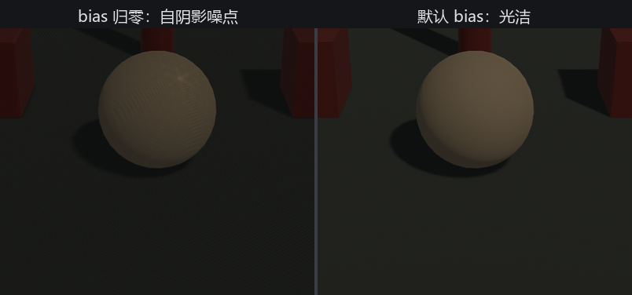

# 驯服影子：acne 与三把旋钮

上一节那张阴影贴图的误差会怎么发作？把太阳的两个 bias（偏置）都按到 0，亲眼看看：

```rust
{{#include ../../code/ch22-lighting/examples/listing-22-03.rs:acne}}
```

<span class="caption">Listing 22-3：把 bias 调成 0，shadow acne 当场发作（examples/listing-22-03.rs）</span>

```console
cargo run -p ch22-lighting --example listing-22-03
```



<span class="caption">Figure 22-3：放大看台中绣球——左边 bias 归零，受光面爬满自阴影噪点（shadow acne）；右边默认 bias，光洁如初</span>

球的受光面爬满了斜向的暗纹，像蒙了层脏。这就是 **shadow acne（自阴影痤疮）**：阴影贴图分辨率有限，一个贴图像素要覆盖表面上一小片，比对深度时这片里总有些点「算出来比记录的更远」，于是把自己误判成「在影子里」，投出一层细碎的自阴影。

## 旋钮三：bias

治 acne 的主力是 **bias**，思路是「比对时手松一点」：判断遮挡前，先把深度推开一丁点缓冲，让表面不至于误伤自己。`DirectionalLight` 有两个 bias 字段：

- `shadow_depth_bias`（默认 `0.02`）：沿光线方向推开的深度量；
- `shadow_normal_bias`（默认 `1.8`）：沿表面法线方向缩一点，对付斜射面尤其有效。

默认值（0.02 / 1.8）是 Bevy 给大多数场景调好的，Listing 22-2 用的就是它们，所以那张图干干净净。把它们归零就退化成 Figure 22-3 左边的样子。反过来，bias 也不能贪大：推过头，影子会从投影物脚下「脱开」一道缝，像物体浮在自己的影子上——这毛病叫 **peter-panning（彼得潘效应，影子跟人脱了钩）**。bias 的活就是在 acne 与 peter-panning 之间找那个甜区，默认值通常已经够好，真要调，小步挪。

## 旋钮一与旋钮二：分辨率与级联

误差的根子在「一个贴图像素覆盖太大一片表面」。另两把旋钮就从这里下手：

```rust
{{#include ../../code/ch22-lighting/examples/listing-22-04.rs:tuned}}
```

<span class="caption">Listing 22-4：调影子的三把旋钮，一处看全（examples/listing-22-04.rs）</span>

**旋钮一是阴影贴图的分辨率**，由资源 `DirectionalLightShadowMap` 管，默认 `2048`。同一片范围摊到更多像素上，每个像素覆盖的表面更小，误差自然更细、边缘更利落。代价是显存与带宽——`4096` 是 `2048` 的四倍开销。它是全局资源（`.insert_resource(...)`，见 Listing 22-4 顶部），一改改的是所有平行光。注意它不在 prelude 里，要从 `bevy::light` 引入。

**旋钮二是级联（cascade）**。平行光要覆盖整座园子，可镜头跟前的立柱和远处的山，对阴影精度的需求天差地别。级联的办法是把视锥按距离切成几段，**近段用一整张贴图、远段再用一整张**——精度集中在你最看得清的近处，远处糊一点没人计较。`CascadeShadowConfigBuilder` 就是配这个的：`num_cascades` 切几段（默认 4，WebGL2 上只能 1），`maximum_distance` 管到多远。它产出一个 `CascadeShadowConfig` 组件，和灯挂在同一个实体上。`DirectionalLight` 其实默认就带了一个级联配置（required component 补的），这里只是把它显式拧到手里。

三把旋钮的分工记一句话就够：**bias 修自阴影的脏，分辨率与级联决定影子边缘有多利落**；日常先信默认值，画面真出毛病了，对着这三个旋钮逐一试。

影子收拾干净，主光这一摊就齐了。入夜，太阳落山，该轮到灯笼和追光上场了。
