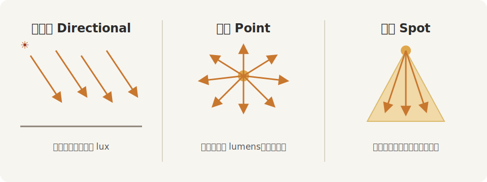
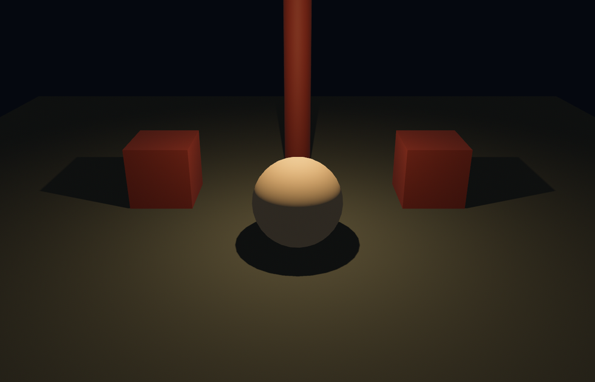
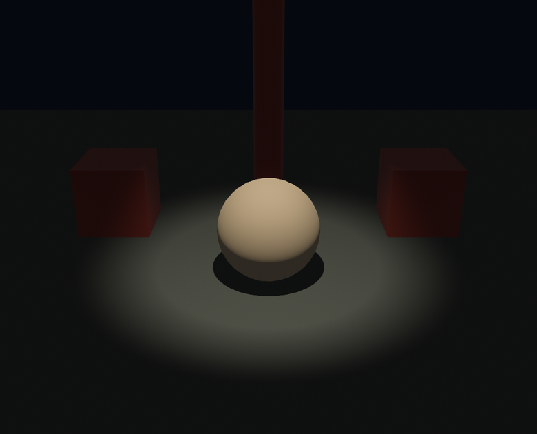

# 点光与聚光

太阳落山，户外那盏平行光照不到室内的角落。入夜的园子靠两样近场光撑着：满台游走的**灯笼**，和罩定角儿的**追光**。它们对应 Bevy 的另两种灯——`PointLight` 与 `SpotLight`。先把三种灯的发光几何摆在一处看清：



<span class="caption">Figure 22-4：三种灯的发光几何——平行光满台平行，点光四散放射，聚光收成一束</span>

## 灯笼：PointLight

`PointLight`（点光源）从一个点向四面八方发光，像一盏不带罩的灯泡——第 21 章那盏堂灯就是它。和平行光不同，点光**有位置**（`Transform` 的平移这下管用了），而且**越远越暗**：

```rust
{{#include ../../code/ch22-lighting/examples/listing-22-05.rs:lantern}}
```

<span class="caption">Listing 22-5：夜里的一盏灯笼（examples/listing-22-05.rs）</span>

```console
cargo run -p ch22-lighting --example listing-22-05
```



<span class="caption">Figure 22-5：一盏灯笼——光从一点泼开，中心亮、边缘暗，超出射程便沉入夜色</span>

点光的亮度记的是 **intensity（光强）**，单位**流明（lumens）**——描述的是「这盏灯一共发多少光」，和家用灯泡包装上印的那个流明是同一个量。默认值大得吓人（`1_000_000`，相当于一盏超大影视灯），照小场景要往下调，这里用了 `600_000`。

`range`（射程，默认 20）是它够得着的最远距离：超出之外，引擎干脆当它不发光，省下计算。所以 `range` 不是物理意义上的衰减边界，而是一道**性能闸**——调小了能省，但调得比实际照亮范围还小，光会被生生截断、留下一圈硬边。还有个 `radius`（默认 0），把灯设想成一个有体积的发光球，主要影响高光的形状，日常留默认即可。

## 追光：SpotLight

`SpotLight`（聚光灯）是把点光关进一个圆锥里——只朝一个方向、在一定张角内发光，正是戏台追光的样子。它**既有位置又有朝向**：位置同点光，朝向同平行光，靠 `Transform` 的旋转决定光锥指哪（`looking_at` 一步到位，把锥口对准目标）：

```rust
{{#include ../../code/ch22-lighting/examples/listing-22-06.rs:spot}}
```

<span class="caption">Listing 22-6：台口的一盏追光，罩定台中央的绣球（examples/listing-22-06.rs）</span>

```console
cargo run -p ch22-lighting --example listing-22-06
```



<span class="caption">Figure 22-6：一盏追光——光收在圆锥里，落地是一个内亮外柔的光斑</span>

追光的亮度也记**流明**，`range`、`radius` 同点光。多出来的是两个角（弧度）：

- `outer_angle`（外锥角，默认 π/4）：光锥的张口，到这儿光彻底归零；
- `inner_angle`（内锥角，默认 0）：这个角以内全亮，从内角到外角光柔和地衰减下去。

内外角拉开，光斑边缘就柔；让 `inner_angle` 逼近 `outer_angle`，边缘就硬得像一把手电。Listing 22-6 用 π/12 到 π/7 的窄锥，罩出一个干净的小光斑。

三种灯的亮度量纲到这儿凑齐了：**平行光记 lux（照度），点光与聚光记 lumens（光强）**。还差最后一种——那层从第 21 章就在兜底的、没有方向的光。
