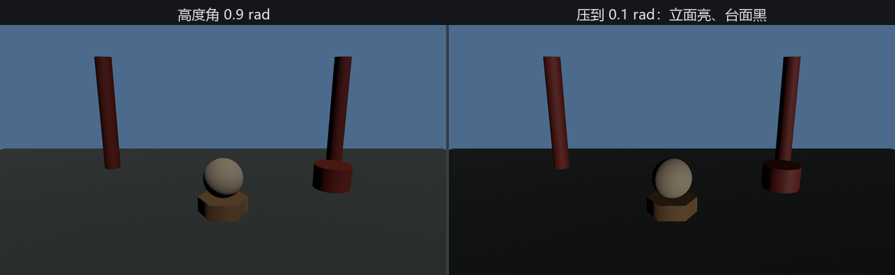

# 请太阳：DirectionalLight

露天园子最大的灯不用花钱：太阳。它离得太远，照到台上的光线彼此平行——于是引擎给它单开一类：**`DirectionalLight`**（平行光/方向光），只有方向，没有位置。

```rust
{{#include ../../code/ch22-lighting/examples/listing-22-04.rs:sun}}
```

<span class="caption">Listing 22-4（其一）：请太阳——照度以勒克斯计，方向由旋转定（examples/listing-22-04.rs）</span>

两处与点光不同：

- 亮度字段叫 **`illuminance`**（照度），单位**勒克斯**（lux）——落到每平方米地面上的光通量。太阳没法谈“总共发多少流明”（那是个天文数字），有意义的是“照到台上每平米多少”；
- 没有 `range`，也不看 `Transform` 的平移——**只有旋转有意义**，光沿实体的 −Z 方向平行地铺满整个世界。

照度的数值同样与现实对表，`light_consts::lux` 里备好了一排常数：

| 常数 | 勒克斯 | 对应场景 |
|---|---|---|
| `MOONLESS_NIGHT` | 0.0001 | 无月的阴夜（星光） |
| `FULL_MOON_NIGHT` | 0.05 | 晴夜满月 |
| `CIVIL_TWILIGHT` | 3.4 | 民用曙暮光的下限 |
| `LIVING_ROOM` | 50 | 家里客厅 |
| `OVERCAST_DAY` | 1000 | 阴天；也是典型的摄影棚棚光 |
| `AMBIENT_DAYLIGHT` | 10000 | 白昼天光（非直晒）——**默认值** |
| `DIRECT_SUNLIGHT` | 100000 | 烈日直晒 |
| `RAW_SUNLIGHT` | 130000 | 大气层外的原始日光（22.10 节的主角） |

## 推日头

左右键改的只是旋转——把高度角从头顶往地平线压：

```rust
{{#include ../../code/ch22-lighting/examples/listing-22-04.rs:push}}
```

<span class="caption">Listing 22-4（其二）：推日头——平行光的“动”，全在旋转里（examples/listing-22-04.rs）</span>

```console
cargo run -p ch22-lighting --example listing-22-04
```

```text
老烛：阴天棚光，一千勒克斯。左右键推日头，空格换天色。
老烛：M 键把太阳这实体搬走二十米——你猜画面动不动。
```



<span class="caption">Figure 22-5：太阳的高度角——高角照顾台面，贴地只照立面</span>

Figure 22-5 右边那一幕值得多看一眼：日头压到贴地，**立面亮了，台面反而黑了**。平行光的强度处处一样，变的是入射角——躺平的台面在斜照下每平米摊到的光少得可怜，立着的柱子却吃了满脸。摄影里的“黄金时刻”、游戏里的清晨黄昏氛围，物理上就是这一笔账。

## 搬不动的太阳

M 键把太阳实体的 `translation.x` 加二十米：

```rust
{{#include ../../code/ch22-lighting/examples/listing-22-04.rs:relocate}}
```

<span class="caption">Listing 22-4（其三）：搬太阳——平移对平行光毫无意义（examples/listing-22-04.rs）</span>

```text
场记：太阳搬到 x = 20 了——画面一根汗毛都没动。
```

场记没夸张：搬家前后的两帧截图**逐像素一致**（写作时真比过）。平行光是“无穷远处的方向”，把实体从这挪到那，方向不变，光就不变。反过来记：想动太阳，只有旋转这一条路。

空格换天色的部分（Listing 22-4 的 `grade` 系统，代码从略）从阴天一路加到烈日直晒——十万勒克斯下画面惨白刺眼。这回你已经知道该找谁了：不是灯坏了，是 EV 9.7 的口径接不住烈日，测光表拨到 15 就是了（22.2 节）。

太阳的影子且慢——影子是 22.6 的正戏。先把最后一种灯请进门，它是四兄弟里唯一“有面积”的。
