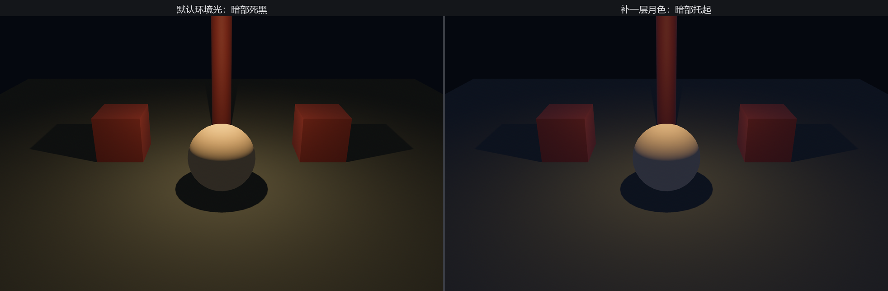

# 环境光

回到 Figure 22-8 那盏灯笼：灯泼到的地方亮，泼不到的角落不是纯黑，还能看出个轮廓。这层「兜底的光」第 21 章见过——`StandardMaterial` 是受光材质，没有直接光照到的面，靠的就是它。现在把它讲全。

现实里没有哪个角落是绝对黑的：阳光打到墙上、地上，又漫反射出来，填进每一道背光的缝。逐次模拟这种弹来弹去太贵，于是引擎用一种廉价的近似顶上：**环境光（ambient light）**——一种来自四面八方、没有方向的恒定弱光，给每张面都加同样一份底色。它撑不起立体感（没方向，每张面领到的一样多），但能保证暗部不死黑。

## 全局那一份：GlobalAmbientLight 资源

引擎默认就插了一个环境光资源 `GlobalAmbientLight`（白色，亮度 80）。它是个资源，整座世界共一份。把它换掉，就能给暗部定调：

```rust
{{#include ../../code/ch22-lighting/examples/listing-22-07.rs:ambient}}
```

<span class="caption">Listing 22-7：把全局环境光换成一层偏蓝的月色（examples/listing-22-07.rs）</span>

```console
cargo run -p ch22-lighting --example listing-22-07
```



<span class="caption">Figure 22-10：左边只有默认环境光，暗部近乎死黑；右边补一层偏蓝月色，夜色立刻通透</span>

环境光的亮度字段叫 `brightness`，量纲是**坎德拉每平方米（cd/m²）**——这是本章第三种、也是最后一种量纲，环境光照（下一节）也用它。`color` 给这层光染色：现实中夜里的环境光偏冷（天幕的散射蓝），所以这里调成蓝调，比纯白更可信。

环境光是性价比极高的一根旋钮：**几乎零开销**，却能立刻决定暗部的「黑到什么程度、什么色温」。调光照时，它通常是定完主光之后第二个去拧的。

## 还能挂到单个相机上

`GlobalAmbientLight` 是全局资源；如果只想压暗某一台相机的环境光（比如分屏里一边是白天一边是地牢），可以把 **`AmbientLight` 组件**挂到那台 `Camera3d` 上——字段和资源一模一样（`color`、`brightness`），但只管它所在的那台相机，盖过全局那一份。

这里藏着一个容易踩的坑：**全局的叫 `GlobalAmbientLight`，是资源；单相机的叫 `AmbientLight`，是组件**。名字像、字段同，身份两样。要是想调全局，却顺手把组件 `AmbientLight` 塞进了 `insert_resource`：

```rust
{{#include ../../code/ch22-lighting/no-compile/listing-22-08.rs:wrong}}
```

<span class="caption">Listing 22-8（编译失败）：把组件当资源插（no-compile/listing-22-08.rs）</span>

编译器当场拦下，错得明明白白：

```text
error[E0277]: `bevy::prelude::AmbientLight` is not a `Resource`
   |
14 |         .insert_resource(AmbientLight {
   |          --------------- ^ invalid `Resource`
   |
   = help: the trait `Resource` is not implemented for `AmbientLight`
```

这是 Bevy 类型系统的一次拦截：`insert_resource` 要求参数实现 `Resource` trait，而 `AmbientLight` 只 derive 了 `Component`。改全局，要么 `insert_resource(GlobalAmbientLight { .. })`，要么把这个 `AmbientLight` 挂到相机实体上去——看你要管全局还是管一台。

灯的全家到齐了：平行、点、聚、环境。可材质墙左上角那颗镜面金属球，至今还黑着。下一节给它一个世界。
