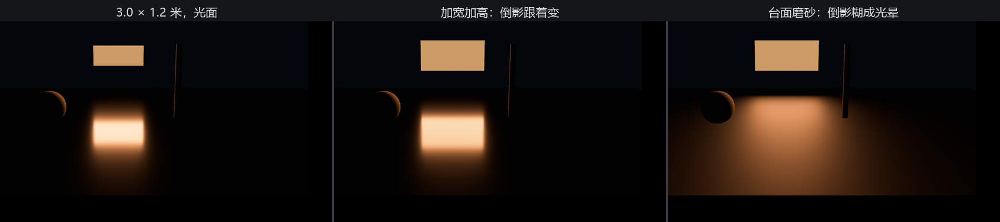
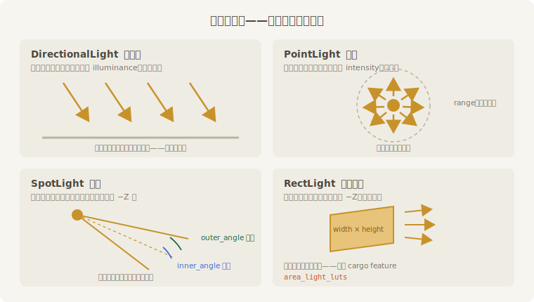

# 灯箱：RectLight

前三种灯在数学上都是“点”或“方向”。第四种不一样：**`RectLight`**（矩形面光）是一整块**面**在发光——现实里的灯箱、柔光箱、亮着的窗户，都是它。老烛给得月楼定制的匾额灯箱，正好用它开张。

先过门槛。本章开头 `Cargo.toml` 里点名的 `area_light_luts`，就是为它准备的：面光的亮度计算靠一套预烘焙的查找表（look-up table，LUT），这套表不在默认 feature 里，得自己开。

> **不开会怎样？** 这是个值得记住的坑：**不开也能编译、能跑，不报错、不告警——但 `RectLight` 一点光都发不出来**。引擎在缺表时垫了一张占位表，结果就是灯箱亮着（那是我们自己贴的发光皮），台下却漆黑一片。写作时实测过：把 feature 摘掉重跑，除了匾额本身，整个画面黑透，控制台一声不吭。灯“坏”得这么安静，查起来最费人——遇到面光不亮，先查 feature。

灯箱立在台后，当一块会发光的匾：

```rust
{{#include ../../code/ch22-lighting/examples/listing-22-05.rs:rect}}
```

<span class="caption">Listing 22-5（其一）：灯箱——RectLight 躺在自己的 XY 平面里，朝 −Z 发光（examples/listing-22-05.rs）</span>

几件事：

- **几何**：矩形躺在实体自己的 XY 平面里，`width` 沿 X、`height` 沿 Y，光朝自己的 **−Z** 出（又是这个方向的规矩）。想让匾冲着观众席，整个实体绕 Y 转 π；
- **亮度**：还是流明——整块面往外泼的总量；
- **发光皮**：`RectLight` 和点光一样不画自己，可见的匾面是子实体上的矩形网格。注意它的材质用了 `unlit: true`（不受光直出本色）——匾面恰好贴在光源平面上，让它再去吃自己发的光，区域光的高光积分会在源平面上炸出一脸噪线（写作时踩过，一屏青色划痕）。`unlit` 一了百了。子实体还得自己再绕 Y 转一次 π——父实体转身时把矩形的正面也带得背对观众了，背面剔除可不讲情面（第 21 章）。

台面这回上了金属大漆（`metallic: 1.0`、低粗糙度）当昏暗的镜子，方向键改宽高，R 换粗糙度：

```rust
{{#include ../../code/ch22-lighting/examples/listing-22-05.rs:resize}}
```

<span class="caption">Listing 22-5（其二）：方向键改宽高——发光皮跟着同步缩放（examples/listing-22-05.rs）</span>

```console
cargo run -p ch22-lighting --example listing-22-05
```

```text
老烛：灯箱挂上了。方向键改宽高，R 换台面的粗细。
老烛：灯箱改到 3.8 × 1.2 米。
老烛：灯箱改到 3.8 × 1.8 米。
老烛：台面粗糙度 0.50。
```



<span class="caption">Figure 22-6：镜面里的灯箱——面光的“形状”写在反射里，粗糙度决定它糊到什么程度</span>

面光的看点全在**反射**里：光面大漆上，倒影就是一块规规矩矩的矩形，宽高一改，倒影跟着变——这是点光聚光给不了的（它们的倒影永远是一粒高光点）。按 R 把台面拧粗糙，矩形立刻糊成一团光晕：第 21 章材质墙上“粗糙度决定高光胖瘦”的那笔账，在面光下看得最真切。

一条脾气要记牢：**`RectLight` 不投影子**。台口那根立杆就杵在灯箱正前方，台面上却干干净净——面光的影子在实时渲染里贵得离谱，引擎干脆不接这单。要影子，用聚光配合；要柔光，面光才是正主。

## 灯的全家福

四种灯到齐，合个影：



<span class="caption">Figure 22-7：灯的全家福——光从哪来、往哪去、按什么记账</span>

| 灯 | 亮度字段 | 单位 | 方向/位置 | 影子 |
|---|---|---|---|---|
| `DirectionalLight` | `illuminance` | 勒克斯 | 只有方向（−Z） | 有（级联） |
| `PointLight` | `intensity` | 流明 | 只有位置 | 有（六面） |
| `SpotLight` | `intensity` | 流明 | 位置 + 方向（−Z） | 有 |
| `RectLight` | `intensity` | 流明 | 位置 + 朝向（−Z）+ 宽高 | **无** |

表里最右一列还全是空头支票——四盏灯到现在一个影子没投过。下一节兑现。
