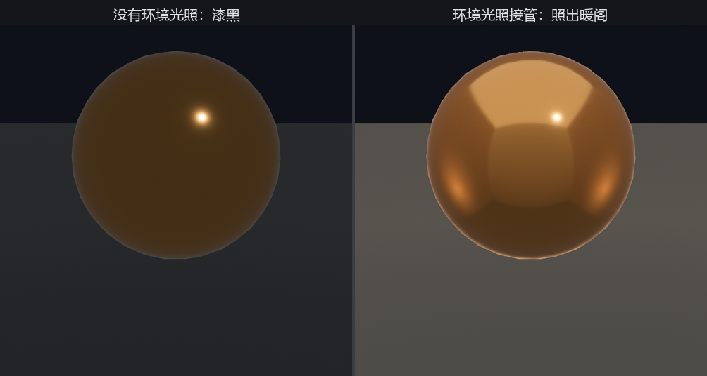

# 给金属一个世界

第 21 章材质墙左上角那颗镜面金属球，从头到尾黑着脸。当时埋了句话：「光滑金属照出的是周遭世界，世界空空，它就发黑。」灯都点齐了，它还是黑的——因为问题不在灯的多少，在金属的脾气。

非金属（木头、石头）的高光是白的，给它一盏灯就有光斑。金属不一样：它几乎不漫反射，眼睛看到的金属表面，**全是它反射出来的周遭环境**。一面镜子在黑屋里就是黑的，不管屋里点了多亮的灯——灯本身那个小点它照得出来，可镜面的其余部分映的是四壁，四壁黑，镜面就黑。我们的金属球正是这样：直接光给了它一两个高光点，剩下的整片球面无物可映。

要让它亮起来，得给它一个**可映的世界**。这就是**环境光照（image-based lighting，IBL）**：拿一张包住全场景的图当「周遭」，让每个反射面都从这张图里取对应方向的颜色。这张图是一种特殊贴图——**立方体贴图（cubemap）**，六张面拼成一个盒子，分别朝上下左右前后，合起来就是站在场景中心向各个方向看到的样子。

## 把六张面装配成立方体贴图

`scripts/make_ch22_assets.py` 画的 `skybox.png`，是把六张面竖着摞成的一张普通 PNG（一个暖调的阁子：顶上天光、四壁带灯笼暖光）。PNG 本身不带「我是立方体贴图」的标记，加载完默认就是一张高瘦的 2D 图，得等它就位后亲手装配：

```rust
{{#include ../../code/ch22-lighting/examples/listing-22-09.rs:assemble}}
```

<span class="caption">Listing 22-9：装配立方体贴图，装好再挂环境光照（examples/listing-22-09.rs）</span>

装配两步：`reinterpret_stacked_2d_as_array` 把高瘦的一张切成六张面的数组，再给它一个 `dimension: Cube` 的视图描述符，它才真正成其为立方体贴图。

这里有个**顺序的坑**，值得记牢：装配必须在挂 `GeneratedEnvironmentMapLight` **之前**完成。这个组件一旦挂上，引擎下一步就要拿源图去 GPU 上滤波，而它要求源图是正方形的立方体贴图——要是趁图还是 256×1536 的高瘦 2D 图时就挂了，会当场 panic（`source cubemap must be square power-of-two`）。所以代码把组件的挂载推迟到装配完成那一刻，用 `commands.entity(camera).insert(...)` 补上去。

`GeneratedEnvironmentMapLight`（运行时生成的环境光照）拿那张立方体贴图当周遭，在 GPU 上实时滤成环境光，`intensity` 调它的强度（同环境光，量纲是 cd/m²）。它挂在相机上，作用于全场。还要紧的一点：环境光照吃**高动态范围（HDR）**，得给相机加一个 `Hdr` 标记（从 `bevy::render::view` 引入），否则反射会被过早压暗、出不来质感。

## 黑球终于照出了世界

```console
cargo run -p ch22-lighting --example listing-22-09
```



<span class="caption">Figure 22-8：左边没有环境光照、金属球无物可映，黑得和第 21 章一样；右边环境光照接管，球面映出整座暖阁</span>

左边是没有环境光照时的金属球——无物可映，黑得和第 21 章一模一样。右边是环境光照接管后的同一颗球：顶上的天光、四壁的灯笼暖光、脚下沉下去的地板，全映在了球面上。这才是金属该有的样子。第 21 章那颗等了一章的镜面球，到这儿才算交了差。

## 两种环境光照

Bevy 提供两条路给环境光照。本节用的 `GeneratedEnvironmentMapLight` 是**运行时滤波**：丢一张立方体贴图进去，GPU 当场算出环境光所需的各级模糊版本——胜在简单、资产好造（一张图就够），略费一点运行时。另一条是 `EnvironmentMapLight`，要你**事先**把 `diffuse_map`（漫反射用的模糊版）和 `specular_map`（镜面反射用的多级版）这两张图都备好（通常是离线工具烤出来的 `.ktx2`）——多一道准备，省下运行时滤波，是发布时的常用做法。两者效果一致，按「省事」还是「省性能」二选一。

环境光照还能配 `LightProbe`（光探针）只作用于场景里的一块区域，做到屋里屋外各映各的世界——这属于进阶用法，下一节连同雾一起提一笔。
