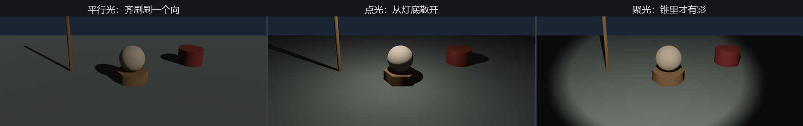
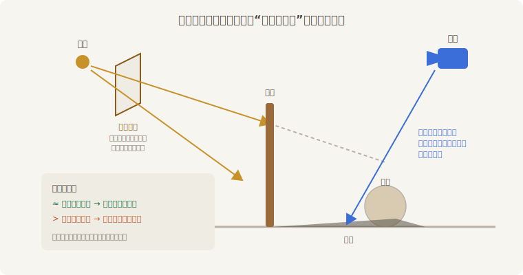
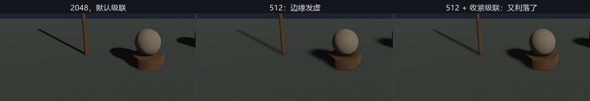

# 影子开箱

看客的条子里最扎心的一张是“桌子浮在台上”。第 21 章的布景、22.4 的太阳，画面里的东西全都脚不沾地——因为没有影子。影子不是光的赠品，是**单独收费的工序**：每盏灯一个开关，`shadow_maps_enabled`。

三盏灯排班，全开影子；换班的法子是把下岗那盏的亮度归零：

```rust
{{#include ../../code/ch22-lighting/examples/listing-22-06.rs:three}}
```

<span class="caption">Listing 22-6（其一）：三盏灯都开影子，靠亮度归零换班（examples/listing-22-06.rs）</span>

> **为什么不用 Visibility 换班？** 按直觉，藏灯该用第 13 章的 `Visibility::Hidden`——灯不可见就不发光，也确实如此。但写作时实测发现一处陷阱：**平行光隐藏再显示后，它的级联影子不会自己回来**（点光聚光不受影响）。归零亮度绕开这一切，还白送一个知识点：亮度为零的灯不出光也不出影，但实体、开关、配置全都原地待命。

```console
cargo run -p ch22-lighting --example listing-22-06
```

```text
老烛：三盏灯排班，都开了影子。Tab 换班，[ ] 拨影子贴图，T 收紧级联。
场记：当班的是平行光。
场记：当班的是点光。
场记：当班的是聚光。
```



<span class="caption">Figure 22-9：三种灯，三种影子的性格——平行、放射、锥内才算数</span>

影子一落地，“浮空病”当场痊愈。三种影子的性格也一目了然：平行光的影子彼此平行（太阳底下万物同向）；点光的影子以灯为圆心四散；聚光只在锥里结账。

## 影子是怎么算出来的

引擎没有“光线追到哪挡住了”这种奢侈算法（那是光追的地界，第 26 章提一嘴）。实时影子的主流手艺叫**影子贴图**（shadow map），思路朴素得像戏班对账：



<span class="caption">Figure 22-8：影子贴图——先替灯拍一张“谁离我最近”，再逐像素对账</span>

1. **替灯拍一张**：从灯的视角把场景渲染一遍，但不记颜色，只记深度——每个格子存“这条方向上离我最近的东西有多远”；
2. **逐像素对账**：相机正式作画时，每画一个点，先把它变换到灯的视角里查那张表——**我到灯的距离，比表里记的远吗？** 不远，说明灯看得见我，照亮；更远，说明有谁挡在前头，我在影子里。

平行光拍的是正交投影、聚光拍透视、点光要拍满六个面（它往四面八方发光）——所以官方文档反复念叨：**开影子的灯越多越贵**，点光的影子尤其贵。工程惯例是全场只让一两盏灯投影。

## 贴图的预算

既然影子是一张贴图，它就有分辨率，就有“不够用”的时候。平行光和聚光的贴图边长由一个资源统一管：

```rust
{{#include ../../code/ch22-lighting/examples/listing-22-06.rs:size}}
```

<span class="caption">Listing 22-6（其二）：DirectionalLightShadowMap——影子贴图的边长是资源，一改全场生效（examples/listing-22-06.rs）</span>

默认 2048。灯谱里故意混进了一档 3000——**边长必须是 2 的幂**，按到那一档，引擎当场纠正并在控制台告状：

```text
老烛：影子贴图拨到 3000。
```

```text
WARN bevy_light::directional_light: Non-power-of-two DirectionalLightShadowMap sizes are not supported, correcting 3000 to 4096
```

（点光的那份叫 `PointLightShadowMap`，默认 1024，管的是六个面里每一面的边长。）

## 级联：把预算铺对地方

平行光有个独门难题：它要罩住**整个视野**——从脚边到天边全用一张贴图分摊，近处每米摊到的像素就少得可怜。解法叫**级联影子贴图**（cascaded shadow maps）：沿视线方向把视野切成几段，近处一段用整张贴图伺候，远处的段越铺越大。切法由平行光实体上的 `CascadeShadowConfig` 组件说了算：

```rust
{{#include ../../code/ch22-lighting/examples/listing-22-06.rs:tighten}}
```

<span class="caption">Listing 22-6（其三）：T 键换级联——默认铺到 150 米，收紧后全花在眼前 30 米（examples/listing-22-06.rs）</span>

默认配置照顾到 150 米开外——对一座 20 米的戏台太浪费。把 `maximum_distance` 收到 30 米，同一张贴图的精度立刻翻几倍：

```text
老烛：影子贴图拨到 512。
老烛：级联收紧——四层全铺在眼前 30 米。
```



<span class="caption">Figure 22-10：同一张 512 的贴图——级联铺对了地方，精度白捡回来一截</span>

Figure 22-10 中间与右边用的是**同一张 512**，差别全在铺法。影子质量的第一反应不该是无脑加分辨率（显存直接四倍四倍地涨），而是先问：级联铺的范围，配得上场景的尺寸吗？

影子开了箱，但这门手艺自带几种祖传毛病——贴图终究是贴图。下一节专治。
