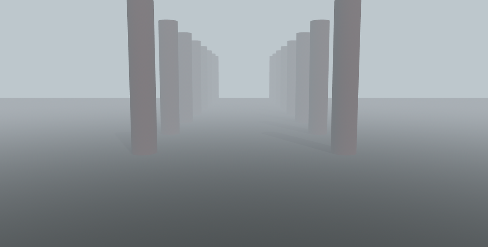
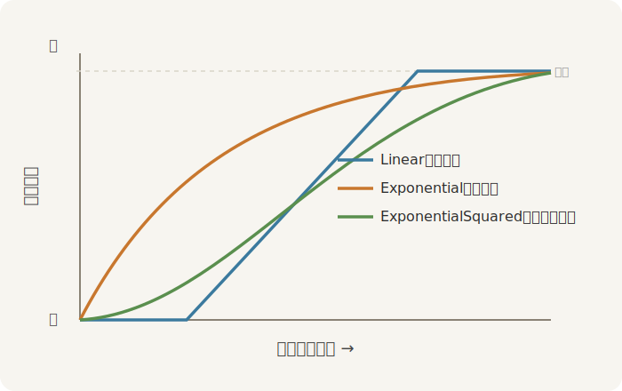

# 雾，以及更远处

清晨的园子常起雾：近处的立柱清清楚楚，远处的退到雾里只剩个影。雾不是某件东西的属性，而是「看出去」这件事本身蒙了一层——离镜头越远的像素，越往雾色里调。所以在 Bevy 里，雾挂在**相机**上：

```rust
{{#include ../../code/ch22-lighting/examples/listing-22-10.rs:fog}}
```

<span class="caption">Listing 22-10：给相机挂一层 `DistanceFog`（examples/listing-22-10.rs）</span>

```console
cargo run -p ch22-lighting --example listing-22-10
```



<span class="caption">Figure 22-13：晨雾——同样一排立柱，越远越隐入雾色，纵深一下出来了</span>

`DistanceFog` 两个要紧字段：`color` 是雾的颜色（远处最终融成的那个色），`falloff` 是「随距离变浓的快慢」。`falloff` 是个枚举，给了几种衰减规律：



<span class="caption">Figure 22-14：三种雾的衰减规律——Linear 线性、Exponential 指数、ExponentialSquared 指数平方</span>

- `FogFalloff::Linear { start, end }`：start 之前全清晰，end 之后全雾，中间线性过渡——最好懂，但不像真实空气；
- `FogFalloff::Exponential { density }`：按指数变浓，`density` 越大雾越厚，近处就开始有了；
- `FogFalloff::ExponentialSquared { density }`：指数的平方，近处更通透、远处收得更急，最接近真实大气的手感，Listing 22-10 用的就是它；
- `FogFalloff::Atmospheric { .. }`：按光的消光与散射分通道建模，能做出「朝太阳那侧的雾偏亮」的大气感，最贵也最真，留给大场景。

还有个 `directional_light_color` 字段，给平行光在雾里晕开一团光，做逆光时朝太阳那侧的发白——默认关着（`Color::NONE`）。

## 更远处：体积雾与光探针（概述）

`DistanceFog` 是「整片均匀蒙一层」。真正的丁达尔光柱——光穿过晨雾、从窗棂或树隙里劈下一道道实体的光束——要的是**体积雾（volumetric fog）**：给相机加 `VolumetricFog`、给想透出光柱的灯加 `VolumetricLight`、再用 `FogVolume` 圈出雾所在的空间，引擎沿光线步进采样，把光在雾里的散射真算出来。开销比距离雾大得多，但「光柱本身就是画面主角」时无可替代。官方示例 `volumetric_fog.rs` 是最好的起点。

另一件进阶家什是**光探针（light probe）**。上一节的环境光照作用于全场，可室内室外该映不同的世界。`LightProbe` 配合 `EnvironmentMapLight`，能让一块立方体区域用它自己的那张立方体贴图——走进屋里，金属映的是屋顶；走出门，映的是天空。它的近亲 `IrradianceVolume`（辐照体积）则用一格格三维体素存好「这个点从各方向收到多少光」，给运动的角色补上有方向感的间接光。两者都属于把静态间接光「烤」进数据再运行时查表的路子，官方示例 `reflection_probes.rs` 与 `irradiance_volumes.rs` 各有演示，等做到需要它们的场景时再深挖。

灯的全家、影子、环境光照、雾，本章的家什备齐了。最后把它们装进一个台子——昼夜光照切换台。
