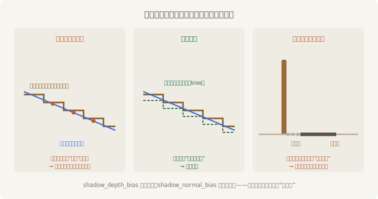
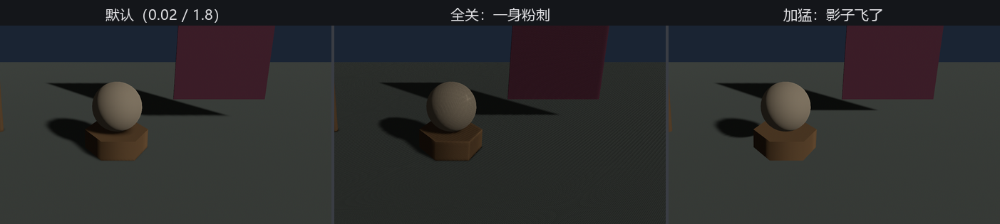
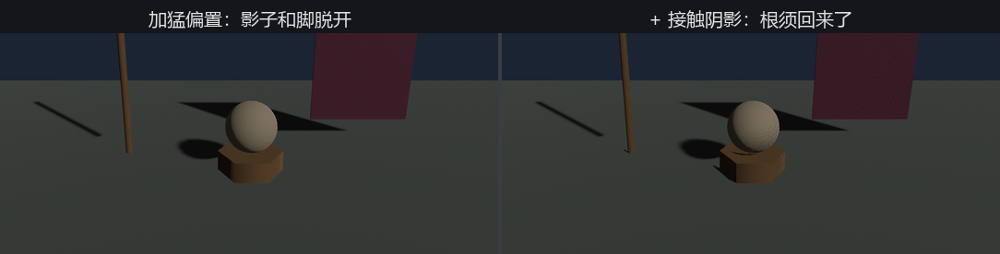

# 影子的毛病

影子贴图的一切毛病都从同一个事实里长出来：**贴图是马赛克**。一格深度要替一小片斜坡作证，格子里总有半边比记录深一点、半边浅一点——“深一点”的那半边就会被判成“被挡了”，自己给自己投影。画面上是一身细密的条纹和麻点，行话叫**影子粉刺**（shadow acne）。

药方是**偏置**（bias）：对账前，先把“我到灯的距离”让掉一小步，让整个表面都判成“不比记录深”。但让多了又生新病——影子的根部也被让成了“没被挡”，影子和脚脱开，像从物体上飞了出去，行话叫**彼得潘**（peter panning，彼得·潘的影子会自己跑）。



<span class="caption">Figure 22-11：偏置的两难——让少了长粉刺，让多了出彼得潘</span>

每盏灯身上有两根偏置旋钮：`shadow_depth_bias` 顺着光的方向让，`shadow_normal_bias` 顺着表面法线让。默认值（平行光 0.02 / 1.8）是引擎替大多数场景调好的折中，**多数时候不用碰**——但你得亲眼见过两头翻车的样子，将来才认得出：

```rust
{{#include ../../code/ch22-lighting/examples/listing-22-07.rs:bias}}
```

<span class="caption">Listing 22-7（其一）：B 键在默认、全关、加猛三档之间轮换（examples/listing-22-07.rs）</span>

```console
cargo run -p ch22-lighting --example listing-22-07
```

```text
老烛：影子有影子的毛病。B 拨偏置，C 上接触阴影，N 让绸幕不投影。
老烛：偏置眼下是默认（0.02 / 1.8）。
老烛：偏置拨到全关（0 / 0）。
老烛：偏置拨到加猛（2.0 / 1.8）。
```



<span class="caption">Figure 22-12：偏置三档——默认干净、全关长粉刺、加猛影子飞走（贴图故意压到 1024 放大病灶）</span>

## 接触阴影：把根须找回来

彼得潘暴露的正是影子贴图的分辨率盲区：**物体与地面相触的那几厘米**，贴图的格子根本分辨不出来。补这一段的是另一门手艺——**接触阴影**（contact shadows，屏幕空间小范围步进找遮挡），专管“根须”：

```rust
{{#include ../../code/ch22-lighting/examples/listing-22-07.rs:contact}}
```

<span class="caption">Listing 22-7（其二）：接触阴影是双开关——灯上 contact_shadows_enabled，相机上 ContactShadows（examples/listing-22-07.rs）</span>

两头都要开：灯上的 `contact_shadows_enabled` 表态“我的影子要补根”，相机上的 `ContactShadows` 组件（来自 `bevy::pbr`）真正干活。故意停在“加猛”那档按 C：

```text
老烛：接触阴影上了——根须回来了。
```



<span class="caption">Figure 22-13：接触阴影补根须——影子贴图管大形，接触阴影管落脚那几厘米</span>

细看 Figure 22-13 右图会发现一层淡淡的噪点——接触阴影靠带抖动的屏幕空间采样，本就指望时间抗锯齿（TAA）把噪抹平，而 TAA 是第 26 章的货。眼下记住搭配即可：接触阴影几乎总是和 TAA 一起上。

> 顺带一句：每盏灯还有个 `soft_shadows_enabled`/`soft_shadow_size`（PCSS 软影子——离得越远影子越糊的那种真实感），躲在 `experimental_pbr_pcss` 这个实验性 feature 后面，此处按下不表。相机上还有一个 `ShadowFilteringMethod` 组件可换影子边缘的滤波算法，默认的 Gaussian 对无 TAA 的场景就是最优解。

## 谁投影，谁不投

最后一味药不治病，管豁免。台口那幅绸幕又大又薄，投出的影子把半张台面都吞了——导演说幕要在、影不能有。给它挂 `NotShadowCaster`：

```rust
{{#include ../../code/ch22-lighting/examples/listing-22-07.rs:curtain}}
```

<span class="caption">Listing 22-7（其三）：NotShadowCaster——布还在，影子说没就没（examples/listing-22-07.rs）</span>

```text
场记：绸幕挂上 NotShadowCaster——布在，影没了。
```

这是个纯标记组件，挂谁谁豁免；孪生兄弟 `NotShadowReceiver` 反过来——挂上的物体**不接**别人的影子（俩都从 `bevy::light` 引入）。典型用途：贴地的特效面片不接影免得脏，密密麻麻的草叶不投影省预算。

影子的账清了。到目前为止，光都来自“灯”——下一节换个思路：让**世界本身**发光。
