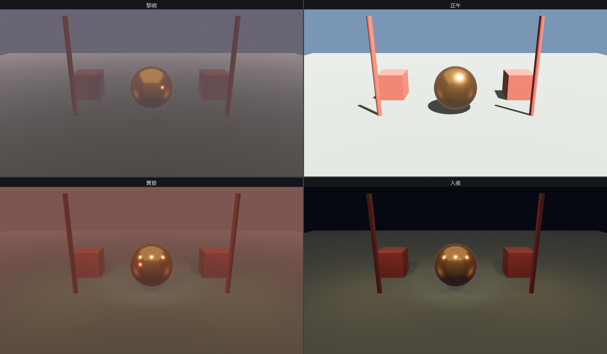

# 昼夜光照切换台

家什齐了，掌灯的把它们装进一个台子。一档「天色」是一组配套的光：天幕颜色、太阳的朝向/色温/强度、环境光、雾、夜灯开不开——全在一处定好。先把这套数据结构立出来：

```rust
{{#include ../../code/ch22-lighting/src/main.rs:phase}}
```

<span class="caption">Listing 22-11（节选一）：一档天色就是一组配套的光参数（src/main.rs）</span>

四档预设，从黎明到入夜，每一档都是上面那些旋钮的一组取值。挑两档对照着看就懂了套路——正午用 `DIRECT_SUNLIGHT` 的顶光、几乎无雾、夜灯不开；入夜把太阳压到月色般的微光、点亮灯笼与追光、补一层冷蓝环境光：

```rust
{{#include ../../code/ch22-lighting/src/main.rs:presets}}
```

<span class="caption">Listing 22-11（节选二）：四档预设——本章所有旋钮的一次合奏（src/main.rs）</span>

切换台本身只有两件事：空格往下翻一档；档位一变，把这一档的参数泼到全场的灯上。值得品的是**泼的手法**——太阳、环境光、雾各是一个组件或资源，换档不过是逐个改它们的字段，和前面各节单独调灯一模一样，只是攒到了一处：

```rust
{{#include ../../code/ch22-lighting/src/main.rs:switch}}
```

<span class="caption">Listing 22-11（节选三）：换档就是把预设泼到各盏灯上（src/main.rs）</span>

夜灯（灯笼与追光）的开关用的是 `Visibility`：白天设成 `Hidden` 把它们藏起，入夜设回 `Inherited` 点亮——灯也是要听 `Visibility` 的实体，藏起来就等于灭了，比反复增删组件省心。开台：

```console
cargo run -p ch22-lighting
```

```text
掌灯的：切换台就位——空格换一档天色。眼下是黎明。
掌灯的：换到「正午」。
掌灯的：换到「黄昏」。
掌灯的：换到「入夜」。
```



<span class="caption">Figure 22-15：一按空格，四档天色——同一座得月楼，黎明、正午、黄昏、入夜</span>

按几下空格，同一座园子在四档天色间翻覆：黎明的长影与薄雾、正午的硬光、黄昏点起的灯笼、入夜冷蓝托底的追光场。台中那颗鎏金绣球始终映着当下的环境——白天映天光，入夜映灯笼。本章的每一根旋钮，都在这一个台子上各司其职。

## 小结

- **三种直接光，三种量纲**：`DirectionalLight`（平行光/太阳）记照度 lux、只认旋转不认位置；`PointLight`（点光/灯笼）与 `SpotLight`（聚光/追光）记光强 lumens、有位置、越远越暗，聚光还多一对内外锥角；亮度是真实物理量，`light_consts` 备了实景常量
- **影子默认关，按灯计费**：一行 `shadows_enabled` 打开；主光投影、副光只补亮是常见分工
- **影子三旋钮**：`bias`（depth/normal）治 shadow acne，过头则 peter-panning；`DirectionalLightShadowMap` 调贴图分辨率；`CascadeShadowConfigBuilder` 把精度按距离分级集中到近处
- **环境光**是零成本的无方向兜底：全局那份是资源 `GlobalAmbientLight`，单相机那份是组件 `AmbientLight`——名字像、身份两样，把组件塞 `insert_resource` 编译不过
- **金属靠环境光照才有质感**：`GeneratedEnvironmentMapLight` 拿一张立方体贴图当周遭、GPU 实时滤波；立方体贴图要先装配（reinterpret + Cube 视图）再挂、相机要开 `Hdr`
- **雾挂在相机上**：`DistanceFog` 按距离往雾色调，`FogFalloff` 选衰减规律；体积雾、光探针是更贵也更真的进阶家什

## 练习

1. **正午开影子，黎明关**：给 `Phase` 加一个 `shadows: bool` 字段，在 `apply_phase` 里据此开关太阳的 `shadows_enabled`——体会「按需投影」省下的开销。
2. **第五档：阴天**：往预设里加一档「阴天」，用 `OVERCAST_DAY` 的弱平行光、抬高的环境光、灰白浓雾，不开夜灯。先猜画面，再跑。
3. **追光跟人走**：让台口那盏 `SpotLight` 的朝向随时间缓缓摆动（在 `Update` 里改它的 `Transform` 旋转），做一个扫场的追光。
4. **把灯笼调成红灯笼**：只改 `PointLight` 的 `color` 与 `intensity`，看暖光偏红后入夜那档的气氛变化——再试着把 `range` 调小到截断，亲眼看看那圈硬边。
5. **离线环境光照**：把 `GeneratedEnvironmentMapLight` 换成 `EnvironmentMapLight`，需要预先烤好的 `diffuse_map` 与 `specular_map`。读一读官方 `reflection_probes.rs`，对比两种路子的取舍。

## 下一章

得月楼的灯彻底亮了，可台上立着的还是箱笼、立柱、绣球这些内置图元拼的「布景」。真正的角儿——有脸、有衣褶、会做动作的角色——不是手搓几个 `Cuboid` 拼得出来的，得从 Blender 这样的建模工具里请进来。下一章打开 `bevy_gltf`：用 glTF 这套「3D 世界的通用提货单」加载现成模型与场景，把一个真角色请上得月楼的台。
