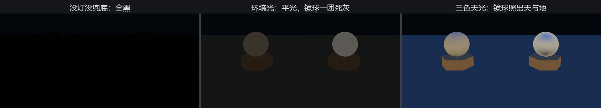

# 环境光照：来自四面八方

阴天没有太阳，屋里没开灯，你照样看得清东西——现实里的光被天空、墙面、地板倒过无数手，从**四面八方**漫进来。逐束地模拟这些反弹是离线渲染的奢侈，实时渲染用两级近似顶上：环境光，和环境贴图。

这一节的场子里**一盏灯都没有**，两颗球坐台：左边素坯（吃漫反射），右边正是第 21 章材质墙上那颗黑着的镜面金球——它等的“值得照的世界”，今天到货。

## 环境光：一层平光

第 21 章见过的 `GlobalAmbientLight` 资源，就是最粗的一级近似：不问方向、不问位置，给全场每张面均匀垫一层亮。A 键开关它：

```rust
{{#include ../../code/ch22-lighting/examples/listing-22-08.rs:ambient}}
```

<span class="caption">Listing 22-8（其一）：环境光——无向、无影、每张面一视同仁（examples/listing-22-08.rs）</span>

它的 `brightness` 单位是**坎德拉每平方米**（cd/m²，亮度单位——环境这类“摊在面上的光”都用它记账，下文的环境贴图、天幕同理）。想只给某一台相机换环境光，还有个同名的 `AmbientLight` **组件**可挂在相机上，盖过全局资源——分屏时给小地图单开一份亮度就靠它。

## 环境贴图：一张裹住世界的照片

第二级近似有方向感：把“四面八方的光”拍成一张**环境贴图**（environment map）——六张照片拼成的立方体贴图（cubemap），裹在场景外面。渲染时，漫反射查它的糊版（往哪个方向的面，吃哪边的天光），镜面反射查它的清晰版（直接照出那个方向的“世界”）。这门手艺统称 **IBL**（image-based lighting，基于图像的光照）。

组件叫 **`EnvironmentMapLight`**，挂在相机上全场生效。正经的环境贴图要专门的资产（22.9 节做一张），但引擎给了个零资产的起步款——三色渐变天光：

```rust
{{#include ../../code/ch22-lighting/examples/listing-22-08.rs:env}}
```

<span class="caption">Listing 22-8（其二）：hemispherical_gradient——上蓝、中白、下褐的三色天光，现场合成（examples/listing-22-08.rs）</span>

`hemispherical_gradient` 在内存里现造一张一像素见方的六面贴图：天顶一色、地平线一色、脚下一色。别嫌小——环境光照本来就糊，一像素的渐变已经够素坯球分出“上下脸”。跑起来按 A、再换 E：

```console
cargo run -p ch22-lighting --example listing-22-08
```

```text
老烛：一盏灯都没点，兜底也拉了。A 上环境光，E 上三色天光。
老烛：环境光上了——满场一层平光；镜球照出一团死灰，四面八方全一样，等于什么都没照见。
老烛：环境光撤了。
老烛：三色天光上了——镜球照出天与地，素坯有了上下脸，台面染了层天青。
```



<span class="caption">Figure 22-14：三级台阶——全黑、平光、有方向的天光；镜面球是最诚实的检测仪</span>

两级近似的差距，镜面球说得最明白：

- 环境光下它**不是黑的，是一团死灰**——环境光也喂镜面反射，但四面八方全一个值，照出来的“世界”就是一片均匀，等于什么都没照见；
- 三色天光一上，它立刻照出天与地的分界。素坯球也换了气质：顶面沾天蓝、底面反地褐——**光有了方向，形体才有了故事**。

还有个容易被忽略的细节：台面整体染了层青。晴天户外的照片里万物都偏蓝，就是这层天光的漫反射——环境贴图把这笔“氛围账”自动记全了。

镜面金球至此照见了世界——虽然只是一张一像素的世界。下一节给它换张真的：满天星斗。
