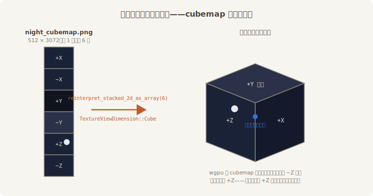
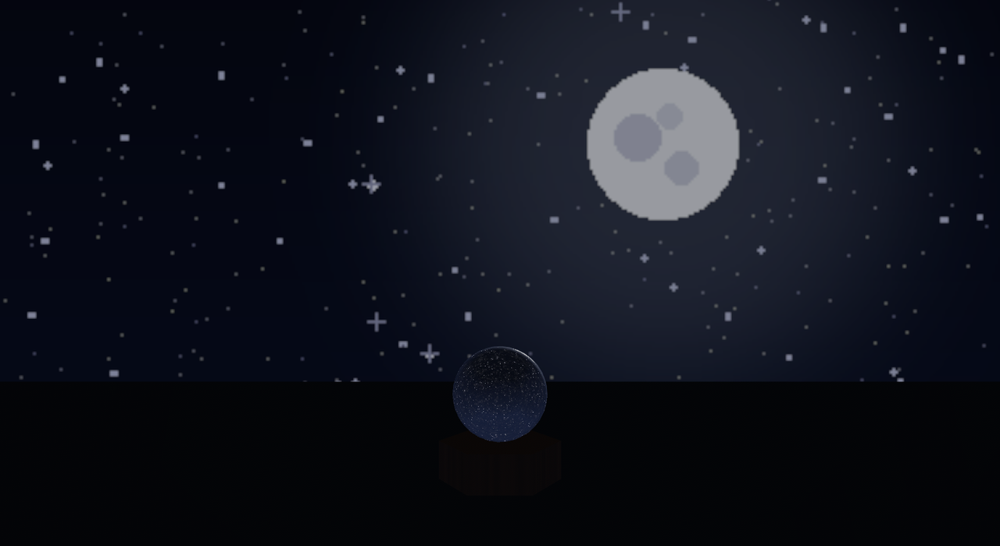

# 星空天幕：Skybox

戏班管台后那幅画着远山明月的布叫**天幕**。3D 世界里同一件行头叫 **`Skybox`**（天空盒）：一张裹住相机的立方体贴图，永远垫在画面最远处，镜头怎么转都罩着你。

天幕布是 `make_ch22_assets.py` 合成的一张竖条 PNG：六张 512×512 的面，从上到下摞成 512×3072——星野、一轮月亮，还有一条淡银河。

## 裁布的暗号

麻烦在于 **PNG 自己不知道自己是 cubemap**。加载进来它就是一张 1 层的长条贴图，得动手“裁布”：按高度切成 6 层数组，再声明“按立方体贴图采样”。



<span class="caption">Figure 22-15：一条竖布裁成六面天——面的顺序是 +X −X +Y −Y +Z −Z 的接头暗号</span>

裁布要等布到货（第 14 章的功课：资产是异步的），所以拆成两步——Startup 下订单，Update 里守着货：

```rust
{{#include ../../code/ch22-lighting/examples/listing-22-09.rs:load}}
```

<span class="caption">Listing 22-9（其一）：下订单——天幕布还在路上（examples/listing-22-09.rs）</span>

```rust
{{#include ../../code/ch22-lighting/examples/listing-22-09.rs:hang}}
```

<span class="caption">Listing 22-9（其二）：货到裁布挂幕——reinterpret 切层，Cube 声明采样方式，一并挂上 Skybox 与夜光（examples/listing-22-09.rs）</span>

挂上去的是两件套：

- **`Skybox`**（`bevy::light`）——天幕本体。`brightness` 还是 cd/m² 的账；**它只管画天，一点光都不出**；
- **`GeneratedEnvironmentMapLight`**——让这片天真的发光。它接过同一张 cubemap，在 GPU 上现场滤波出环境光照要的两张图（糊的漫反射版 + 分层的镜面版），完事自动往实体上补一个 22.8 节的 `EnvironmentMapLight`。一句话：**任何 cubemap，运行时变环境光**。

```console
cargo run -p ch22-lighting --example listing-22-09
```

```text
场记：夜戏开演前，得把星空天幕挂上——布还在路上。
场记：天幕挂好了——满天星斗，台上洒了层月色，镜球里也是一片星空。
```



<span class="caption">Figure 22-16：星空天幕——Skybox 画天，滤波出来的星光给台面洒了层月色</span>

一处会咬人的细节藏在月亮的位置里：wgpu 的 cubemap 是**左手系**——镜头朝世界 −Z 看，采到的是 **+Z 那面**。月亮要挂在戏台正对的天上，就得画在 +Z 面（Figure 22-15 右）。第一版素材把月亮画在了 −Z，结果它悬在了观众席的后脑勺上。

## 老鲁裁坏的那批布

`GeneratedEnvironmentMapLight` 对料子有硬要求：**方形、边长是 2 的幂、不超过 8192**——GPU 滤波要逐级减半地生成 mip 链，尺寸不齐没法切。库房里恰好有批老鲁按 500 裁的布（`night_cubemap_odd.png`，500×3000）。Listing 22-10 与 22-9 只差一个文件名：

```rust
{{#include ../../code/ch22-lighting/examples/listing-22-10.rs:load}}
```

<span class="caption">Listing 22-10：坏尺寸的天幕——与 Listing 22-9 唯一的差别是这张布（examples/listing-22-10.rs）</span>

```console
cargo run -p ch22-lighting --example listing-22-10
```

```text
场记：夜戏开演前，得把星空天幕挂上——布还在路上。
场记：天幕挂好了——满天星斗，台上洒了层月色，镜球里也是一片星空。
```

场记话音未落，后台一声闷响：

```text
thread 'Compute Task Pool (6)' (3584) panicked at ...\bevy_pbr-0.19.0\src\light_probe\generate.rs:1037:13:
GeneratedEnvironmentMapLight source cubemap must be square power-of-two ≤ 8192, got 500×500
note: run with `RUST_BACKTRACE=1` environment variable to display a backtrace
Encountered a panic in system `bevy_pbr::light_probe::generate::generate_environment_map_light`!
```

翻车翻得很有讲究：布**挂上去了**（`Skybox` 对尺寸没意见，单画天是成的），是滤波系统在下一瞬验货时当场撂挑子——panic 信息把尺寸规矩和肇事系统名都交代得清清楚楚（系统名能印出来，是本章 Cargo.toml 里那个 `debug` feature 的功劳）。给天幕备料时，把“2 的幂”写进裁布单。

天幕虽美，终究是一张画死的布——月亮永远钉在那，天色永远不变。下一节把布撤了，支一片**真的天**。
