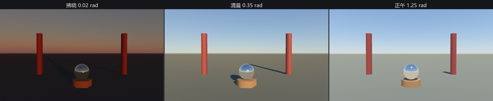

# 真的天：大气散射

天为什么是蓝的、晚霞为什么是红的，物理上是同一件事：阳光穿过大气，被空气分子和悬浮的尘埃**散射**——短波的蓝光被抛洒得到处都是（所以抬头处处见蓝），日落时光要斜穿厚得多的大气，蓝光半路散光了，剩下红橙一路到底。Bevy 把这套物理搬进了引擎：**`Atmosphere`**（大气散射）。它不是一张画好的天，而是一片**算出来**的天——太阳走到哪，天色自己变到哪。

上台分三步——一份资产、一颗行星、一台相机：

```rust
{{#include ../../code/ch22-lighting/examples/listing-22-11.rs:atmosphere}}
```

<span class="caption">Listing 22-11（其一）：大气三件——ScatteringMedium 资产、Atmosphere 行星实体、相机上的 AtmosphereSettings（examples/listing-22-11.rs）</span>

逐件看：

- **`ScatteringMedium`** 是一种**资产**：这片大气由什么构成、怎么散射光。`earth(256, 256)` 预设装着地球配方——瑞利散射（空气分子，散蓝光）、米氏散射（尘埃，管太阳周围那圈亮晕）、臭氧吸收，三味药各有各的海拔分布。参数是两张查找表的分辨率，默认档够用；
- **`Atmosphere`** 是一个**独立实体**——一颗行星。`earth(medium)` 填上地球半径（6,360 公里）。它的 `GlobalTransform` 是行星球心：不给的话，挂载钩子自动把球心放到你脚下 6,360 公里处，让“地面”恰好落在原点附近——除非你做太空戏，这个默认正合适；
- 相机挂 **`AtmosphereSettings`**（`bevy::pbr`）表态“我要用这片天”，场上有多颗行星时选最近的。它自带的参数是几张查找表的分辨率与采样数，另有一个 `rendering_method` 可切换到逐像素步进的 `AtmosphereMode::Raymarched`（更准更贵，拍太空远景用）——默认的查找表模式演戏台绰绰有余。

还有两件配角：`Exposure { ev100: 13.0 }`——真实白昼的亮度得配烈日级的口径（22.2 的功课）；**`AtmosphereEnvironmentMapLight`**——让大气反过来当全场的环境光，天有多红，台上就染多红（幕后正是 22.9 的运行时滤波在干活）。

太阳这头也换了记法：

```rust
{{#include ../../code/ch22-lighting/examples/listing-22-11.rs:sun}}
```

<span class="caption">Listing 22-11（其二）：喂给大气的太阳——RAW_SUNLIGHT 原始日光，SunDisk 挂出日轮（examples/listing-22-11.rs）</span>

- 照度用 **`RAW_SUNLIGHT`**（130,000 勒克斯）——**大气层外**的原始日光。22.4 那张表里的其它常数都是“散射之后”的地面读数，现在散射交给大气自己算，就得喂它散射之前的原料；
- **`SunDisk`** 组件让天上真的挂一轮日头。`EARTH` 预设按地球上看的太阳角径（约半度）画盘，只管样子，不改光照，也只在配了大气的相机里现身。

```console
cargo run -p ch22-lighting --example listing-22-11
```

```text
老烛：这回不挂布了——把天支起来。左右键推日头，1/2/3 直接跳档。
老烛：日头拨到拂晓。
老烛：日头拨到清晨。
老烛：日头拨到正午。
```



<span class="caption">Figure 22-17：一颗太阳三种天——天色、影长、氛围全由太阳的高度角推着走</span>

代码里**没有一行在调天的颜色**。拂晓的橙红、正午的湛蓝、洒在台面上那层冷暖变化的环境光，全是散射方程从太阳角度里算出来的。这正是大气对天幕的碾压之处：昼夜循环、时辰氛围，改一个旋转就全套联动——22.13 节的切换台就靠这一手。

> 顺带一提：`ScatteringMedium::mars` 与 `Atmosphere::mars` 是官方自带的火星配方（二氧化碳 + 红尘，还要一张尘埃相函数贴图）——蓝色的火星日落，物理正确。

天支起来了。但有一类光它管不着：**屋里的反射**。下一节回到室内，给镜面活儿划地盘。
