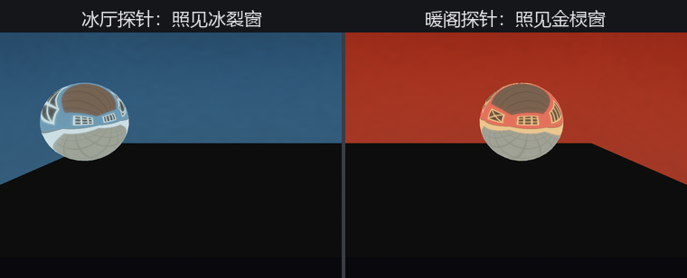

# 镜厅：反射探针

22.8 的环境贴图挂在**相机**上，一份贴图包打全场。这在户外说得过去（哪儿的天都是那片天），一进屋就穿帮：暖阁里的镜球该照见朱红的墙，挪到冰厅就该照见青蓝的墙——**环境光照得跟着地方走**。

分地方管光的家伙叫**光探针**（light probe）：一块划了地盘的区域，罩住谁，谁的环境光照就听它的。Bevy 里 `LightProbe` 组件划地盘——它的势力范围是一只单位立方（1×1×1），靠 `Transform` 撑大挪位；地盘里配上环境贴图（`EnvironmentMapLight` 或它的运行时兄弟），这套组合就叫**反射探针**（reflection probe）。

得月楼的镜厅一分为二：左冰厅、右暖阁，各立一只探针。两张厅堂 cubemap 还是 `make_ch22_assets.py` 画的竖条布（裁布手艺与 22.9 完全相同），到货后开工：

```rust
{{#include ../../code/ch22-lighting/examples/listing-22-12.rs:probes}}
```

<span class="caption">Listing 22-12（其一）：两只反射探针——LightProbe 划地盘，GeneratedEnvironmentMapLight 现场滤波（examples/listing-22-12.rs）</span>

三处点睛：

- 探针的 `Transform` 把单位立方撑成 8×4×8，正好各罩半间厅——**地盘的边界就用房间的墙来定**，这是行规，一会儿说为什么；
- 贴图交给 `GeneratedEnvironmentMapLight` 运行时滤波——正经工程会用离线预滤波的 KTX2（画质更好），手艺相同；
- **`falloff`** 是地盘边缘的过渡带宽度（0 到 1 的比例）：0.3 表示从八成处开始渐弱。两只探针的过渡带在厅堂交界处交叠，镜球从冰厅推到暖阁，反射是**渐变**过去的，不跳戏——这就是探针混合。

```console
cargo run -p ch22-lighting --example listing-22-12
```

```text
老烛：镜厅两头各立一只探针。左右键推球，P 键关视差校正。
场记：探针立好了——球在哪半间，就照见哪半间的墙。
```



<span class="caption">Figure 22-18：一球两厅——探针罩到谁，谁就照见自己那半间的墙</span>

## 视差校正：让反射贴着墙走

还有个更隐蔽的问题。挂在相机上的环境贴图，反射被当成**无穷远**——照天没问题（天确实远），照屋里的墙就露馅：你在屋里挪动，镜子里的墙纹丝不动，像贴在天边。

反射探针默认修掉了这毛病，手法叫**视差校正**（parallax-corrected cubemap）：把反射到的“世界”当成恰好贴在探针地盘的边界上——地盘边界又恰好是墙（现在明白行规了），于是球一挪，镜里的窗棂就按几何规规矩矩地换位置。开关是探针实体上的 `ParallaxCorrection` 组件，引擎会自动补一个 `Auto` 档（边界即地盘）；P 键把它拨到 `None` 对比：

```rust
{{#include ../../code/ch22-lighting/examples/listing-22-12.rs:parallax}}
```

<span class="caption">Listing 22-12（其二）：P 键拨视差校正——Auto 贴着地盘算，None 当天边无穷远（examples/listing-22-12.rs）</span>

```text
老烛：视差校正关——墙被当成天边，球怎么挪，镜里都是同一幅画。
老烛：视差校正开——反射贴着墙走，球挪一步，镜里的窗棂跟着换位置。
```

开着校正推球，窗棂在球面上近大远小地滑过；一关，球走到哪，镜里都是同一幅静止画。还有第三档 `ParallaxCorrection::Custom(半边长)`，让校正边界与地盘边界脱钩——房间比地盘略小、或用了 falloff 过渡带时拿它微调。

## 环境光照的班次表

到这里，能给一个像素供“环境光”的来源已经不少。多路在场时，引擎按质量高低点班（漫反射与镜面分开点）：

| 优先级 | 漫反射 | 镜面反射 |
|---|---|---|
| 1 | 光照贴图（lightmap，烘焙产物——工具链成熟前少见） | 光照贴图 |
| 2 | 辐照度体积 | **反射探针** |
| 3 | **反射探针** | 相机上的环境贴图 |
| 4 | 相机上的环境贴图 | — |

环境光（`AmbientLight`）不排队——它永远额外**叠加**。表里的**辐照度体积**（`IrradianceVolume`：一格一格存好的三维漫反射光场，给会动的角色供“屋里的漫光”）与光照贴图都归离线烘焙的工作流，本书按下不表；记住班次表，将来对着官方示例不迷路。

屋里屋外的光都齐了。还差一味戏台名场面——晨光穿雾。
