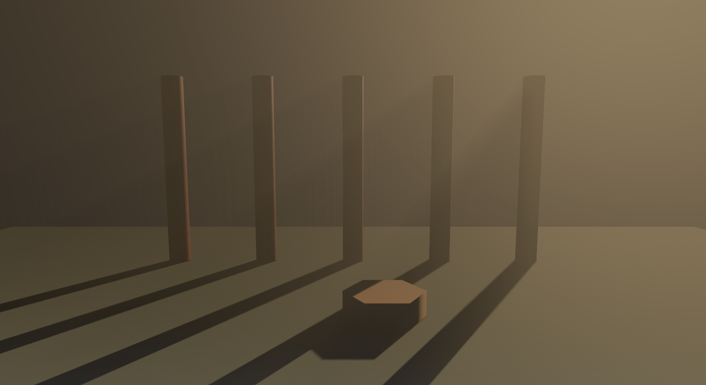

# 晨雾：体积雾

到目前为止，光都是打在**表面**上才看得见。可戏台名场面偏偏长在半空里：晨光穿过柱缝，雾里立起一根根光柱。要让光在**空气里**现形，得给空气一个身体——**体积雾**（volumetric fog）。

三件套，各挂各处：

```rust
{{#include ../../code/ch22-lighting/examples/listing-22-13.rs:camera}}
```

<span class="caption">Listing 22-13（其一）：相机挂 VolumetricFog——“看得见雾”的开关（examples/listing-22-13.rs）</span>

```rust
{{#include ../../code/ch22-lighting/examples/listing-22-13.rs:fog}}
```

<span class="caption">Listing 22-13（其二）：灯挂 VolumetricLight，雾体是一只 FogVolume 立方（examples/listing-22-13.rs）</span>

- **`VolumetricFog`**（相机）——总开关。渲染器从镜头出发在雾里一步步试探（`step_count` 默认 64 步），累出每个像素“途中沾了多少光”；
- **`VolumetricLight`**（灯）——哪盏灯的光要在雾里现形，就给谁挂这个标记。**前提是那盏灯开着影子**：光柱的本质是“雾里被照到的部分”与“被柱子挡住的部分”的分界，没有影子贴图就无从对账。平行光、点光、聚光都受用；
- **`FogVolume`**（实体）——雾的身体：一只单位立方，`Transform` 撑成罩住全台的雾罩子。`density_factor` 是浓度；还有一套散射参数（`scattering`、`absorption`、`scattering_asymmetry`……）管雾的“质地”，默认值就是像样的白雾。

五根立柱排成篦子，晨光从台后斜着打过来（还是那句话：方向 = 旋转），F 键收放雾气：

```console
cargo run -p ch22-lighting --example listing-22-13
```

```text
老烛：起雾了。晨光从柱子缝里漏进来——F 键收放雾气。
老烛：雾气拨到 0.02。
```



<span class="caption">Figure 22-19：柱缝里漏下来的光——光柱是影子在雾里的补集</span>

按 F 把浓度拨到 0.02，光柱立刻淡成一层薄纱——雾越稀，途中沾的光越少。这一节点到为止：体积雾还有雾密度贴图（`density_texture`，能让雾随风滚动）、逐灯的强度微调等一整套细账，等你需要“会动的雾”时再翻它的文档不迟。

> 提醒一句成本：体积雾是逐像素步进的活儿，`step_count` 直接乘在开销上；发布到 Web 时它还要求 WebGPU（第 38 章再算这笔账）。

十二节课，灯、影、天、雾各就各位。压轴那场，把它们全请上同一座台。
