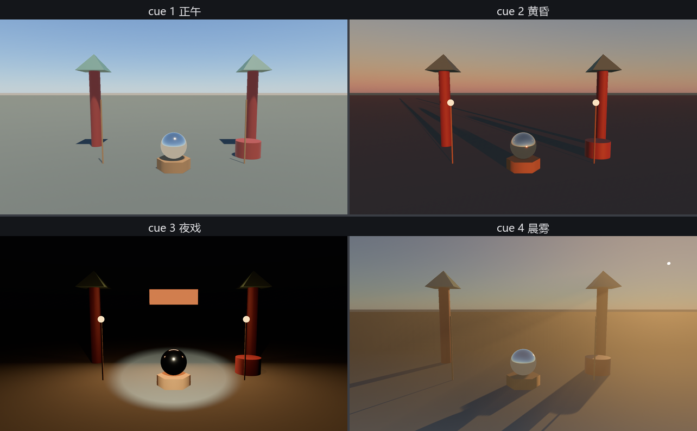

# 昼夜切换台

老烛的皮箱见了底，最后拼出他吃饭的家伙：**切换台**——一个数字键一套光，正午、黄昏、夜戏、晨雾，口令一出全班联动。`src/main.rs` 把全章的家底合龙，只挑三段有讲头的看。

第一段，天。全场只有**一套**天：大气行星开场就位，再不撤下——夜戏不换天，是太阳落下去，天自己黑透：

```rust
{{#include ../../code/ch22-lighting/src/main.rs:rig}}
```

<span class="caption">Listing 22-14（节选一）：一套天用到底——大气行星、配好曝光的相机、身兼月亮的太阳（src/main.rs）</span>

> **为什么夜戏不换 22.9 的星空天幕？** 写作时认真试过“白天大气、入夜撤行星换星幕”的方案，撞上一处本版本引擎的实际行为：**大气一旦为某台相机渲染过，把 `Atmosphere` 实体撤下（或摘掉相机的 `AtmosphereSettings`）之后，天空的绘制并不会跟着消失**——渲染端为它准备的组件只增不删，白亮的天残留在夜景上。切换台于是改走物理路线：太阳交班给月亮，大气自己演黑夜，星空天幕的完整示范留在 22.9。真要在大气与天幕之间切换的场合，稳妥做法是备两台相机整台切换（第 13 章的 `is_active`），而不是在一台相机上拆装大气。

第二段，夜戏的家什。灯笼、追光、匾额白天全归零、发光皮藏起——22.6 换班手艺的放大版：

```rust
{{#include ../../code/ch22-lighting/src/main.rs:night_rig}}
```

<span class="caption">Listing 22-14（节选二）：夜戏的家什——灯笼（点光）、匾额（矩形光 + unlit 发光皮）、待命的雾罩子（src/main.rs）</span>

第三段，切换台本体。一套 cue 一份参数——日头的角度与照度、曝光的口径、家什的班次，一把换齐：

```rust
{{#include ../../code/ch22-lighting/src/main.rs:cues}}
```

<span class="caption">Listing 22-14（节选三）：switch_cue——数字键换 cue，天、灯、曝光、雾一次到位（src/main.rs）</span>

参数表里全是本章的熟人：正午 EV 13.5 配原始日光；黄昏只是把高度角压到 0.03；夜戏的“月亮”就是太阳调到 0.3 勒克斯、染一点蓝、挂回天上（大气收到 0.3 勒克斯的输入，自己就黑透了），曝光大开到 6.5 迎接灯笼与追光；晨雾把日头转到台后，光穿柱缝，给太阳挂上 `VolumetricLight`、给相机插上 `VolumetricFog`。开演：

```console
cargo run -p ch22-lighting
```

```text
老雷：昼夜切换台就位，全班听老烛的口令。
场记：1 正午、2 黄昏、3 夜戏、4 晨雾。
老烛：cue 2——黄昏。
老烛：cue 3——夜戏。
老烛：cue 4——晨雾。
老烛：cue 1——正午。
```



<span class="caption">Figure 22-20：一台四景——按一个数字键，光的全班换一套阵型</span>

四个键各按一遍，再回头看看代码量：布景一行没动，动的全是光——**画面里“时间”和“气氛”这两样东西，从头到尾是光在演**。老雷看完四遍换景，只批了四个字：值这个价。

## 小结

- 灯是四种组件：**平行光**只有方向（勒克斯计）、**点光**只有位置（流明计、`range` 一刀切）、**聚光**位置加方向（内沿外沿两只角）、**矩形面光**一整块发光的面（不投影子、要 `area_light_luts` feature——不开不报错但一点光不出）；聚光、平行光、面光都沿自己的 **−Z** 干活
- **画面亮暗 = 灯 × 相机**：`Exposure` 的 `ev100` 是相机吃光的口径，数越大吃得越少；先定曝光基准，再调灯的数值
- **影子单独收费**：`shadow_maps_enabled` 逐灯开；原理是先替灯拍深度贴图再逐像素对账，所以有分辨率预算（`DirectionalLightShadowMap`，2 的幂）、有级联铺法（`CascadeShadowConfig`）、有祖传毛病——偏置少了长**粉刺**、多了出**彼得潘**，接触阴影补根须，`NotShadowCaster` 管豁免
- **环境光照三级台阶**：`GlobalAmbientLight`/`AmbientLight` 是无向平光兜底；`EnvironmentMapLight` 用 cubemap 给光以方向（镜面球的“世界”）；`LightProbe` 给环境光照划地盘，视差校正让反射贴着墙走，falloff 让两块地盘无缝过渡
- **天有两种**：`Skybox` 是画死的布（竖条 PNG 裁六面，注意左手系与 2 的幂），配 `GeneratedEnvironmentMapLight` 能让任何 cubemap 运行时发光；`Atmosphere` 是算出来的天——行星实体 + 相机 `AtmosphereSettings` + `RAW_SUNLIGHT` 的太阳，天色随太阳角度自己变
- **体积雾**让光在空气里现形：相机 `VolumetricFog` + 灯 `VolumetricLight`（须开影子）+ `FogVolume` 雾体
- 光的单位一律物理：流明（发出的总量）、勒克斯（落到每平米的量）、cd/m²（摊在面上的亮度）——数值可以直接抄现实

## 练习

1. **radius 的高光**：给 Listing 22-1 的堂灯加一档 `radius: 0.5`，盯着绣球上的高光按空格——发光体一胖，高光跟着胖。为什么点光的倒影永远是一粒点、面光的倒影却是一块矩形？用 22.5 的话回答。
2. **手电筒**：把 Listing 22-3 的追光从台口挪到相机位置、方向对齐相机（提示：把灯 spawn 成相机的子实体，第 9 章），做一支第一人称手电。想想为什么它天然“跟手”。
3. **正午的彼得潘**：Listing 22-7 里把太阳抬到头顶正上方（高度角 π/2）再拨到“加猛”档——彼得潘几乎看不出来了。对着 Figure 22-11 想想为什么影子偏移量和光的入射角有关系。
4. **黄昏的班次**：给切换台加一档 cue 5“暴雨”：太阳压暗到 `OVERCAST_DAY` 以下、天光换成 22.8 的三色灰、雾罩子拉满、灯笼全开。哪些件能复用、哪些要新添？
5. **火星戏台**：把 Listing 22-11 的 earth 全换成 mars（`ScatteringMedium::mars` 需要 `textures/mars_mie_phase.ktx2`，可从官方仓库的 assets 取）——亲眼看一场蓝色的日落。

## 下一章

得月楼的光配齐了，台上的角儿却还是老鲁凿的胶囊木人。行头呢？水袖呢？能做表情的脸呢？这些东西没法在代码里一顶点一顶点地凿——它们生在专业的建模软件里，装在一种叫 **glTF** 的箱子里进园子。下一章开箱：加载带骨架、带动画、带整套材质的 3D 资产。
