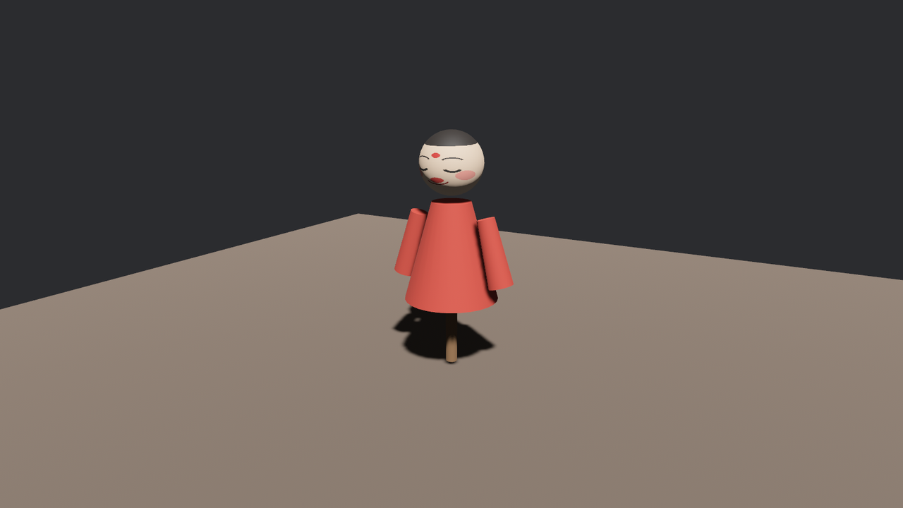

# 第一次开箱

货运到后台，箱面上漆着一行字：`assets/models/afu/afu.gltf`。开箱不用撬棍，用一个组件：

```rust
{{#include ../../code/ch23-gltf/examples/listing-23-01.rs:setup}}
```

<span class="caption">Listing 23-1：一个 `WorldAssetRoot` 组件，把阿福请上台（examples/listing-23-01.rs）</span>

机位、台灯、台板都是前两章的老摆法，新面孔只有最后一个 spawn，值得逐字看清：

- **`WorldAssetRoot`** 是“把一段现成的世界挂到这个实体名下”的组件，里面装一个 `Handle<WorldAsset>`。**WorldAsset**（世界资产）是 Bevy 对“一小段预先搭好的世界”的称呼——一棵带组件的实体树，存成资产，随取随搭。glTF 文件里的每个场景，加载进来就是一件 WorldAsset。挂上这个组件的实体从此就是“台口”：场景搭好后会作为它的子树长出来，你挪台口（改 `Transform`）、藏台口（改 `Visibility`），整棵子树跟着走——这两个组件是 `WorldAssetRoot` 的 required components，不写也自动配齐（第 3 章的规矩）。
- **`GltfAssetLabel::Scene(0)`** 是提货单上的行号。一只 glTF 箱子里装着许多件货，你必须说清提哪一件；`Scene(0)` 就是“0 号场景”。`from_asset("models/afu/afu.gltf")` 把行号拼到文件路径后面，得到一条完整的资产路径——它等价于字符串 `"models/afu/afu.gltf#Scene0"`，`#` 后面的部分叫**标签**（label），23.3 节展开全家。
- 路径照第 14 章的规矩，从 `assets/` 目录起算；`asset_server.load` 立刻返回提货单，装卸是后台异步的——spawn 完这行代码时，阿福还在路上，到货后引擎自会把树搭出来。

跑起来：

```console
cargo run -p ch23-gltf --example listing-23-01
```



<span class="caption">Figure 23-1：阿福进园子——一个组件换来的整尊木偶</span>

一个组件、一条路径，画面里就有了一尊带脸、带袍、带杆的木偶。回想第 21 章手搓一面旗要多少行——顶点、索引、法线、UV、贴图、材质，一样不能少——就明白 glTF 交付的是什么：**建模的活归建模软件，游戏这边只管收货。**

“台口”的比喻也当场可验：给这个 spawn 加一行 `Transform::from_xyz(0.0, 0.0, -1.0)`，整尊阿福退后一米；换成 `Visibility::Hidden`，整尊隐身——第 12 章的变换传播、第 13 章的可见性继承，对这棵还没长出来的子树照样作数，因为它长出来就是台口的子孙。

## 亲眼看一次：漏了标签

新手开第一只箱子，十有八九栽在同一个地方——忘写 `#Scene0`。既然要栽，不如当着大家的面栽：

```rust
{{#include ../../code/ch23-gltf/examples/listing-23-02.rs:wrong}}
```

<span class="caption">Listing 23-2：把一整箱塞进装场景的口袋（examples/listing-23-02.rs）</span>

```console
cargo run -p ch23-gltf --example listing-23-02
```

窗口照常打开，台上却空无一物，日志里躺着一条谜语：

```text
ERROR bevy_asset::server: Could not find an asset loader matching: Asset Type:
Some(TypeId(0xaabfcee51a29021733b69b22b3761910)); Path: "models/afu/afu.gltf";
```

破译一下。`asset_server.load` 是泛型方法，它从**接收方**倒推资产类型：`WorldAssetRoot` 里装的是 `Handle<WorldAsset>`，于是这次加载要的是一件 WorldAsset。资产服务器拿着这个要求去找 loader——“谁能把 `.gltf` 文件做成 WorldAsset？”——没人应。glTF loader 确实管 `.gltf`，但它把**整个文件**做成的成品是 `Gltf`（下一节的主角），不是 WorldAsset；场景只是它顺手登记的子资产，必须用标签去点名。于是报错说“找不到匹配的 loader”，那串 `TypeId(0xaabf…)` 就是 WorldAsset 的类型指纹——机器读得懂，人读不懂。

这条报错的费解是有名的，值得你现在就把它跟病因焊在一起：**看到 “Could not find an asset loader matching: Asset Type”，先查路径上是不是漏了标签**。画面上则什么都不会发生——没有崩溃，没有占位方块，就是空。资产加载的失败从不打断程序（第 14 章讲过为什么），它只进日志；不看日志，你会对着空台面怀疑人生。
