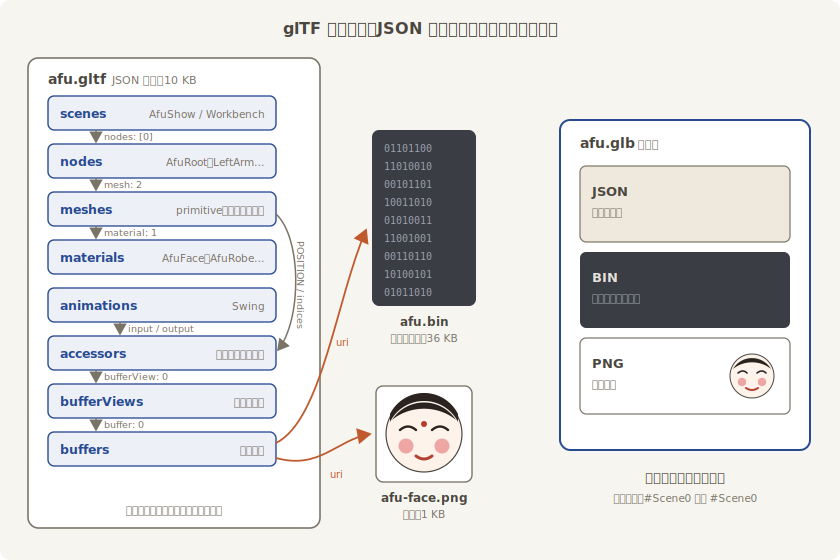

# 箱子解剖

开都开了，索性把箱子拆穿。`assets/models/afu/` 目录下躺着三件东西：

```text
afu.gltf        10 KB   JSON 主档：结构、名字、参数，全箱的“账本”
afu.bin         36 KB   二进制副档：顶点、索引、动画曲线，纯数据
afu-face.png     1 KB   贴图：阿福的脸
```

**glTF 的主档就是一份 JSON 文本**，任何编辑器都能打开。这份是我们的脚本写的，Blender 导出的长得一模一样——格式是 Khronos（管 OpenGL、Vulkan 的那家标准组织）定的规矩，谁写都得这么写。掐头看前二十来行：

```json
{{#include ../../code/ch23-gltf/assets/models/afu/afu.gltf:1:23}}
```

- **`asset.version`** 是格式版本，恒为 `"2.0"`；`generator` 是导出工具的落款，Blender 会在这儿签自己的名。
- **`scene: 0`** 钦定默认场景——上一节 `default_scene` 的出处就是这个字段。
- **`scenes`** 是场景数组。每个场景一个 `name`，加一列**根节点的序号**。注意 `AfuShow` 只领了节点 0 一个根，`Workbench` 领了四个——glTF 里几乎所有的引用都长这样：**拿序号指来指去**。

顺着序号去 `nodes` 数组里看一个节点，就挑挂灯位的左袖：

```json
{{#include ../../code/ch23-gltf/assets/models/afu/afu.gltf:58:75}}
```

节点就是树上的一个关节：`translation` 与 `rotation`（四元数，`[x, y, z, w]`）对应第 12 章的 `Transform`；`mesh: 2` 说“我身上长着 2 号网格”；`children`（这个节点没有）挂子节点序号；`extras` 是作坊随手夹的字条，23.6 节会念它。整棵阿福就是这么搭的：`AfuRoot` 下挂 `Body` 和 `MainRod`，`Body` 下挂 `Head`、`LeftArm`、`RightArm`——跟第 9 章你亲手 spawn 的父子树同一个形状，只是睡在文件里。

顺着 `mesh: 2` 该去 `meshes` 数组了。四件网格长得一个模样，就近解剖排头的 0 号——阿福的头（左袖那件 2 号同理，只是读数器序号换成 8 到 11）。每件网格由若干 **primitive**（图元，一段顶点数据配一罐材质）组成：

```json
{{#include ../../code/ch23-gltf/assets/models/afu/afu.gltf:159:173}}
```

`POSITION: 0`、`NORMAL: 1`、`TEXCOORD_0: 2`、`indices: 3`——这四个名词你在第 21 章亲手喂过 `Mesh`：位置、法线、UV、索引。这里的数字又是序号，指向 **accessors**（读数器）数组：

```json
{{#include ../../code/ch23-gltf/assets/models/afu/afu.gltf:455:471}}
```

一个 accessor 说明“怎么读一段二进制”：`componentType: 5126` 是 float32（魔法数来自 OpenGL 的类型编码），`type: "VEC3"` 说三个一组，`count: 551` 说共 551 组——这正是头部球的顶点数。`bufferView: 0` 再往下指：bufferView 划定 `afu.bin` 里的一段字节（偏移多少、长多少），buffer 最终指到那份 36 KB 的副档：

```json
{{#include ../../code/ch23-gltf/assets/models/afu/afu.gltf:336:341}}
```

至此指针链走通了：**scene → node → mesh → primitive → accessor → bufferView → buffer → `afu.bin`**。材质与动画也是同样的路数——材质记参数：

```json
{{#include ../../code/ch23-gltf/assets/models/afu/afu.gltf:228:240}}
```

`pbrMetallicRoughness` 一节你全认识：基色、金属度、粗糙度，第 21 章 `StandardMaterial` 的三大旋钮。glTF 的材质模型跟 Bevy 的 PBR 是同一套物理词汇，所以搬运几乎无损。**留意 `baseColorFactor` 是线性色**——不是 sRGB，23.7 节的账房会拿实据再敲一遍这一点。

带贴图的那罐（`AfuFace`）记的不是颜色因子，而是 `"baseColorTexture": {"index": 0}`——又一个序号，这次指进贴图的三级小链：

```json
{{#include ../../code/ch23-gltf/assets/models/afu/afu.gltf:255:273}}
```

**texture** 是“贴图 = 图 + 采样方式”的搭配单：`source` 指向 **images**（图从哪来——这里是外挂的 `afu-face.png`，也可以指一段 bufferView 走内嵌），`sampler` 指向 **samplers**（怎么读图：`9729` 是线性过滤、`33071` 是边缘钳制，又是 OpenGL 的魔法数——第 15 章图集一章讲过这两件事的含义，glTF 只是把它们写进了箱单）。美术在建模软件里给贴图设的过滤方式，就是从这儿一路带进 Bevy 的 `ImageSampler` 的。

动画则把关键帧时间和数值各存成 accessor，用 `channels` 说明“哪条曲线灌给哪个节点的哪个属性”：

```json
{{#include ../../code/ch23-gltf/assets/models/afu/afu.gltf:284:316}}
```

两条通道：4 号节点（`RightArm`）的 `rotation`、2 号节点（`Head`）的 `rotation`，共用 16 号 accessor 当时间轴，`LINEAR` 插值——这折《Swing》23.8 节开锣。



<span class="caption">Figure 23-2：glTF 的指针链——JSON 记账，二进制装货，贴图外挂；.glb 把三件打成一件</span>

## 三件套与单件箱：.gltf 与 .glb

三件套（`.gltf` + `.bin` + 贴图）好读好 diff，但交付时怕丢件。glTF 于是有第二种装箱：**`.glb`**——一个二进制容器，头部 12 字节，后面 JSON 一块、二进制一块，贴图也一并塞进二进制块。我们的脚本两种都出了：`assets/models/afu.glb` 与三件套内容完全相同。

想验货很容易，这是本章最便宜的实验：把 Listing 23-1 的路径换成 `"models/afu.glb"` 再跑一遍——画面一个像素都不变。标签也照旧（`#Scene0` 还是 `#Scene0`），因为标签指的是箱内结构，跟外包装无关。后文 23.5、23.9 和终场的全本用的都是 `.glb` 这份，届时你不会再多看它一眼——这正是格式的本分。

三件套的“怕丢件”也值得亲眼见一次。把 `afu.bin` 挪走（改个名就行）再跑 Listing 23-1：

```text
ERROR bevy_asset::server: Failed to load asset 'models/afu/afu.gltf' with asset
loader 'bevy_gltf::loader::GltfLoader': failed to read bytes from an asset path:
Path not found: C:\…\assets\models\afu\afu.bin
```

这条比上一节的谜语友好多了：loader 找到了、主档也读了，是主档里 `"uri": "afu.bin"` 那根指针落了空。团队协作里资产半套入库是常事，记住这条报错的长相。看完把文件名改回去。

最后补两句箱子的“度量衡”，都是 glTF 规范钦定、恰好跟 Bevy 一拍即合的：**单位是米**（阿福连杆高 1.22，一望便知是尊木偶而不是巨人）；**+Y 朝上，右手系**——第 12 章的老规矩。只有一样两家说不到一块儿：glTF 认为模型的脸该朝 **+Z**，Bevy 的“前”却是 **−Z**。这笔账先记下，23.9 节专门清算。
