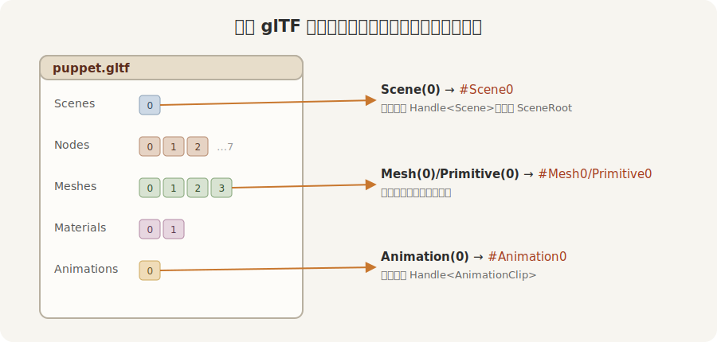

# 拆开提货单

一份 glTF 是一整箱货，箱里分门别类：**scenes**（场景）、**nodes**（节点，摆放部件的骨架）、**meshes**（网格）、**materials**（材质）、**animations**（动画），还有蒙皮 skins。要单提其中一样，靠的是标签 `GltfAssetLabel`。它列全了能点名的东西，几样常用的：

- `Scene(0)`——第 0 个场景，文字形态 `#Scene0`，提出来是一张 `Handle<Scene>`；
- `Node(2)`——第 2 个节点，`#Node2`；
- `Mesh(0)`——第 0 个网格，`#Mesh0`；真正可渲染的那块网格还在它的图元里，要 `Primitive { mesh: 0, primitive: 0 }`，即 `#Mesh0/Primitive0`；
- `Material { index: 1, .. }`——第 1 个材质；
- `Animation(0)`——第 0 段动画，`#Animation0`，提出来是一张 `Handle<AnimationClip>`（`AnimationClip` 是一段动画片段资产）。



<span class="caption">Figure 23-2：一份 glTF 是一箱分门别类的货，`GltfAssetLabel` 是提某一件的标签</span>

glTF 的真身是一份 JSON。翻开 `puppet.gltf`，`nodes` 那一段（精简过）长这样：

```json
"nodes": [
  { "name": "Puppet", "children": [1] },
  { "name": "Torso", "mesh": 0, "translation": [0.0, 2.4, 0.0], "children": [2, 3, 4, 5, 6] },
  { "name": "Head",  "mesh": 1, "translation": [0.0, 1.05, 0.0] },
  …
]
```

每个节点有名字、可能挂着一个 `mesh`、还可能有一串 `children`——这就是阿福的骨架：`Puppet` 底下是 `Torso`，`Torso` 底下吊着头和四肢。节点摆位置、网格管长相，跟你在第 12、21 章手摆 `Transform`、手挂 `Mesh3d` 是同一回事，只不过这次是从文件里读出来的。

可一份陌生的 glTF 里都有什么、各自排第几号？把整份提货单加载进来翻目录就知道了。**不带标签** `load`，得到的正是 `Handle<Gltf>`——整份文件的资产：

```rust
{{#include ../../code/ch23-gltf/examples/listing-23-02.rs:handle}}
```

<span class="caption">Listing 23-2（上）：不带标签加载，拿到整份 `Gltf`（examples/listing-23-02.rs）</span>

`Gltf` 资产加载好后，它的字段就是那张目录：`scenes`、`nodes`、`meshes`、`materials`、`animations` 各是一个 `Vec`（按号索引），还各配一份 `named_*` 的 `HashMap`（按名字索引）。翻一遍：

```rust
{{#include ../../code/ch23-gltf/examples/listing-23-02.rs:inspect}}
```

<span class="caption">Listing 23-2（下）：等它加载好，翻出里面的命名节点、动画、材质</span>

这里有个第 14 章的老规矩在起作用：资产是**异步**加载的。加载没完成前，`Assets<Gltf>` 里还查不到它，`gltfs.get(&doc.0)` 返回 `None`。所以这活儿放在 `Update` 里每帧试一次，直到拿到为止；`Local<bool>` 记下「报过了」，免得每帧刷屏。

```console
cargo run -p ch23-gltf --example listing-23-02
```

```text
场景 1 个，动画 1 段
命名节点：["ArmLeft", "ArmRight", "Head", "LegLeft", "LegRight", "Puppet", "Torso"]
命名动画：["Swing"]
命名材质：["Face", "Robe"]
```

七个命名节点、一段叫 `Swing` 的动画、两种材质 `Face` 和 `Robe`——正是手写脚本里铺下的那些名字。可见「按名字提货」（`named_nodes["Head"]`）和「按号提货」（`Scene(0)`）是一回事的两个入口：号是文件里的排序，名是建模时起的称呼。下一节会用上「名」这条路。
