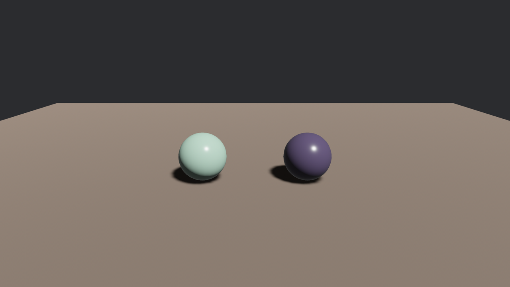

# 装箱单与标签

上一节拆穿了箱子的构造，这一节回到收货现场：不拆结构，只看**花名册**。第一次开箱我们心里有数——场景在 0 号——可要是箱子是别人发的呢？作坊换了版本、场景挪了位、材质改了名，硬编码的序号说翻车就翻车。稳妥的收货流程是：先把整箱的**目录**抬进来，照单清点，再决定请谁上台。

这份目录就是 `Gltf` 资产——不带标签加载 `.gltf` 文件得到的东西（上一节报错里“loader 的成品”正是它）。老雷把这活派给了新聘的验货员：

```rust
{{#include ../../code/ch23-gltf/examples/listing-23-03.rs:shipment}}
```

```rust
{{#include ../../code/ch23-gltf/examples/listing-23-03.rs:load_whole}}
```

<span class="caption">Listing 23-3（其一）：不带标签，请的是整箱目录 `Handle<Gltf>`（examples/listing-23-03.rs）</span>

代码里那句 `use bevy::gltf::Gltf` 其实可以省——它本就在 prelude 里；本书对这类“门牌型”类型习惯显式引入，把它住在 `bevy::gltf` 这件事写在明处。清点系统照第 14 章的老规矩轮询到货：

```rust
{{#include ../../code/ch23-gltf/examples/listing-23-03.rs:inspect}}
```

<span class="caption">Listing 23-3（其二）：验货员清点花名册，点完请默认场景上台（examples/listing-23-03.rs）</span>

`Gltf` 结构上就是一摞成对的清单：每类货一个按序号排的 `Vec<Handle<…>>`（`scenes`、`meshes`、`materials`、`nodes`、`animations`……），配一个按名字查的 `named_*` HashMap。名字来自文件里的 `name` 字段；箱里那些没名字的货（我们的箱子没有）只出现在 `Vec` 里。`default_scene` 是 `Option<Handle<WorldAsset>>`——主档里写了 `"scene": 0` 才是 `Some`。有两处小讲究值得点破：

- `named_*` 的键是 `Box<str>` 而不是 `String`——只读的名字用不着预留增长空间，这是 Bevy 抠内存的习惯做法，查表时用 `&str` 照常；
- HashMap 不记顺序，`roll_call` 里那趟排序不是穷讲究——**不排序的话每次运行报单顺序都不同**，台词就没法跟书里对了。

```console
cargo run -p ch23-gltf --example listing-23-03
```

```text
验货员：巧手斋的箱子到了，开箱清点——
验货员：场景 2 出：["AfuShow", "Workbench"]
验货员：节点 10 处：["AfuRoot", "Body", "BoothLamp", "Head", "LeftArm", "MainRod", "MakerCam", "RightArm", "SpareArm", "SpareHead"]
验货员：网格 4 件：["HeadMesh", "RobeMesh", "RodMesh", "SleeveMesh"]
验货员：材质 3 罐：["AfuFace", "AfuRobe", "RodWood"]
验货员：动画 1 折：["Swing"]
验货员：货净单清，请主角上台。
```

跟 23.2 节摊开的 JSON 逐项对得上：两出场景、十处节点（连工作台的备件、作坊的灯和机位都在册）、四件网格、三罐漆、一折戏。清点完 `commands.spawn(WorldAssetRoot(stage_scene))` 上台的阿福，跟 Listing 23-1 的一模一样——`default_scene` 里的句柄和 `#Scene0` 指的是同一件货。

## GltfAssetLabel：提货单的全部写法

`#Scene0` 只是标签家族的一员。每种箱内资产都有自己的标签格式，全部收录在 `GltfAssetLabel` 枚举里：`Scene(n)`、`Node(n)`、`Mesh(n)`、`Primitive { mesh, primitive }`、`Texture(n)`、`Material { index, is_scale_inverted }`、`DefaultMaterial`、`Animation(n)`、`Skin(n)`、`InverseBindMatrices(n)`。眼下用得上的是前几种；`Material` 那对留到 23.7，`Skin` 一族是蒙皮骨骼的地界，第 30 章再会。

只提一件货是什么体验？老鲁头一个来占便宜——他看上了阿福的头形，想翻两个素坯自己上釉：

```rust
{{#include ../../code/ch23-gltf/examples/listing-23-04.rs:primitive}}
```

<span class="caption">Listing 23-4：`#Mesh0/Primitive0` 只提头形，一张不折不扣的 `Mesh`（examples/listing-23-04.rs）</span>

```console
cargo run -p ch23-gltf --example listing-23-04
```



<span class="caption">Figure 23-3：老鲁的两个素坯——网格是阿福的头形，釉是自家的</span>

这个 listing 教的东西比画面多：

- **箱内的网格就是普通 `Mesh`**。提出来配上自己的 `StandardMaterial`，跟第 21 章手搓的坯子毫无二致——素坯归素坯，釉归釉；
- **同一件货写了两种提法**。枚举写法 `GltfAssetLabel::Primitive { mesh: 0, primitive: 0 }` 拼错字段编译器当场拦；字符串写法 `"…#Mesh0/Primitive0"` 短，但拼错要到运行时才见分晓。正经代码用枚举，字符串适合配置文件和随手试验；
- 两个 spawn 用的是**同一张网格**的两个句柄——第 14 章讲过，资产按路径去重，显存里头形只有一份。

“运行时才见分晓”长什么样？把标签故意写错两回——序号越界的 `#Mesh9/Primitive0`，大小写不对的 `#mesh0/primitive0`——报错是同一条，而且相当够意思：

```text
ERROR bevy_asset::server: The file at 'models/afu/afu.gltf' does not contain the
labeled asset 'Mesh9/Primitive0'; it contains the following 28 assets: 'Animation0',
'DefaultMaterial/std', 'Material0', 'Material0/std', 'Material1', 'Material1/std',
'Material2', 'Material2/std', 'Mesh0', 'Mesh0/Primitive0', 'Mesh1', 'Mesh1/Primitive0',
'Mesh2', 'Mesh2/Primitive0', 'Mesh3', 'Mesh3/Primitive0', 'Node0', 'Node1', 'Node2',
'Node3', 'Node4', 'Node5', 'Node6', 'Node7', 'Node8', 'Node9', 'Scene0', 'Scene1'
```

它把**整箱的标签清单**印给你了——拼错标签时最好的纠错资料就在报错自己身上。两处细节别放过：标签**大小写敏感**（`mesh0` 不是 `Mesh0`）；清单里混着几张生面孔——`Material0/std`、`DefaultMaterial/std`——每罐材质都有个带 `/std` 后缀的影子。那是 23.7 节两本账的第二本，先混个脸熟。
