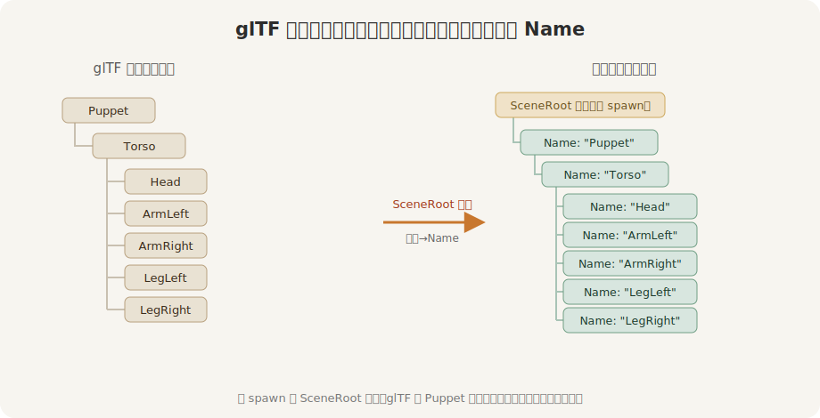
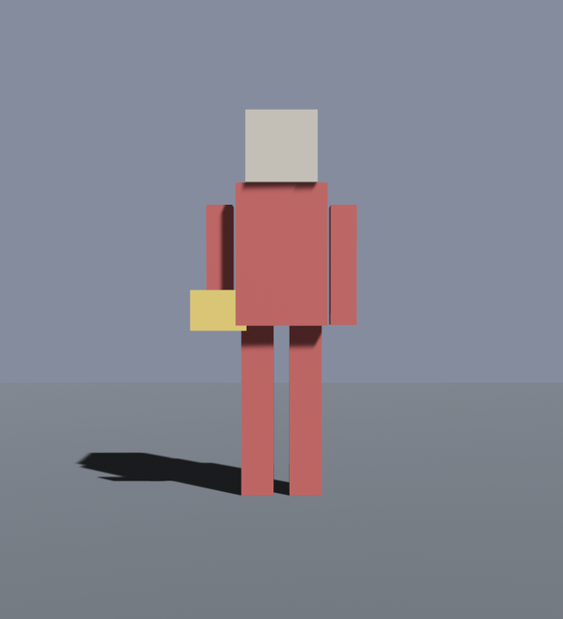

# 点谁的名

加载那一刻，阿福被展开成了一棵实体树：`SceneRoot` 那个实体是根，底下是 `Torso`，再底下是头和四肢，每个 glTF 节点对应一个实体。节点的名字，原样变成了实体上的 `Name` 组件。所以「找到那条右臂」就是一句话：遍历子孙，挑名叫 `"ArmRight"` 的那个。



<span class="caption">Figure 23-3：glTF 的节点树，加载后展开成一棵实体树；节点名变成实体的 `Name`</span>

这里有两层「根」，别混了。你在代码里 `spawn(SceneRoot(...))` 得到的是**实例根实体**：它代表「这一份场景实例」，可以拿来整体移动、整体挂观察者。glTF 文件里的 `Puppet`、`Torso`、`ArmRight` 这些节点，则是在场景展开后才生成的**子孙实体**。`SceneInstanceReady` 发出时，实例根已经带上了完整的子孙树；从这个根开始 `iter_descendants`，才走得到那些由 glTF 节点生成的实体。

但有个时机问题：`SceneRoot` 一挂上，子实体不是**立刻**就有的——展开要等一两帧。在 `Startup` 里紧接着查 `Name`，会扑个空。Bevy 给了一支发令枪：`SceneInstanceReady`，在场景**展开完毕**的那一刻、朝 `SceneRoot` 那个实体发出。用一个观察者接住它：

```rust
{{#include ../../code/ch23-gltf/examples/listing-23-04.rs:give_flag}}
```

<span class="caption">Listing 23-4：场景就位后，按名字找到 `ArmRight`，给它挂一面小旗（examples/listing-23-04.rs）</span>

观察者怎么挂上去的，在 `setup` 里：`commands.spawn(SceneRoot(...)).observe(give_flag)`——观察者盯着这个实体，场景一展开就触发。`SceneInstanceReady` 是个 `EntityEvent`，它的 `ready.entity` 就是那个 `SceneRoot` 实体；`children.iter_descendants(ready.entity)` 把它底下的子孙挨个走一遍。`Name` 解引用成 `&str`，拿 `name.as_str()` 跟 `"ArmRight"` 一比就成。

```console
cargo run -p ch23-gltf --example listing-23-04
```

```text
找到了 ArmRight，把小旗挂上了
```



<span class="caption">Figure 23-4：按名字找到 `ArmRight`，往它手里塞了面小旗</span>

小旗是用 `ChildOf(entity)` 生成的——它做了 `ArmRight` 的子实体，就钉死在这条胳膊的坐标系里。这一点下一节有回报：胳膊一摆，小旗跟着摆。这正是「按名字找到挂载点、往上面装东西」的通用套路——给手装武器、给头戴帽子、在某个节点上吊特效，都是这一招。

名字其实有三路，看你要按什么找：节点名进 `Name`（最常用）；网格名进 `GltfMeshName`、材质名进 `GltfMaterialName`（两个分别记下实体源自 glTF 的网格名 / 材质名的组件，都在 `bevy::gltf` 里，`.0` 取字符串）。查右臂用 `Name`，查「所有用了某材质的图元」就改查 `GltfMaterialName`。
