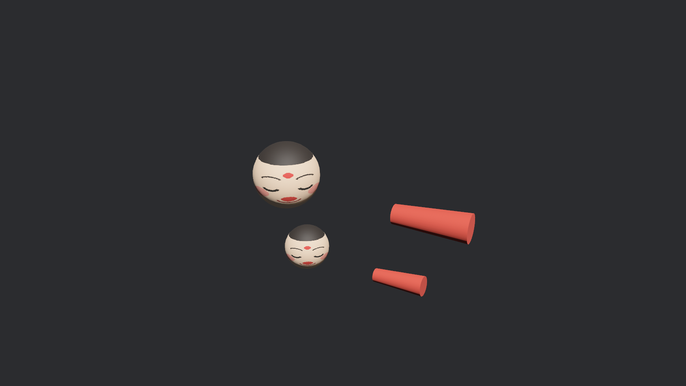

# 换场

装箱单上明明白白写着两出场景，只演 `AfuShow` 未免亏了。老雷起了兴致：把作坊的工作台（`Workbench`——备用头、备用袖，作坊连自己的家什都一并装了箱）搬上台给看客开开眼。要求还不低：**换场不重启**，一个键切过去、再一个键切回来。

上一节的 `Gltf` 目录正好派上用场——`named_scenes` 按名字取场景句柄，塞回台口实体的 `WorldAssetRoot` 就行：

```rust
{{#include ../../code/ch23-gltf/examples/listing-23-05.rs:swap}}
```

<span class="caption">Listing 23-5：改 `WorldAssetRoot` 的值就是换场——旧场自动拆、新场自动搭（examples/listing-23-05.rs）</span>

系统本身没一行拆搭代码，全部玄机在 `root.0 = …` 这一句赋值上。引擎里有个系统盯着 `Changed<WorldAssetRoot>`（第 4 章的变更过滤器，引擎自己也拿它当耳目）：值一变，它就把上一次搭出来的那棵实例子树整个 despawn，再按新句柄搭一棵。所以换场的语义是**换胎不换台口**——台口实体还是原来那个，Transform、名下的 observer 都还在，只有子树是新的。

跑起来按一次空格：

```console
cargo run -p ch23-gltf --example listing-23-05
```

```text
老雷：开幕是 AfuShow。按空格，后台工作台搬上来给大家开开眼。
老雷：换场——Workbench！
```

台上确实换成了工作台的备件——但画面不对劲：



<span class="caption">Figure 23-4：换到 Workbench 的瞬间——两台相机各画一遍，叠成一张双重曝光</span>

日志同时抛出一条警告：

```text
WARN bevy_render::camera: Camera order ambiguities detected for active cameras with
the following priorities: {(0, Some(Window(NormalizedWindowRef(65v0))))}. To fix this,
ensure there is exactly one Camera entity spawned with a given order for a given
RenderTarget. Ambiguities should be resolved because either (1) multiple active cameras
were spawned accidentally, which will result in rendering multiple instances of the
scene or (2) for cases where multiple active cameras is intentional, ambiguities could
result in unpredictable render results.
```

案情并不复杂。回看装箱单：`Workbench` 场景里除了备件，还躺着 `MakerCam`——**作坊自己的参考机位**。glTF 是能装相机的（建模软件里摆好的取景机位会一并导出），而 Bevy 的装卸工对相机的默认处置是：**照单全收，而且文件里第一台直接通电**（`Camera` 组件的 `is_active` 为 true）。于是台上出现了两台开机的相机，`order` 都是默认的 0——第 13 章讲过，order 决定多相机往同一块画布上画的先后；order 撞车，谁先谁后没个准，警告原文里那句 “rendering multiple instances of the scene” 就是你看到的重影：两台相机各画了一遍，叠在同一个窗口上。

再按一次空格换回 `AfuShow`，重影应声而愈——`MakerCam` 是 Workbench 实例子树的一员，换场拆树时被一并拆走了。这算是自愈，但病根没除：**只要按默认规矩开这只箱子，作坊的相机就会跟你的相机抢画布**，还有那盏没露过面的 `BoothLamp` 摊位灯，也在没人问过你的情况下悄悄进了园子给场景加光。

开箱这件事，看来不能全按作坊的意思来。下一节立规矩。
