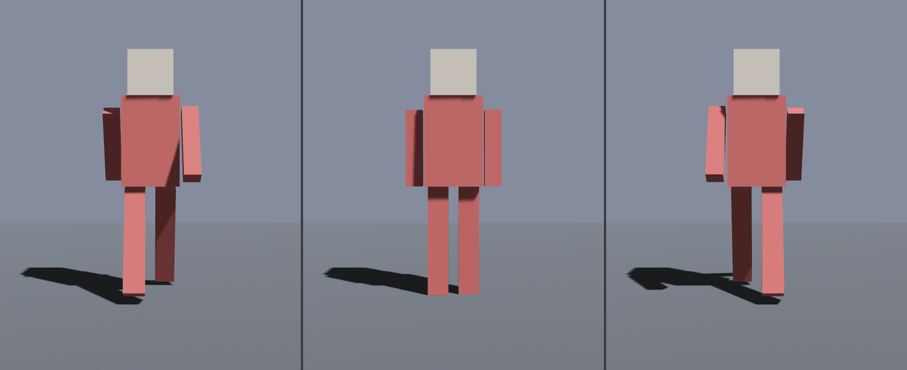

# 让角儿动起来

阿福的提货单里有一段动画，叫 `Swing`。把它放起来，最小的一路是三步：装进一张图、找到播放器、按下播放。

先认四个名字：

| 名字 | 本章里把它当什么 |
|---|---|
| `AnimationClip` | 一段动画资产，比如 glTF 里的 `Swing` |
| `AnimationGraph` | 播放器要看的动画图；本章只有一个节点，里面装一段 clip |
| `AnimationPlayer` | 实际播放动画的组件，glTF 加载器会自动挂到某个子孙实体上 |
| `AnimationGraphHandle` | 把播放器接到哪张动画图上的句柄组件；漏了它，`play(index)` 找不到编号属于哪张图 |

先装图。哪怕只有一段动画，也得先进一张**动画图** `AnimationGraph`。`AnimationGraph::from_clip` 接一张 `Handle<AnimationClip>`（就用 `GltfAssetLabel::Animation(0)` 从文件里提），吐出一对 `(图, 这段动画在图里的编号)`；把图存进 `Assets<AnimationGraph>`：

```rust
{{#include ../../code/ch23-gltf/examples/listing-23-05.rs:build_graph}}
```

<span class="caption">Listing 23-5（上）：把第 0 段动画装进一张图，连同 `SceneRoot` 一起 spawn（examples/listing-23-05.rs）</span>

为什么动画非得套一层「图」？因为真正的动画很少只放一段——走、跑、跳之间要**混合**、要**过渡**，那是图的活儿。这些第 30 章细讲；这里只取它最简单的一面：一张图、一段动画、编号就一个。要播什么，连同 `index` 一起记在 `AnimationToPlay` 组件上，挂到 spawn 出来的实体上备用。

接着是常叫人摸不着头脑的一步：`AnimationPlayer`（动画播放器——挂在哪个实体上，就驱动那个实体名下的动画）是谁挂的？**glTF 加载器替你挂的**。场景展开时，引擎在动画的根节点那个实体上自动插了一个 `AnimationPlayer`。你不 `spawn` 它——你**找**它。又是 `SceneInstanceReady` 观察者，沿子孙找到带 `AnimationPlayer` 的那个实体，按下播放：

```rust
{{#include ../../code/ch23-gltf/examples/listing-23-05.rs:play_when_ready}}
```

<span class="caption">Listing 23-5（下）：场景就位后，找到自动挂上的 `AnimationPlayer`，放动画并接上图</span>

`player.play(anim.index)` 让它放第 `index` 号，`.repeat()` 让它循环。但**还差一步，而且这一步漏了不报错**：给这个实体 `insert(AnimationGraphHandle(...))`（指向那张动画图的句柄组件），把动画图接到播放器上。`play` 只说了「放第 0 号」，可播放器还不知道这个编号出自哪张图；接上 `AnimationGraphHandle`，编号才有了出处。少了这一句，阿福杵着一动不动——既不 panic、也不告警，是个彻头彻尾的哑巴坑。要是哪天动画死活不动，先回头看这一句接上没有。

```console
cargo run -p ch23-gltf --example listing-23-05
```

<figure class="bevy-demo" data-src="demos/ch23/anim.html" data-ratio="16 / 10">



<figcaption class="caption">Figure 23-5：`Swing` 循环播放——阿福四肢前后摆，原地踏步。点一下画面可在浏览器里实时运行，并就地把动画图从播放器上拔掉、再接回去：拔了它，阿福当场僵在半步、还不报错；接回去又从那一帧续着踏——正是本节那个哑巴坑，这回让你一键亲手撞。</figcaption>

</figure>

阿福活了，四肢前后摆着原地踏步。这段动画动的是**节点的旋转**——脚本给四条肢的 rotation 通道打了关键帧，引擎逐帧把这些旋转灌回对应实体的 `Transform`。这跟「皮肉随骨头连续变形」的**蒙皮**是两路：木偶的胳膊是硬邦邦一整块，绕着肩膀转。蒙皮更进一层，留到第 30 章。眼下记住这条最小路就够使：`from_clip` 装图 → 等场景就位 → 找到 `AnimationPlayer` → `play().repeat()` 并接上图。
