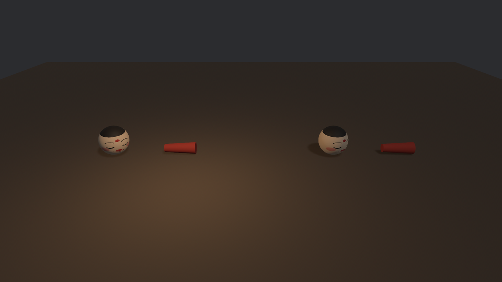
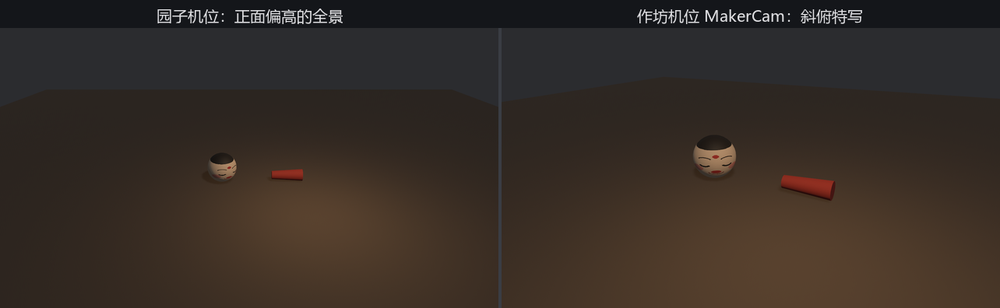

# 开箱的讲究

作坊的相机抢画布、作坊的灯私自加光——病根在于我们一直用**默认规矩**开箱。规矩是可以立的：glTF loader 接受一份 `GltfLoaderSettings`，在加载时随路径递进去。递法用第 14 章教过的 `load_builder`：

```rust
{{#include ../../code/ch23-gltf/examples/listing-23-06.rs:settings}}
```

<span class="caption">Listing 23-6：同一箱货开两回——左手请作坊的灯，右手全按园子的来（examples/listing-23-06.rs）</span>

`GltfLoaderSettings` 从 `bevy::gltf` 引入，`with_settings` 的闭包收到一份默认值，改你要改的字段。这个 listing 把工作台开了两份摆在左右，唯一的差别是右边多关了一盏灯——为了让差别肉眼可见，园子自己的平行光特意压暗到 400 勒克斯：

```console
cargo run -p ch23-gltf --example listing-23-06
```



<span class="caption">Figure 23-5：`load_lights` 的一拨之差——左边请了作坊的摊位灯，右边谢绝</span>

左边那团暖光就是 `BoothLamp`。顺带交代装卸工搬灯的账目，都是从 loader 源码里核出来的：glTF 用 KHR_lights_punctual 扩展装灯，点光的强度单位是**坎德拉**（cd，每球面度的流明），Bevy 的 `PointLight` 要的却是**流明**总量（第 22 章的口径），装卸时按 `流明 = 坎德拉 × 4π` 换算——箱里这盏写 3000 cd，落地就是约 37 700 lm；glTF 没写光程时 `range` 默认给 20 米。灯实体作为该节点的**子实体**生成，`Name` 取的是灯自己的名字（`BoothGlow`），不是节点名（`BoothLamp`）——学会下一节的点名手艺后，拿它打印一次 Workbench 场景，就能亲眼看到这层父子。

## 逐个旋钮过一遍

`GltfLoaderSettings` 的全部字段，按用得上的频率排：

- **`load_cameras: bool`**（默认 `true`）——要不要替箱里的相机节点生成 `Camera3d`。上一节的重影就是它默认放行惹的祸；除非你在做“用建模软件排机位”的工作流，游戏里一般关掉。
- **`load_lights: bool`**（默认 `true`）——同理管灯。美术在建模软件里打的光要不要原样进园子，是工作流决定的事：接受，光照交给美术；谢绝，光照代码说了算。两边都行，但要**有意识地选**。
- **`load_animations: bool`**（默认 `true`）——要不要加载动画（以及随之而来的 `AnimationPlayer` 等装配，23.8 节的主角）。纯摆件场景关掉能省一点加载。
- **`load_meshes` / `load_materials`**（类型是 `RenderAssetUsages`，默认既进内存也进显存）——控制网格与材质数据装到哪。改成只进显存能省内存，代价是 CPU 侧再也读不到顶点（做碰撞检测就没了原料）。`load_meshes` 置空是干净的“不装”：绘制实体整层不生成、节点树照常——写作时实测过，阿福隐了身，骨架名单一个不少，做服务器端或纯逻辑加载正合适。`load_materials` 则别当开关用：它还捎带决定**贴图**数据装到哪，置空的实测结果是个半残状态——素色的件照常带色渲染、带贴图的件直接消失。日常保持默认。
- **`include_source: bool`**（默认 `false`）——开着的话，`Gltf` 资产的 `source` 字段会保留整份解析后的 glTF 原始文档，供你翻规范级的犄角旮旯。
- **`default_sampler` / `override_sampler`**——贴图采样器的默认值与强制覆盖（像素画风格要 nearest 采样时用得上，第 15 章的老话题）。
- **`validate: bool`**（默认 `true`）——按 glTF 规范校验文件。关掉能容忍一些不合规的文件，代价自负。
- **`convert_coordinates`**——坐标转换，23.9 节整节伺候。
- **`skinned_mesh_bounds_policy`**——蒙皮网格的包围盒策略，第 30 章的地界。

## 借机位：不请人，借坐标

谢绝了 `MakerCam`，有点可惜——作坊摆那个机位是有讲究的，那是他们钦定的“最佳观赏角度”。好在**不请人也能借坐标**：相机没进园子，节点还在箱里。装箱单上的 `Node{N}` 标签能把任何节点提成 `GltfNode` 资产（`bevy::gltf` 引入），里面躺着这个节点在 glTF 里的名字、原始 `Transform`、子节点与所挂网格的句柄——一份不落地的“节点档案”：

```rust
{{#include ../../code/ch23-gltf/examples/listing-23-07.rs:borrow_seat}}
```

<span class="caption">Listing 23-7（其一）：场景照旧谢绝相机，另用 `#Node7` 把机位档案提出来（examples/listing-23-07.rs）</span>

`MakerCam` 是装箱单上的 7 号节点（23.3 节的花名册数得出来）。换座系统从 `Assets<GltfNode>` 里读档案，把作坊的 `Transform` 原样搬给自己的相机：

```rust
{{#include ../../code/ch23-gltf/examples/listing-23-07.rs:swap_seat}}
```

<span class="caption">Listing 23-7（其二）：空格换座——`GltfNode::transform` 就是作坊摆机位的原始坐标（examples/listing-23-07.rs）</span>

```console
cargo run -p ch23-gltf --example listing-23-07
```

```text
老雷：空格换机位——园子的看全景，作坊的看他们钦定的构图。
老雷：坐上作坊的 MakerCam——他们留的构图。
老雷：回园子自己的机位。
```



<span class="caption">Figure 23-6：同一张工作台，两把椅子——右边是从 `GltfNode` 档案里借来的作坊构图</span>

一按空格，画面从园子的全景跳到作坊的特写构图——备件斜上方的近景，摊位灯的暖光压着看。这一手的应用面比“借机位”宽得多：**建模软件里摆的任何空节点，都能这样当数据用**——出生点、巡逻路径的路标、炮口的挂点，美术在场景里摆好，程序按 `Node` 标签或按名提档案，不必真的把它们 spawn 出来。有一处口径要对齐：`GltfNode::transform` 是节点写在文件里的**局部**变换（这里 MakerCam 是场景根层的节点、场景又摆在原点，局部即世界，拿来就用）；节点要是埋在层级深处，就得自己沿档案里的父子链把变换乘出来。

## 一箱只认一套规矩

Listing 23-6 里有个容易被当成笔误的细节：左手开的是 `models/afu/afu.gltf`，右手开的却是 `models/afu.glb`。这不是为了炫耀 23.2 节的两种装箱——是**绕坑**。

写这一节的第一稿，左右两边开的是同一个路径，只是 settings 不同。结果两边**都**亮着灯：右手那份 `load_lights = false` 被静默无视了，日志里一个字都没有。查下来是资产系统的一条硬规矩：**资产的身份是“路径 + 标签”，不含 settings**。同一路径不管请多少次，装卸只发生一次；哪一次请求的 settings 随这次装卸生效——**装载是异步的，谁抢到没有任何保证**——其余请求的 settings 从头到尾没人打开过，一声不响。

这不是理论恐吓，是本章代码真踩过的雷，还踩了两回：这一节的第一稿是一回；Listing 23-7 的初稿是另一回——它对 `afu.gltf` 发了两次请求，`Scene(1)` 那次关了相机、`Node(7)` 那次忘了带 settings，结果**随机翻车**：默认 settings 抢赢的那几次运行里，`MakerCam` 以活相机进园，order 撞车的警告和双相机叠画一起回来，换座系统还因为多出一台相机集体罢工。同一份代码，跑十次几次好几次坏——这类竞态 bug 的排查成本，值得你现在就用规矩预防：

- **同一路径的所有装载点，settings 必须一字不差**（Listing 23-7 最终稿就是这么修的）；
- 要同一份内容、两种开法，就得是**两个路径**——我们恰好有 `.glb` 这份内容相同的拷贝，正好一箱顶两箱用；
- 实际项目里更常见的解法是别让这种需求出现：开箱规矩全工程统一，写在一处（比如资产加载的封装函数里），而不是散在各个调用点各行其是。

> **口径**：`with_settings` 影响的是**整个文件**的装卸，不是某个标签——同一路径下所有标签共享同一次装卸。这也是为什么规矩只能立一次：装卸只发生一次。
