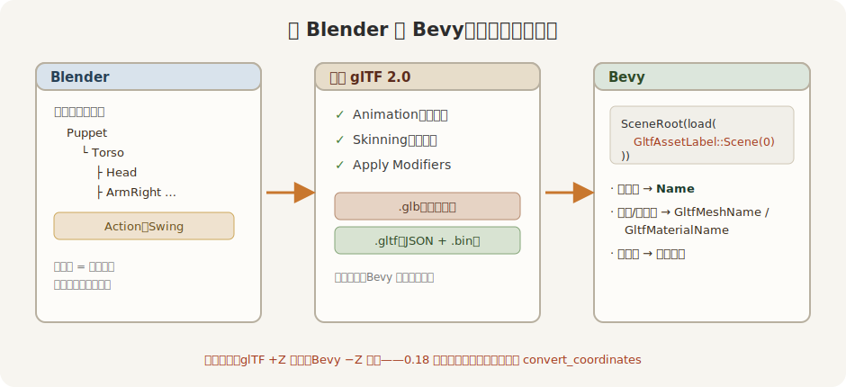

# 从 Blender 到 Bevy

阿福是手写的，真实项目里模型从建模软件来。把这条路走一遍，你就能把任何一个 Blender 模型请进 Bevy。

Figure 23-6：Blender → 导出 glTF → Bevy 加载，名字一路过得去

一步一步：

1. **先起好名字。** 在 Blender 里给对象、材质、动作（Action）起**有意义**的名字。这些名字会原样过到 Bevy——对象名进 `Name`、网格名进 `GltfMeshName`、材质名进 `GltfMaterialName`、动作名进命名动画。你想在代码里按 `"ArmRight"` 点名右臂，前提是建模时它就叫这个名。这一步最容易被略过，却决定了你之后能不能「点名取人」。

2. **导出 glTF 2.0。** File → Export → glTF 2.0。两种容器任选：`.glb` 是单个二进制文件，网格、贴图、动画全打进一份，部署最省心；`.gltf` 是 JSON 配上旁边的 `.bin` 与贴图，可读、可 diff、好排错。两者在 Bevy 里**加载写法完全一样**，只有路径扩展名不同——第 01 节那句 `SceneRoot(asset_server.load(GltfAssetLabel::Scene(0).from_asset(...)))` 原样适用。

3. **勾对导出选项。** 要动画就勾上 Animation，要蒙皮就勾上 Skinning，几何上若用了修改器记得 Apply Modifiers。glTF 约定 +Y 朝上，导出器会替你把 Blender 的 +Z 朝上转好，这一档保持默认即可。

4. **留神坐标朝向。** 一个值得记住的约定差：glTF 里 **+Z 朝前**，而 Bevy 里 **−Z 才是前**（第 12、21 章那条「前方是 −Z」）。Bevy 0.18 默认**不**替你旋转 glTF 的数据（这仍是个实验特性），所以模型自带的「前」未必等于它落地后实体的 `Transform::forward`。摆好相机看模型，这点通常不咬人；可一旦你要让代码顺着「模型的脸朝哪」去算东西（比如让它朝某个方向走），就得心里有数，必要时查 `GltfLoaderSettings::convert_coordinates`。

5. **落地加载。** 把导出的文件丢进 crate 的 `assets/`，照第 01 节加载就行。

最后说回**蒙皮**。阿福是杖头木偶——四肢硬邦邦各自绕着关节摆，那是**节点动画**（动的是节点的 `Transform`）。真人演员皮肉随骨头连续变形，那是**蒙皮**：模型里多一份 skin + joints 数据，记着「每块皮归哪几根骨头管、各占几分」。好消息是——**加载和放动画的代码一字不差**：还是 `SceneRoot` 加载、`SceneInstanceReady` 等就位、找 `AnimationPlayer`、`play().repeat()`，蒙皮数据引擎自动认。Bevy 官方的 `Fox.glb` 就是个蒙皮模型，想亲眼看真蒙皮，把官方 `animated_mesh` 示例跑一跑；它的机理留到第 30 章拆。

该把这一章的三样——加载、点名、动画——并到一台戏上了。
