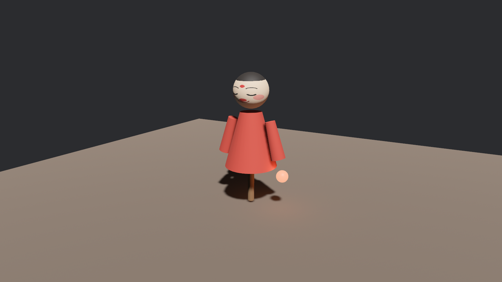

# 回执与按名找人

老雷看完工作台，回头吩咐跟包：给阿福的左袖挂盏灯笼，夜场用。跟包领了活就犯难：灯笼要挂到**场景里的某个实体**上，可 `spawn(WorldAssetRoot(…))` 之后立刻去找，树上一个实体都没有——货还在路上（第 14 章的老课题：加载是异步的）。轮询“到了没”是一条路，但第 8 章学过更体面的做法：**留个观察者，等回执**。

场景搭完的那一刻，引擎会对台口实体触发一个 `WorldInstanceReady` 事件（EntityEvent，从 `bevy::world_serialization` 引入）。把 observer 直接挂在 spawn 那个实体上，事件来了自动上工：

```rust
{{#include ../../code/ch23-gltf/examples/listing-23-08.rs:observe}}
```

<span class="caption">Listing 23-8（其一）：spawn 台口，顺手挂上收回执的 observer（examples/listing-23-08.rs）</span>

回执上写着什么？`ready.entity` 是台口实体，`instance_id` 是这次实例的编号（拆搭管理用，本章用不上）。跟包收到回执头一件事不是挂灯，是**点名**——把搭出来的树从头到脚打印一遍，看看货到底长什么样：

```rust
{{#include ../../code/ch23-gltf/examples/listing-23-08.rs:receipt}}
```

<span class="caption">Listing 23-8（其二）：沿 `Children` 递归下行，凭 `Name` 点名（examples/listing-23-08.rs）</span>

`iter_descendants` 与递归下行都是第 9 章的走树手艺；`Has<AnimationPlayer>` 这个查询参数（第 11 章）不借数据、只答“有没有”，正适合往名字后面缀徽章。跑：

```console
cargo run -p ch23-gltf --example listing-23-08
```

```text
跟包：回执到，实体 372v0 名下的场子搭好了——
(无名 372v0)
  AfuShow
    AfuRoot　←带 AnimationPlayer
      Body
        RobeMesh.AfuRobe
        Head
          HeadMesh.AfuFace
        LeftArm
          SleeveMesh.AfuRobe
        RightArm
          SleeveMesh.AfuRobe
      MainRod
        RodMesh.RodWood
```

这棵树值得逐层验明正身（实体编号每次运行会变，树形不变）：

- **台口实体**（我们 spawn 的那个）没有 `Name`，打印成“无名”；它名下先长出一层**场景根实体**，`Name` 取场景名 `AfuShow`；
- 再往下就是 23.2 节 JSON 里的节点树原样落地：`AfuRoot` → `Body` → `Head`/`LeftArm`/`RightArm`，旁支 `MainRod`——**glTF 节点的名字，原封不动变成实体的 `Name` 组件**（没名字的节点会得到 `GltfNode3` 这类编号名）。这就是“按名找人”的全部依据；
- 每个带网格的节点**又**挂了一层子实体，那才是真正带 `Mesh3d` 的绘制实体，命名格式是**网格名.材质名**（`SleeveMesh.AfuRobe`）。为什么多这一层？因为 glTF 的一件网格可以有多个 primitive（多罐漆各管一片），每个 primitive 一个实体；名字里带上材质名，正是为了同一网格的几个实体能区分开。这层实体身上还别着 `GltfMaterialName`、`GltfMeshName` 两枚名牌，23.7 节换漆全靠前者；
- `AfuRoot` 后面那枚徽章：装卸工发现箱里有动画、而这棵子树是动画的根，就顺手把**播放器**（`AnimationPlayer`）装在了这儿——23.8 节的锣就敲在这个实体上。

一个易踩的时差也在这儿交代了：回执触发在树刚搭完的当口，**这一帧的 `GlobalTransform` 还没跑传播**（第 12 章两本账的规矩）——observer 里读世界坐标会读到没对齐的零账本。要世界坐标，等下一帧再读；本章的活计只认 `Name` 和父子关系，不受影响。

## 挂灯笼

点完名，正主上工。货单（extras）这时也能派上用场——作坊在 `LeftArm` 节点的 `extras` 里注了一句 `{"slot": "lantern"}`（23.2 节 JSON 里你见过原文），这类**自定义数据**在 Blender 里就是对象的 Custom Properties，装卸工把它原样装进 `GltfExtras` 组件，`value` 字段是一段没解析过的 JSON 文本：

```rust
{{#include ../../code/ch23-gltf/examples/listing-23-09.rs:hang}}
```

<span class="caption">Listing 23-9：凭 `Name` 找到左袖，念一眼货单，挂灯（examples/listing-23-09.rs）</span>

有三处手艺值得放大：

- **挂点即节点**：灯笼 spawn 成 `LeftArm` 实体的子实体（`with_child`，第 9 章），偏移 `(0.0, -0.50, 0.0)` 表示“顺着袖子往下半米”——是袖子自己的坐标系，不是世界坐标。袖子将来一挥（23.8 节），灯笼分文不改就会跟着荡；
- **灯笼是三件套**：一颗小球网格给人看、一层自发光让它像个光源、一盏真 `PointLight` 让它照亮台面——第 22 章拆过的“可见的灯泡”老搭配；
- **extras 是原文**：`value` 里连作坊写 JSON 时的缩进换行都在，念之前先把空白捋平。真项目里该用 `serde_json` 正经解析，再按里面的数据决定挂什么、挂哪儿——这就是“美术在建模软件里标记挂点，程序照单办事”的数据驱动工作流，只是我们的示例从简。

顺带把名牌一族点齐：节点上的字条进 `GltfExtras`（阿福箱里 `AfuRoot` 还有一张 `{"workshop": "Qiaoshouzhai"}`，作坊的落款）；写在场景、网格、材质上的字条则各进各的 `GltfSceneExtras`、`GltfMeshExtras`、`GltfMaterialExtras`，挂在相应实体上。同理，场景根实体除了 `Name` 还别着 `GltfSceneName`——跟绘制实体的 `GltfMaterialName`/`GltfMeshName` 一个路数：`Name` 给人看和找，`Gltf*Name` 明确记着“它在箱单上的原名”。

```console
cargo run -p ch23-gltf --example listing-23-09
```

```text
跟包：LeftArm 找到了，货单注着 { "slot": "lantern" }——挂灯。
```



<span class="caption">Figure 23-7：灯笼挂上左袖——挂的是节点实体的子实体，袖动灯随</span>
