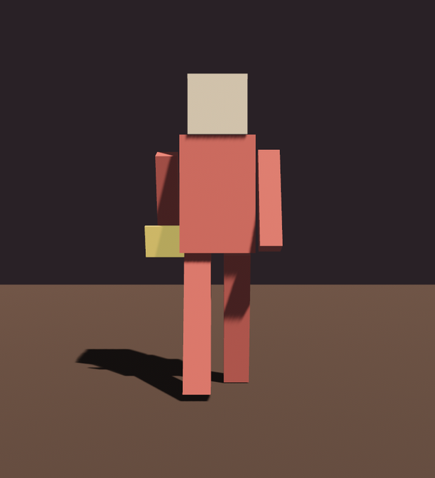

# 角儿登场

灯也会打了、角儿也请来了、名也会点了、动也会放了。最后把这三样并到一个角儿身上，凑一台戏。先记下要播的动画，再把场景与观察者一起 spawn：

```rust
{{#include ../../code/ch23-gltf/src/main.rs:components}}
```

<span class="caption">Listing 23-6（节选一）：记一笔「要播哪段动画」（src/main.rs）</span>

```rust
{{#include ../../code/ch23-gltf/src/main.rs:setup}}
```

<span class="caption">Listing 23-6（节选二）：装好动画图，连同 `SceneRoot` 一起 spawn，挂上观察者</span>

要紧的是那个 `on_ready`。场景一就位，沿子孙走**一遍**，把两件事顺手都办了——撞见 `AnimationPlayer` 就放动画，撞见名叫 `"ArmRight"` 的节点就挂小旗：

```rust
{{#include ../../code/ch23-gltf/src/main.rs:on_ready}}
```

<span class="caption">Listing 23-6（节选三）：一趟遍历，放动画 + 按名字挂道具</span>

小旗做了 `ArmRight` 的子实体，于是它跟着挥动的手一起摆——第 04 节埋的扣子在这里收了。开台：

```console
cargo run -p ch23-gltf
```



<span class="caption">Figure 23-7：角儿登场——加载的模型、按名字添的道具、放起的动画，一台戏齐活</span>

一台戏就齐了：一份 glTF 提货单，提出场景摆上台、提出动画放起来，再按名字给角儿添了件道具。从这里到一个真正的游戏角色，缺的只是更精细的模型和更丰富的动画——而请它进门、让它动起来的路数，就是这一章这几步。

## 小结

- **glTF 是一箱货**：一份文件装着场景、节点、网格、材质、动画；`GltfAssetLabel` 按号（或文字标签 `#Scene0`）提单件，`.from_asset(path)` 把标签贴到路径上；不带标签 `load` 得到整份 `Handle<Gltf>`，翻 `named_*` 目录能按名字索引
- **上台靠 `SceneRoot(Handle<Scene>)`**：它把场景展开成一棵子实体树；少了 `Scene(0)` 标签，要么类型对不上（`Handle<Gltf>` 塞不进要 `Handle<Scene>` 的位子），要么运行时加载失败（控制台有 `ERROR`，并列出所有可用标签）——所以用带类型的 `GltfAssetLabel`，别手搓字符串
- **按名字取实体**：节点名变 `Name`（网格名 `GltfMeshName`、材质名 `GltfMaterialName`）；展开是异步的，用 `SceneInstanceReady` 观察者等就位，再 `iter_descendants` 按名字找实体、用 `ChildOf` 挂载道具
- **放动画三步**：`AnimationGraph::from_clip` 装图存进 `Assets<AnimationGraph>` → 找到 glTF 加载器**自动挂**的 `AnimationPlayer` → `play(index).repeat()` 并 `insert(AnimationGraphHandle(...))`；漏掉接图不报错、动作也不动
- **节点动画 vs 蒙皮**：前者动节点的 `Transform`，后者让皮肉随骨头变形——但加载与播放代码相同；蒙皮、多段混合、过渡都是第 30 章
- **DCC 工作流**：Blender 里起好名 → 导出 glTF 2.0（`.glb` 单文件 / `.gltf` 可读）→ 勾上 Animation/Skinning → 留神 +Z 朝前的坐标约定 → 丢进 `assets/` 加载

## 练习

1. **换个挂点**：把小旗从 `ArmRight` 换到 `Head`（当根翎子），或挂到 `LegRight`——只改那个名字字符串，跑一遍，看道具换了位置。
2. **一队木偶**：把 `SceneRoot` 里那张 `Handle<Scene>` `.clone()` 几份，在不同 `Transform` 上各 spawn 一个，凑一队阿福。各自都要单独放动画吗？试试看哪些动、哪些不动，想想为什么。
3. **翻目录做菜单**：借第 02 节的 `Handle<Gltf>`，把 `named_animations` 的名字都打印出来；要是文件里有好几段动画，试着**按名字**（而非 `Animation(0)`）取一张 clip 来播。
4. **探一个真模型**：找一个带动画的 `.glb`（官方 `Fox.glb` 就行），换掉 `PUPPET` 路径——`Scene(0)` / `Animation(0)` 多半直接能跑。先用第 02 节的办法把它的命名节点和动画翻出来，再按名字找一根骨头挂个东西。
5. **朝向的坑**：给阿福加一段「转身朝某个方向」的逻辑，亲身体会 glTF 的 +Z 与 Bevy 的 −Z 之差；若朝向不对，查 `GltfLoaderSettings::convert_coordinates`，或自己补一个旋转。

## 下一章

阿福一身红袍，是 glTF 随模型一起带来的 `StandardMaterial`。可这材质到底有哪些旋钮——金属、粗糙、自发光、透明、清漆……第 21 章只揭了个角。下一章 `bevy_pbr` 把 `StandardMaterial` 的全套参数摊开，支起一面材质球画廊，挨个拨给你看。
