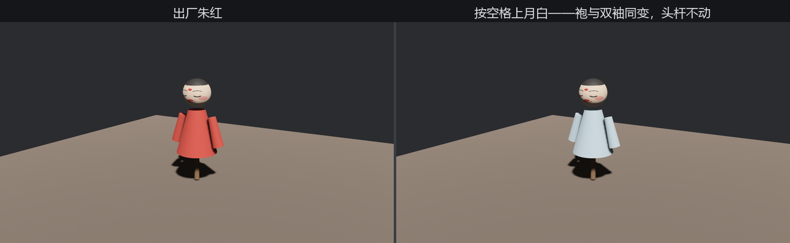
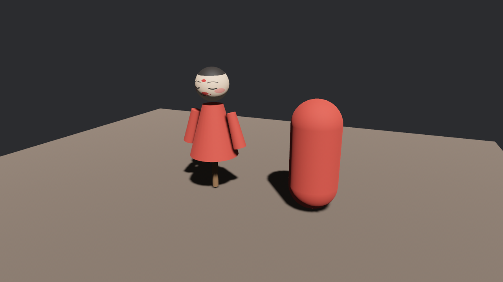

# 材质两本账

23.3 节报错清单里那批 `/std` 影子，现在到了揭底的时候。先说结论：**箱里的每罐漆，进园子后记两本账。**

第一本叫 `GltfMaterial`，标签 `Material{N}`——glTF 材质参数的忠实誊录，一个**引擎无关**的数据壳子：基色、金属度、粗糙度、法线贴图……有什么记什么，不掺渲染器的私货。装卸 glTF 的 `bevy_gltf` 只出这一本账，因为它根本不认识渲染——这是模块化的分寸（第 1 章吹过的牛，这里兑现）。

第二本才是能上台的：`bevy_pbr` 以“开箱协理”的身份登记在 loader 上，每誊完一罐 `GltfMaterial`，就顺手换算出一罐 `StandardMaterial`，登记成 `Material{N}/std`——`std` 即 standard。**场景里网格实体穿的全是第二本**：上一节树里的 `SleeveMesh.AfuRobe`，身上的 `MeshMaterial3d<StandardMaterial>` 指向的就是 `Material1/std`。默认材质也有一对：`DefaultMaterial` 与 `DefaultMaterial/std`，箱里哪件网格没指定材质就吃它。

> `Material` 标签里还有个 `is_scale_inverted` 字段，对应清单里可能出现的 `Material1 (inverted)` 变体：节点被负缩放翻了面时，剔除方向得跟着翻（第 21 章的背面剔除），loader 会为这种场合另备一罐。我们的箱子没有负缩放，用不上。

## 换漆：GltfMaterialName 对号

夜场想让阿福换件月白袍。既然网格实体身上有 `GltfMaterialName` 名牌，漆匠的活就是沿树对号，把袍漆那罐的句柄拿到手：

```rust
{{#include ../../code/ch23-gltf/examples/listing-23-10.rs:paint_pot}}
```

```rust
{{#include ../../code/ch23-gltf/examples/listing-23-10.rs:find}}
```

<span class="caption">Listing 23-10（其一）：数一遍谁穿 AfuRobe，把漆罐句柄和出厂色都记下（examples/listing-23-10.rs）</span>

换色本身是一次资产改写——`Assets<StandardMaterial>` 里按句柄取出来改字段，第 14 章的常规操作：

```rust
{{#include ../../code/ch23-gltf/examples/listing-23-10.rs:repaint}}
```

<span class="caption">Listing 23-10（其二）：空格上月白，再按回朱红（examples/listing-23-10.rs）</span>

```console
cargo run -p ch23-gltf --example listing-23-10
```

```text
漆匠：数完了——挂着 AfuRobe 号漆的一共 3 件，用的是同一罐。
漆匠：空格上月白，再按回朱红。
漆匠：上月白——一罐漆动一下，袍和双袖三件一起变。
漆匠：回朱红——出厂那罐色我留着底呢。
```



<span class="caption">Figure 23-8：一罐漆动一下，三件衣裳一起变——资产是共享的</span>

台词里“3 件”“同一罐”不是修辞，是本节真正的知识点：袍身和两只袖子在 glTF 里就共用 `AfuRobe` 这一罐材质，装卸后三个绘制实体握着**同一个句柄**。改资产，所有持有者一起变——想只给一只袖子换色，得像官方“换装”示例那样 `clone` 出新一罐、只给那个实体换句柄（第 15 章给 Sprite 换色时用过同样的思路）。顺带留意 `find_robe_paint` 记下了 `factory_color`：直接在共享资产上动手是覆写，出厂色不自己留底就找不回来了。

## 借漆：#Material1/std 直取

两本账既然都是资产，就都能用标签直接提。老鲁的胶囊木人这回沾了大光——不翻模、不调色，直接穿阿福的袍漆：

```rust
{{#include ../../code/ch23-gltf/examples/listing-23-11.rs:borrow}}
```

<span class="caption">Listing 23-11（其一）：`#Material1/std` 提的是现成的 `StandardMaterial`（examples/listing-23-11.rs）</span>

注意 `/std` 这本账只有字符串写法——`GltfAssetLabel::Material { index: 1, is_scale_inverted: false }` 拼出来的是第一本 `Material1`；`/std` 后缀是 `bevy_pbr` 的登记惯例，枚举里没有它的席位。第一本账也没闲着，账房拿它念参数：

```rust
{{#include ../../code/ch23-gltf/examples/listing-23-11.rs:read_book}}
```

<span class="caption">Listing 23-11（其二）：第一本账 `GltfMaterial`，记的是 glTF 原始口径（examples/listing-23-11.rs）</span>

```console
cargo run -p ch23-gltf --example listing-23-11
```

```text
老鲁：借你家漆一罐——我这木人也穿件红袍，看看正不正。
账房：AfuRobe 的原账——base_color LinearRgba(LinearRgba { red: 0.42, green: 0.032,
blue: 0.02, alpha: 1.0 })，roughness 0.85，metallic 0。
```



<span class="caption">Figure 23-9：老鲁的木人借漆上身——同一罐 `StandardMaterial`，色差为零</span>

账房这行输出把 23.2 节埋的伏笔收了：JSON 里 `baseColorFactor` 写的 `[0.42, 0.032, 0.02]`，进账后原样躺在 **`LinearRgba`** 里——**glTF 的颜色因子是线性色，不是 sRGB**。要是你把它当 sRGB 抄进取色器，会得到一个暗得多的红。规范如此约定是为了让 GPU 直接拿去乘算（第 15 章 bevy_color 讲过两套色彩空间的分工）；对你的实际影响只有一条：**在建模软件里调色、导出、Bevy 里原样还原**这条链路是自洽的，不需要也不应该手动换算。

`StandardMaterial` 这罐漆里其实还有几十根旋钮没露面——清漆、透光、各向异性……第 24 章整章都是它。本章只需要记住：glTF 的材质到站后就是普通 `StandardMaterial`，你在第 21 章学的一切手艺照用。
