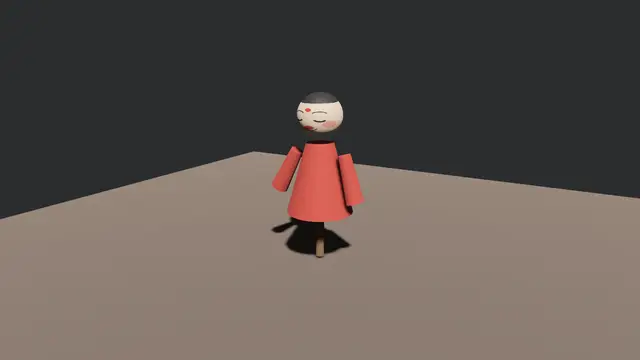

# 让阿福动起来

行头齐了、灯也挂了，就差开锣。箱底那折《Swing》——23.2 节看过它的原文：两条旋转曲线，一条给右袖、一条给头——现在要把它请出来演。Bevy 放动画用三件东西，先把名分讲清：

- **`AnimationClip`（一折戏）**：一段烤好的动画曲线集，就是标签 `Animation{N}` 提出来的货；
- **`AnimationGraph`（谱架）**：一张图，把一折或多折戏组织起来——混合、分层、加权，全是它的事。第 30 章才摆开这张图的全貌，今天只有一折戏，用便捷函数 `from_clip` 搭一座单谱的架子就够了；
- **`AnimationPlayer`（司鼓）**：真正推进时间、把姿势打进 `Transform` 的组件。它不用你 spawn——23.6 节的实体树里看见了，装卸工早把它装在动画根 `AfuRoot` 上。

```rust
{{#include ../../code/ch23-gltf/examples/listing-23-12.rs:to_play}}
```

```rust
{{#include ../../code/ch23-gltf/examples/listing-23-12.rs:build_graph}}
```

<span class="caption">Listing 23-12（其一）：提戏、搭谱架、把戏单钉在台口实体上（examples/listing-23-12.rs）</span>

逐行对账：`GltfAssetLabel::Animation(0)` 提的就是《Swing》（要按名取也行——走 23.3 节的 `Gltf` 目录查 `named_animations`，代价是得先等整箱目录到货，序号写法则一行到位）；`AnimationGraph::from_clip` 返回 `(图, 座号)`——**`AnimationNodeIndex` 是这折戏在图里的座位号**，开锣时点的是座号而不是句柄；图本身是资产，`graphs.add` 入库换句柄。三样打包进 `AnimationToPlay` 组件钉在台口实体上，是给回执观察者留的戏单——哪个实体的场子，配哪座谱架。

回执一到，司鼓上工：

```rust
{{#include ../../code/ch23-gltf/examples/listing-23-12.rs:strike}}
```

<span class="caption">Listing 23-12（其二）：找到播放器，点座号开锣，递谱（examples/listing-23-12.rs）</span>

两个动作缺一不可。**`player.play(node)`** 点戏：往播放器的活动名单里登记这折，返回的 `&mut ActiveAnimation` 可以链式调 `.repeat()`（循环到永远；不调的话演一遍就停在末帧，还有 `set_repeat` 可以点“演三遍”）。**`insert(AnimationGraphHandle(…))`** 递谱：把谱架句柄作为组件插到**播放器所在的实体**上——司鼓光知道敲哪一折没用，手里得有谱。为什么是个组件而不是 `play` 的参数？因为图是可以整座热换的（换装备换动作集），组件正适合这种“随时换一本”的关系。

```console
cargo run -p ch23-gltf --example listing-23-12
```

```text
司鼓：谱架上好，起——《Swing》，循环。
```



<span class="caption">Figure 23-10：《Swing》开锣——右袖起落，头随拍轻摆，2.4 秒一循环</span>

袖子起落、头轻轻摆——回想 23.2 节那两条 `rotation` 通道：动画系统做的事，本质就是**按时间轴把插值出来的值灌进对应实体的 `Transform`**。所以第 12 章的一切在这儿全部成立：袖子转，袖子的子实体（比如那盏灯笼）跟着转，不用任何额外代码。

## 哑巴坑：谱子抽了，台上没声

递谱那步要是忘了呢？按 Bevy 的脾气，你大概猜是一条 panic 或者至少一条警告。都不是——**什么都没有**。这个坑哑到值得专门做成实验：Listing 23-13 在 23-12 之上加一个系统，左键一点，把谱子从播放器手里抽走或塞回：

```rust
{{#include ../../code/ch23-gltf/examples/listing-23-13.rs:toggle}}
```

<span class="caption">Listing 23-13：点一下抽谱、再点一下还谱——盯住袖子，再盯住日志（examples/listing-23-13.rs）</span>

```console
cargo run -p ch23-gltf --example listing-23-13
```

```text
老雷：开演后点一下左键抽谱、再点一下还谱——盯住阿福的袖子。
司鼓：谱架上好，起——《Swing》，循环。
老雷：谱子抽了——阿福僵在半空。听听，日志一声不吭。
老雷：谱子还回去——从僵住那一拍原样接着来，连时间都没走。
```

第一下点下去，阿福**僵在半空**——袖子停在抽谱瞬间的角度，一动不动；日志零警告零报错（写作时用逐像素对比验过：冻住期间前后帧完全相同）。再点一下，从僵住那一拍**原样续演**，不跳帧。

网页版的读者现在就可以亲手拨这个开关——点击画面即是左键：

<figure class="bevy-demo" data-src="demos/ch23/anim.html">
  
  <figcaption><span class="caption">互动版 Listing 23-13：点一下画面抽谱——亲眼看动画冻住而日志无声；再点一下，原样复活</span></figcaption>
</figure>

为什么哑？机制一句话就讲完：动画系统里推进时间、把姿势写进 `Transform` 的那两个系统，Query 里都带着 `&AnimationGraphHandle`——没这个组件的播放器**根本不在它们的查询结果里**（第 4 章：Query 匹配不上就是不存在，而“不存在”从来不是错误）。时间不推进、姿势不落笔，连“过了多久”都没人记——所以还谱之后是原样续演而不是快进追赶。

这也解释了它为什么危险：真实项目里这个坑通常不是“抽走”而是“忘插”——场景加载好了、`play` 也调了，就是忘了 `AnimationGraphHandle`，于是模型顶着初始姿势纹丝不动，日志干干净净。从此记住排查口诀：**动画不动先查三件套齐不齐——戏点了没、谱递了没、播放器找对实体没**。

第 30 章会回到这套系统的深水区：多折戏在图上混合、蒙皮骨骼（`Skin` 标签一族在那儿才领戏份）、动画事件与过渡。本章的份量到此正好。
