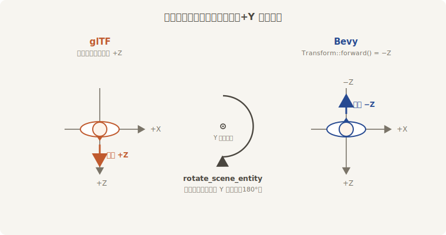
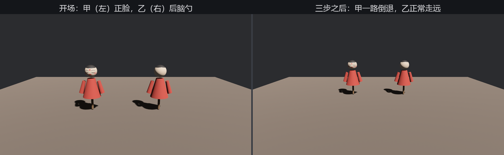

# 转向：glTF 的前与 Bevy 的前

23.2 节末尾记了一笔账：glTF 规范说模型的脸朝 **+Z**，Bevy 的“前”（`Transform::forward()`，第 12 章）却是 **−Z**。两家各有道理——glTF 想的是“模型摆出来正脸对着看的人”，Bevy 跟的是右手系相机的传统（镜头看向自己的 −Z）。分歧不大，后果不小：**照规范制作的模型，进了 Bevy 一律“前后颠倒”**——你让它沿 `forward()` 走，它就一路倒退给你看。



<span class="caption">Figure 23-11：两家的“前”差半圈——转换开关拧的是场景根实体</span>

loader 为此备了转换开关 `GltfConvertCoordinates`（`bevy::gltf::convert_coordinates` 引入；文档标注这是实验性功能，行为可能调整）。它有两个各自独立的布尔：

- **`rotate_scene_entity`**——把 23.6 节树里那层**场景根实体**（`AfuShow` 那个）绕 Y 拧半圈。整棵模型跟着转，网格数据一个字节不动，便宜；
- **`rotate_meshes`**——深改**网格资产本身**（顶点数据、蒙皮绑定姿势一并处理），连带调整挂网格实体的补偿变换。当你要单独提取网格（23.3 节老鲁那种用法）还指望它朝向正确时才需要。

两个都默认关。绕 Y 拧半圈同时照顾了“右手边”——glTF 的右是 −X、Bevy 的右是 +X，转完前与右一起归位，上下（+Y）两家本来就一致。相机和灯不归它管——glTF 规范里这两位本来就按“看向/照向自身 −Z”定义，与 Bevy 天生同向，转了反而错。

口说无凭，让甲乙两尊阿福当场对质。甲原样开箱，乙开箱时拧 `rotate_scene_entity`；然后老雷喊口令，**两尊都朝自己台口实体的 `forward()` 迈步**——这正是你将来写移动逻辑的姿势：

```rust
{{#include ../../code/ch23-gltf/examples/listing-23-14.rs:two_boxes}}
```

<span class="caption">Listing 23-14（其一）：甲原样、乙转正——注意乙开的是 `.glb` 那份拷贝，23.5 节的规矩（examples/listing-23-14.rs）</span>

```rust
{{#include ../../code/ch23-gltf/examples/listing-23-14.rs:walk}}
```

<span class="caption">Listing 23-14（其二）：走两步——游戏逻辑只认 `forward()`，不认脸（examples/listing-23-14.rs）</span>

```console
cargo run -p ch23-gltf --example listing-23-14
```

```text
老雷：甲乙各就位。空格喊一步——都朝自己实体的 forward() 走。
老雷：甲（原样）走一步，站到 z = -0.5。
老雷：乙（转正）走一步，站到 z = -0.5。
老雷：甲（原样）走一步，站到 z = -1.0。
老雷：乙（转正）走一步，站到 z = -1.0。
老雷：甲（原样）走一步，站到 z = -1.5。
老雷：乙（转正）走一步，站到 z = -1.5。
```



<span class="caption">Figure 23-12：同一句 `forward()`，甲在倒退，乙在走路</span>

坐标数字一模一样——两尊都老老实实沿 −Z 挪了步，因为**台口实体的 `Transform` 我们没转过，`forward()` 都是 −Z**（`rotate_scene_entity` 拧的是台口名下那层场景根，不是台口自己）。差别全在脸上：甲的脸留在 +Z，于是“前进”对它是倒着走；乙的脸被拧到 −Z，脸与 `forward()` 终于一个方向。逻辑没错，错的是模型的朝向没转正——这类 bug 上线前藏得很深，因为静止画面里两尊看起来都“挺正常”。

三条实践口径：

- 项目里模型多、都按规范制作 → 在 `GltfPlugin` 上把 `convert_coordinates` 设成全局默认（插件字段，`DefaultPlugins.set(GltfPlugin { … })`），一处定规矩，处处不操心；
- 只有个别模型要转 → 像本例一样用 `GltfLoaderSettings` 按箱指定；
- 不转也行——很多项目的传统做法是 spawn 时手动给模型实体 `Transform::from_rotation(Quat::from_rotation_y(PI))`。能用，但每个 spawn 点都得记得，忘一处倒退一处；开关的意义就是把这件事从“人人有责”改成“定一次规矩”。
