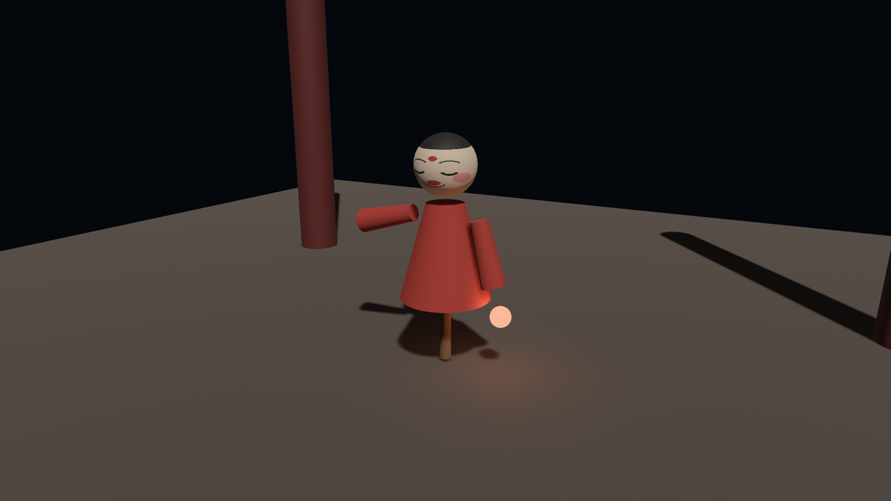

# 木偶戏开演

全章合龙。夜场的《阿福亮相》要一次用上本章的整套手艺：单件 `.glb` 开箱、按名挂灯笼、《Swing》循环，再配一样新彩头——**左键拖着转台看**，把 3D 模型该有的待遇给足。这就是本章 crate 的 `main.rs`（Listing 23-15），照例分段过。

搭台开箱：

```rust
{{#include ../../code/ch23-gltf/src/main.rs:setup}}
```

<span class="caption">Listing 23-15（其一）：夜场、台柱、单件箱、戏单——都是熟面孔（src/main.rs）</span>

比起前面的 listing 只有氛围上的添置：`ClearColor` 压成夜色，平行光收到 3000 勒克斯当月光，两根台柱撑出纵深。开的是 `afu.glb`——上线交付用单件箱，23.2 节说过的本分。后台观察者把 23.6 和 23.8 的活并成一趟走树：

```rust
{{#include ../../code/ch23-gltf/src/main.rs:backstage}}
```

<span class="caption">Listing 23-15（其二）：一份回执两件事——跟包挂灯，司鼓开锣（src/main.rs）</span>

值得看的是合并本身：`iter_descendants` 只走一遍，沿途谁的名字对上就办谁的事。灯笼挂上 `LeftArm` 的那一刻，23.8 节末那句“子实体跟着转”兑现了——袖子随《Swing》起落，灯笼跟着荡，暖光在台面上扫来扫去，一行专门的代码都没写。

转台是本章唯一的新交互，手艺却是第 17 章的：

```rust
{{#include ../../code/ch23-gltf/src/main.rs:orbit}}
```

<span class="caption">Listing 23-15（其三）：拖动转台——cursor_position 差分，机位吊在圆轨上（src/main.rs）</span>

逐个交代取值：按住左键时，拿 `cursor_position()`（窗口内光标坐标，17.3 节）跟上一帧差分算位移，`0.008` 是“像素转弧度”的手感系数——拖 300 像素转 137° 上下，大半圈正好把阿福看个前后，写作时试出来的舒服值；松键就把 `last_cursor` 清掉，避免下次按下时光标已经跳走、差分蹦出一大步。机位吊在半径 3 米、高 0.85 米的圆轨上绕着阿福转，每帧重摆一次 `looking_at`。

> **为什么不用第 17 章的 `AccumulatedMouseMotion`？** 桌面上它跟 cursor_position 差分等价，但这份代码还要编成网页 demo——浏览器里 winit 的原始鼠标位移要独占光标（pointer lock）才有数据，嵌在页面里的 demo 拿到的恒是零，拖动就“失灵”了。cursor_position 两头通吃，是跨桌面与网页的稳妥写法。`main()` 里那两个只在网页构建下生效的窗口字段（`canvas`、`fit_canvas_to_parent`），第 20 章终场交代过，此处如法炮制。

最后是司鼓的暂停开关：

```rust
{{#include ../../code/ch23-gltf/src/main.rs:gong}}
```

<span class="caption">Listing 23-15（其四）：歇锣/起锣——`pause_all` 与 `resume_all`（src/main.rs）</span>

`pause_all` 把播放器名下所有活动动画一起按住（与 23.8 节的抽谱不同——谱还在手里，时间停在原处，这是**体面的**暂停），`resume_all` 原地续演，`all_paused` 用来判断当下该敲哪边。

```console
cargo run -p ch23-gltf
```

```text
老雷：《阿福亮相》，开演——左键拖着转台，空格歇锣/起锣。
司鼓：起——《Swing》，循环。
跟包：灯笼挂上左袖了。
```

<figure class="bevy-demo" data-src="demos/ch23/index.html">
  
  <figcaption><span class="caption">Figure 23-14：《阿福亮相》。读的是网页版就别只看剧照：点击画面入场——左键拖着转台，空格歇锣</span></figcaption>
</figure>

拖一圈看看：正面的戏曲脸、侧面的袖影、背面的主杆和后脑勺——这是 3D 资产与 2D 精灵在体验上的分水岭，也是本书往后各章的常态。

## 小结

开箱这门手艺的账本：

- **glTF 是一箱而不是一件**：JSON 主档记结构（scene→node→mesh→primitive→accessor 的指针链），二进制装几何与动画，贴图外挂；`.glb` 把三件打成单件，内容与标签不变
- **加载靠标签**：`GltfAssetLabel` 拼提货单（`#Scene0`、`#Mesh0/Primitive0`、`#Material1/std`…），枚举写法编译期把关；漏标签是那条 “Could not find an asset loader … Asset Type” 谜语错，拼错标签的报错反而会把整箱清单印给你
- **场景挂载**：`WorldAssetRoot(Handle<WorldAsset>)` 挂在台口实体上，子树异步长出；改组件值即换场（旧拆新搭）；`Gltf` 目录资产管花名册（`named_*`、`default_scene`）
- **开箱规矩**：`GltfLoaderSettings` 管灯、相机、动画、坐标转换……但**一条路径只认一套 settings**（几处装载谁说了算是竞态，没有保证）——同路径统一规矩，两种开法要两个路径
- **落地形态**：节点名→`Name`、图元实体名是“网格名.材质名”、材质两本账（`GltfMaterial` 与 `/std` 的 `StandardMaterial`，实体穿后者）、extras→`GltfExtras`；`WorldInstanceReady` 回执后凭 `Name` 找人办事（回执当帧 `GlobalTransform` 未传播）
- **动画三件套**：clip（一折戏）→ graph（谱架）＋ node index（座号）→ player（司鼓）`play().repeat()`；`AnimationGraphHandle` 是谱——忘插不报错，台上原地冻住，是本章最哑的坑
- **方向的账**：glTF 前=+Z、Bevy 前=−Z，`convert_coordinates` 拧场景根或网格资产；相机与灯天生同向不用转

## 练习

1. **提贴图**：装箱单清单里还有一类标签本章没提过货——`Texture{N}`。把阿福的脸 `#Texture0` 提成 `Handle<Image>`，糊到一面 `Plane3d` 上挂在台口当海报（第 21 章的贴图手艺）。
2. **数号牌**：给 Listing 23-8 的树打印加一列——有 `GltfMaterialName` 的实体，名字后面括号印出材质名。对照 23.6 节“网格名.材质名”的命名规则，验证两处来源一致。
3. **备用头也上妆**：Workbench 场景里的 `SpareHead` 用的也是 `AfuFace` 材质。用 23.7 的换漆手艺把 AfuFace 的 `base_color` 染青，然后回答：主场景里阿福的脸会不会跟着变？先押注，再实测。
4. **半途换戏**：给 main.rs 加一个键，按下时 `player.stop(node)` 停掉《Swing》再重新 `play`——观察从头开演与 Listing 23-13 冻结续演的区别。`stop` 的签名在 `AnimationPlayer` 文档里。
5. **另一半开关**：把 Listing 23-14 乙的 `rotate_scene_entity: true` 换成 `rotate_meshes: true`，先押注画面会怎么变，再跑。你会看到乙和甲一模一样——像是什么都没发生。解释为什么（提示：23.9 节说过这个开关“连带调整挂网格实体的补偿变换”；那它转换的成果给谁看？想想 23.3 节老鲁直提网格的用法）。

## 下一章

阿福的红袍看着体面，凑近了看还是一罐“素漆”——没有绸缎的光泽、没有清漆的镜面、不透一丝光。23.7 节两本账里的 `StandardMaterial`，本章只用了它三根旋钮；这罐漆里还锁着几十根：金属度贴图、法线、清漆、透光、各向异性……下一章把整罐漆拆开，一面材质球画廊逐罐试给你看——PBR 材质深入。
