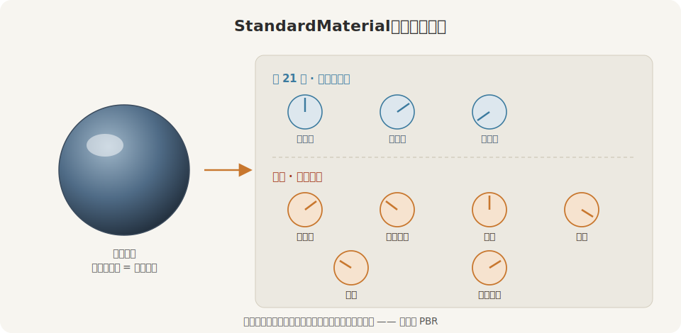

# PBR 材质深入

得月楼这半部戏，画面越铺越满了：第 21 章木匠老鲁立起三维布景，小棠提着漆桶给它们上了第一道色；第 22 章把太阳、灯笼、环境一并请上台，连那颗一直黑着脸的镜面金属球，也总算照出了周遭暖阁；第 23 章阿福一身红袍登场——那袍子的红，是 glTF 随模型一并带进门的一份 `StandardMaterial`。

漆是上了，可那只漆桶，小棠到现在只拧过三根旋钮：固有色、金属度、粗糙度（第 21 章）。`StandardMaterial`（标准材质，`bevy_pbr` 里描述一个表面长什么样的那一大坨参数）的字段足有几十个，21.3 节当时撂下一句「第 24 章逐个清点」。这一章就来兑现：把漆桶整个摊开，一根一根旋钮拧给你看。

为此小棠在台上支起一面**材质球画廊**：一排同样的球，坐同样的墩、沐同样的光，只是各上各的漆——这颗自己会亮，那颗看着坑坑洼洼其实是块平板，这颗透得像玻璃，那颗亮得像车壳。读完这一章，你手里这只漆桶就再没有不认得的旋钮了。



<span class="caption">Figure 24-1：`StandardMaterial` 是一面控制台——第 21 章拧过左边三根，这一章把右边其余的也摊开</span>

一根一根来：

- **自发光与 unlit**——`emissive` 让表面自己发光、灯灭了照旧亮；`unlit` 干脆让它不认光；
- **法线贴图**——`normal_map_texture`：一张图就让平板「长」出凹凸，外加一个不补切线就静悄悄失效的坑；
- **透明**——`alpha_mode`：Opaque / Mask / Blend / Add / Multiply，玻璃、镂空、发光、滤色各走各的算法；
- **清漆与镜面**——`clearcoat` 给表面再罩一层薄亮漆（车漆的光），`reflectance` 调非金属的镜面强度；
- **双面**——`double_sided` 与 `cull_mode`：一片薄旗背过身为什么就没了，怎么让它两面都在；
- **深度偏移**——`depth_bias`：两片贴在同一平面上争着出现（z-fighting），怎么分个先后；
- **材质球画廊**——把这些手艺凑成一台，金属、清漆、玻璃都借第 22 章的环境光照照出周遭；这台画廊还能搬进网页，转着看、点着拨。

这些参数全长在 `StandardMaterial` 这一个结构体上，归 `bevy_pbr` 管，日常都在 `bevy::prelude` 里。透明模式 `AlphaMode` 也在 prelude；只有给法线贴图按线性图加载时要从 `bevy::image` 引入 `ImageLoaderSettings`，画廊装配环境光照时要从 `bevy::render` 引入那两样老相识（`TextureViewDescriptor`、`Hdr`，第 22 章见过）。

配套 crate 是 `code/ch24-pbr-materials`，不需要任何新依赖——本章用到的金属、自发光、法线、透明、清漆、双面、深度偏移，全在 Bevy 的默认特性里（`StandardMaterial` 少数高级字段才要额外特性，本章末尾点一笔）。三件美术资产——一张铆钉法线图、一张镂空贴图、一张画廊环境的 skybox——都由 `scripts/make_ch24_assets.py` 用 Python + Pillow 现场合成，一键就位：

```console
py -3.11 scripts/make_ch24_assets.py
```

开拨。
