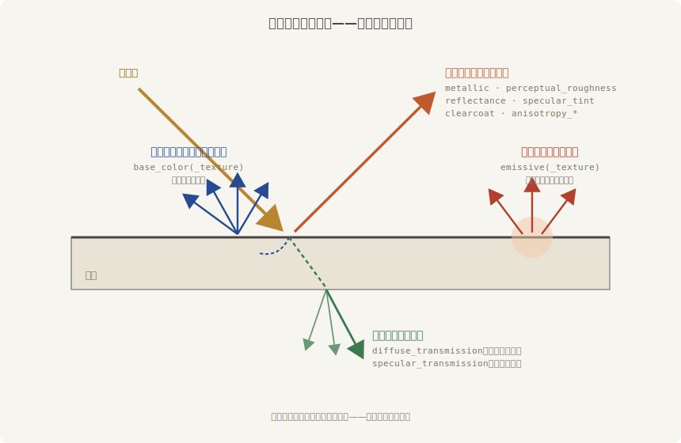

# PBR 材质深入

第 21 章上漆时只拧了 `StandardMaterial` 的三根旋钮：固有色、金属度、粗糙度。这一章把整罐漆拆开——反光度、自发光、金属度贴图、法线、视差、清漆、各向异性、七种透明、玻璃折射、双面、深度偏移、UV 变换，一根不落。班里定下新戏《琉璃记》，老雷开出一张讲究的道具单：**琉璃盏、鎏金锣、剔红漆盒、纱幕、灯箱**。小棠把漆坊后间改成样品间，一件道具一节课，末了画廊开张、全班验货。

动笔前先把账本立起来。PBR 材质的几十个字段看似庞杂，其实都在回答同一个问题：**一束光打到这个表面上，去了哪里**？每个字段管账单上的一行：

Figure 24-1：一束光的四路去向——本章每个字段都在这张账单的某一行上

- **漫反射**：光钻进表面、染上固有色再向四面八方散出——`base_color` 一家管；金属没有这一路（第 21 章讲过）
- **镜面反射**：光在表面直接弹走——`metallic`、`perceptual_roughness`、`reflectance`、`specular_tint`、`clearcoat`、`anisotropy_*` 全在这一行做文章
- **自发光**：不靠外来光，表面自己往镜头里添亮——`emissive` 一家
- **透射**：光穿过表面到背后去——`diffuse_transmission` 与 `specular_transmission` 两条路，价钱差得远

本章每一节拆一行账。读完你手上会有一面材质球画廊：每个参数一件实物道具、一组亲手拨过的对比。

> 本章的示例都在 `code/ch24-materials` 下；它的 `Cargo.toml` 比往常多一段 feature 声明，24.8 节会说清那是为谁准备的。
