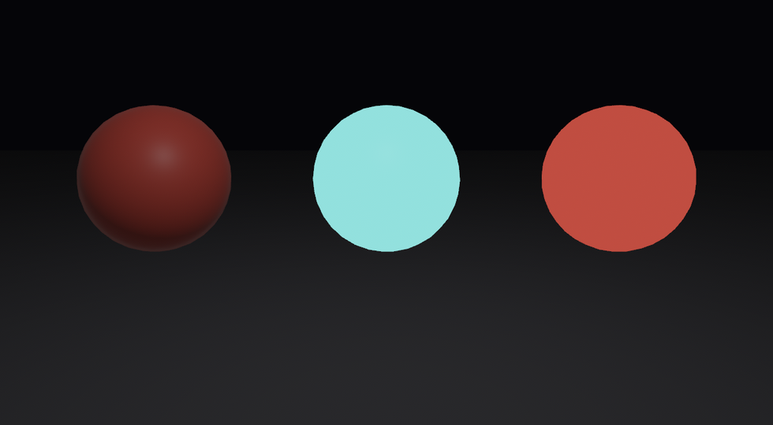

# 自发光与 unlit：自己会亮的漆

到目前为止，画面上每一处亮，都是光打上去、表面反出来的——灯一灭，全黑。可现实里有些东西自己会亮：屏幕、LED、岩浆、夜里的灯牌。这种「不靠反光、自己发光」的本事，是 `emissive`（自发光）这根旋钮。

`emissive` 把一个颜色**直接加**到表面本该有的颜色上。默认是黑（`LinearRgba::BLACK`，加了等于没加）；给它一个亮色，表面就凭空多出那份亮，连暗处也看得见。小棠在一间几乎全黑的屋里摆三颗球，把差别一次看清：

```rust
{{#include ../../code/ch24-pbr-materials/examples/listing-24-01.rs:emissive}}
```

<span class="caption">Listing 24-1：暗场三球——素球靠光、自发光球自己亮、unlit 球不认光（examples/listing-24-01.rs）</span>

```console
cargo run -p ch24-pbr-materials --example listing-24-01
```

```text
小棠：左边这球得借光才看得见；中间这缸漆自己会亮，灯灭了照旧；右边的，干脆不认光。
```



<span class="caption">Figure 24-2：同一间暗屋——素球靠那点弱光勉强可见，自发光球自己亮，unlit 球平平铺开一片红</span>

读图：左边的素球只有 `base_color`，全靠那盏压得很弱的灯，暗场里只剩一弯轮廓——它得借光。中间那颗，`base_color` 是黑的、`emissive` 给了一抹青——它不反光（黑色不反光），却自己亮成一团青，连灯都不需要。右边那颗最值得琢磨：颜色和左边一模一样，却平平地铺成均匀的红，没有明暗、没有立体感——因为它开了 `unlit`。

## emissive 的两个脾气

**其一，它不照亮别人。** `emissive` 只给「这块表面自己」加一份亮，不会像灯那样去照周遭——中间那颗青球再亮，旁边的地面、邻座的球都没沾到一点青光。要照亮场景，得用第 22 章的灯；emissive 管的只是「这一面自己看起来在发光」。想让发光物真的洒出光晕，那是后处理 **bloom**（辉光）的活，留到第 26 章。

**其二，它吃 `LinearRgba`，不吃 `Color`。** emissive 字段的类型是 `LinearRgba`（线性色彩空间的 RGBA），不是平时随手写的 `Color`。而且它的通道值可以超过 1.0——`LinearRgba::rgb(0.1, 2.4, 2.1)` 里那个 2.4 不是笔误，越大越亮，配上 bloom 时尤其能拉开光晕强弱。随手写成 `Color::srgb(...)` 会被编译器当场拦下：

```rust,ignore
{{#include ../../code/ch24-pbr-materials/no-compile/listing-24-02.rs:bad}}
```

<span class="caption">Listing 24-2：把 `Color` 塞给 emissive——编不过（no-compile/listing-24-02.rs）</span>

```text
error[E0308]: mismatched types
   |
   |         emissive: Color::srgb(0.1, 2.4, 2.1),
   |                   ^^^^^^^^^^^^^^^^^^^^^^^^^^^ expected `LinearRgba`, found `Color`
```

改法就一处：写成 `LinearRgba::rgb(0.1, 2.4, 2.1)`，或在末尾补个 `.into()` 把 `Color` 转过去——本章的 Listing 24-1 用的就是前者。

## unlit：把光关掉

右边那颗平铺的红球，开的是 `unlit`（不受光）。设成 `true`，这份材质就彻底不参与光照计算——法线、金属度、粗糙度、环境光统统不管，直接把 `base_color`（配上贴图）原样画出来。它和 emissive 是两回事：emissive 是「在受光之外再加一份自发的亮」，unlit 是「干脆不算光，给什么颜色就是什么颜色」。

unlit 看着朴素，用处却不少：纯色的标记色块、调试用的指示、卡通渲染要的「平涂」，或者「颜色要绝对均匀、不许有明暗」的片——都靠它。本章后面 24.3 节的透明背景墙、24.6 节的深度偏移底板，用的都是 unlit：它们是给主角当背景的，不该自己抢光。
