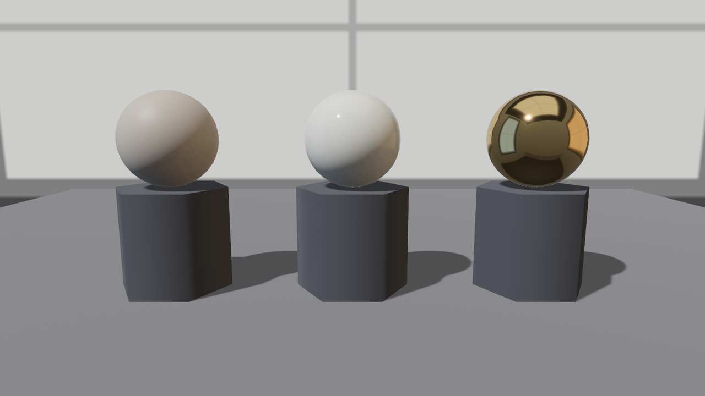

# 样品间开张

看材质得有个像样的场子。第 21 章的材质墙吃过亏：镜面金属在“一盏灯加一片虚空”里照出一团黑，直到第 22 章环境光照到货才翻身。所以样品间的地基分三样：一间**影棚**（灰墙加柔光箱的 cubemap，既当背景又当光源）、一盏**主灯**（负责锐利的高光与影子）、一座**转台**（材质的好坏得转着看）。Listing 24-1 把它搭起来，先请三位老面孔坐台：

```rust
{{#include ../../code/ch24-materials/examples/listing-24-01.rs:setup}}
```

<span class="caption">Listing 24-1（其一）：主灯、台面、三座展台、三颗熟球（examples/listing-24-01.rs）</span>

逐项过一遍取值。主灯是 5000 勒克斯的平行光——比第 23 章夜场那束 3000 的月光亮一档的摄影棚亮度，配合默认曝光（EV100 = 9.7）画面不过曝；`shadow_maps_enabled: true` 让展品落影，球才像坐在台上而不是浮着。台面 12 米见方、中性灰 `0.42`、粗糙度 `0.8`——样品间的规矩是**台面不抢戏**：太光会映出展品倒影，太白会把反光染亮。展台用六棱柱（`Cylinder` 的 `resolution(6)`，第 22 章的手法），三颗球正是 21.3 节材质墙的三个角：素坯（旋钮全默认，只调了底色）、亮瓷（粗糙度拧到下限 `0.089`）、镜面金（`metallic 1.0` + 粗糙度 `0.05`）。

影棚墙本体是一张竖条 cubemap（六面各 256²，`scripts/make_ch24_assets.py` 合成——边长是 2 的幂，22.10 节的 panic 还记得吧）。挂法与 22.9 节的星空天幕逐字相同：

```rust
{{#include ../../code/ch24-materials/examples/listing-24-01.rs:studio}}
```

<span class="caption">Listing 24-1（其二）：影棚墙——Skybox 画背景，GeneratedEnvironmentMapLight 让墙发光（examples/listing-24-01.rs）</span>

两个数值是本章的基准档：`Skybox` 的 `brightness: 700.0`（cd/m²）让背景墙呈现出摄影棚背景纸那种不刺眼的亮灰；`GeneratedEnvironmentMapLight` 的 `intensity: 1_000.0` 是环境光照的总量——它决定了金属和清漆“有多少世界可照”。这两个值是写作时对着画面调出来的：环境再亮，主灯的高光就淹了；再暗，金属又要回到 21 章那种半死不活。`main()` 里还有一行 `insert_resource(GlobalAmbientLight::NONE)`——环境光照接管了“四面八方的光”，默认那份平坦环境光就该退场，两份叠着会把暗部洗灰（22.8 节的老规矩）。往后每个 listing 都原样带着这一整套（影棚加转台），正文不再重贴。

转台照抄 23.11 节：按住左键拖动，`cursor_position()` 差分转 yaw，机位吊在半径 4.2 米、高 1.5 米的圆轨上。

```console
cargo run -p ch24-materials --example listing-24-01
```

```text
小棠：样品间开张——先请三位老面孔坐台：素坯、亮瓷、镜面金。
老雷：道具单在此——琉璃盏、鎏金锣、剔红漆盒、纱幕、灯箱，一样都不能含糊。
场记：影棚墙挂好了——镜面金这回有的照了。
```



<span class="caption">Figure 24-2：样品间开张——镜面金映出柔光箱的格条，“有东西可照”是一切金属质感的前提</span>

拖一圈看：亮瓷上那粒高光跟着机位走，镜面金里的柔光箱倒影也跟着走——**镜面反射是视角的函数**，这正是材质要配转台的原因。样品间齐了，下一节拆第一根新旋钮。
