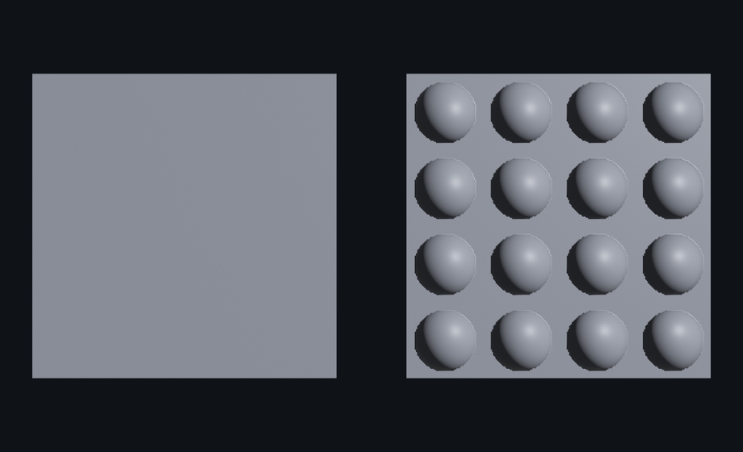

# 法线贴图：假装的凹凸

想让一面墙长出砖缝、一块板冒出铆钉，最笨的办法是真去建几千个三角形的凹凸几何——又费内存又费算力。**法线贴图**（normal map）是个聪明的偷工：网格还是那块平板，但贴一张图，图里每个像素存一个「法线方向」，光照时按这个方向算明暗——于是平板被照得像真有凹凸。省下的几何，全压进了一张图。

第 21 章讲过，受光的方向由网格的**法线**决定。法线贴图做的，就是在原本一律朝外的法线之外，逐像素地「再拐一下」：该鼓起处法线往外偏，该凹下处往里偏。光一打，明暗就分出了立体。

挂法线图只需一个字段 `normal_map_texture`，但有两处不踩就静悄悄出错，得先说清。

**第一处：法线图按线性图加载。** 法线图存的是方向（XYZ 编码进 RGB），不是给人看的颜色。普通贴图默认按 sRGB 解码（为人眼校正过），用在法线图上会把方向算歪。加载时要明确关掉——`is_srgb = false`，就是第 14 章 `load_with_settings` 那套。

**第二处：网格得有切线。** 法线图里的方向是相对表面局部坐标的，要把它摆正到世界里，网格每个顶点除了位置、法线、UV，还得有一根**切线**（tangent）。内置图元出厂自带位置、法线、UV，却**不带切线**——少了它，法线图会被静悄悄忽略、表面渲成平板，一句警告都没有。补切线靠 `Mesh::with_generated_tangents()`（消耗网格、返回带切线的新网格）或 `generate_tangents()`（原地补）。

两处坑并作一图：同一张铆钉法线图，左片用原样的内置网格（没切线），右片补了切线，并排一看便知：

```rust
{{#include ../../code/ch24-pbr-materials/examples/listing-24-03.rs:normal}}
```

<span class="caption">Listing 24-3：同一张法线图，没切线 vs 补了切线（examples/listing-24-03.rs）</span>

```console
cargo run -p ch24-pbr-materials --example listing-24-03
```

```text
小棠：同一张点子图，左边贴上去还是块平板，右边补了切线，铆钉这就鼓起来了。
```



<span class="caption">Figure 24-3：左板没切线，法线图被静悄悄忽略、渲成死平；右板只多补了一句切线，十六颗铆钉就鼓了起来</span>

左片是块死平的灰板——法线图挂上了，却因为没切线使不上劲，被静悄悄忽略；要不是右片对照，你甚至发现不了它本该有凹凸（这正是「无声的坑」最坑的地方）。右片同一张图、同一份材质，只多补了一句 `with_generated_tangents()`，十六颗铆钉就鼓了起来——可它其实还是一块平板，凑近看轮廓边缘仍是直的，凹凸全是法线图骗出来的明暗。把灯（斜着打的那盏）挪一挪，铆钉的亮面也跟着移，骗得相当彻底。

> 还有一个孪生字段 `flip_normal_map_y`：有些建模软件（DirectX 习惯）导出的法线图，Y 分量是反的，挂上去凹凸会内外颠倒（鼓成了凹）。真遇上「凹凸反了」，把它设成 `true` 翻一下即可；本章这张是按 Bevy 默认的约定（OpenGL，Y 朝上）合成的，不用翻。

法线图很少单打独斗：它常和金属度/粗糙度图、自发光图、遮蔽图打包同用——一个表面好几张图，各管一摊（固有色、糙不糙、自发光、哪儿照不到光）。还有个走得更远的亲戚叫**视差贴图**（`depth_map`），连轮廓都能按视角骗出深度，代价是每像素要采样好多次。这些都在本章末尾一并点到。
