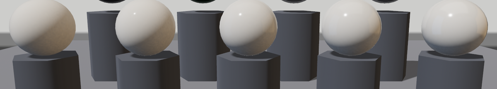
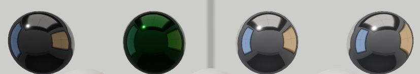

# 反光度与高光染色

第 21 章说非金属的高光“不沾固有色”。那高光的**强弱**归谁管？瓷器和粉笔都算非金属，亮度却差着档次——这根旋钮叫 `reflectance`（反光度），管非金属表面弹回多少光，默认 `0.5`。

问题来了：0.5 是什么单位？口说无凭，铸一排瓷球，只拧这一根旋钮：

```rust
{{#include ../../code/ch24-materials/examples/listing-24-02.rs:row}}
```

<span class="caption">Listing 24-2（其一）：白瓷五连——reflectance 从 0.0 拧到 1.0（examples/listing-24-02.rs）</span>

```console
cargo run -p ch24-materials --example listing-24-02
```

```text
小棠：前排白瓷五连——反光度从 0 拧到 1，高光从无到扎眼。
小棠：后排黑釉一对、银器一对，每对右手那颗抹了石绿——猜猜谁认这罐染料？
```



<span class="caption">Figure 24-3：反光度五档——0 档没有高光，往右递增，但前半段的差异比后半段小得多</span>

两个观察。其一，`reflectance: 0.0` 的球**彻底没有高光**——连环境倒影都没了，像石膏。其二，0.25、0.5、0.75 三档挨得很近，到 1.0 才明显跳出来。这不是显示器的问题，是刻度本身：着色器把反光度换算成物理反射率 F0 时走的是平方（`vendor` 里 `pbr_functions.wgsl` 的原话：`F0 = 0.16 * reflectance * reflectance`），五档对应的反射率是 **0%、1%、4%、9%、16%**。默认 0.5 = 4%，正是现实中大多数非金属（水 2%、塑料 4%、玻璃 4% 上下）扎堆的区间；刻度两端才留给罕见材质。所以这根旋钮的用法是：**日常留默认，做“湿了水、上了釉”的效果往上拧，做粉笔灰泥往下拧**。

## 高光也能染色吗

非金属高光天生是白的——但 `StandardMaterial` 里躺着一个 `specular_tint`（高光染色，默认白 = 不染）。它的文档有一处自相矛盾：正文说它“调制非金属的 reflectance”，末尾一句又说“对非金属无效”。到底对谁无效？源码里染料是先乘进反光度再走平方的：`F0 = mix(0.16·(reflectance·tint)², base_color, metallic)`——按这个式子，金属的反射色来自 `base_color`，染料应该只有非金属认。搭一组 2×2 对照实验，让画面自己说话：

```rust
{{#include ../../code/ch24-materials/examples/listing-24-02.rs:tint}}
```

<span class="caption">Listing 24-2（其二）：黑釉与银器各一对，右手那颗抹石绿——2×2 对照（examples/listing-24-02.rs）</span>

两个讲究。第一，染色组的底色用**纯黑**：漫反射是高光背后的强光源，白底会把 16% 的镜面反射淹得看不见——黑底灭掉漫反射，剩下的全是高光（官方 `specular_tint` 示例同款手法）。第二，`reflectance: 1.0` 把镜面拉到最大档，染料才有的可染。



<span class="caption">Figure 24-4：石绿染料的 2×2 对照——黑釉（非金属）整颗变墨绿琉璃，银器双胞胎逐像素相同</span>

结论一目了然：**非金属认这罐染料，金属不认**——文档末尾那句笔误了，方向反着。银器要变色，改的是 `base_color` 本身（金子的暖色从来就是这么来的）；非金属想要彩色高光（丝绸的闪色、某些漆器的幻彩），才轮到 `specular_tint`。另有两笔账留个名：这个字段在 deferred 渲染路径下不支持（字段文档原话，路径的事第 37 章见），玻璃质感别用它硬凑——真折射在 24.10 节。
